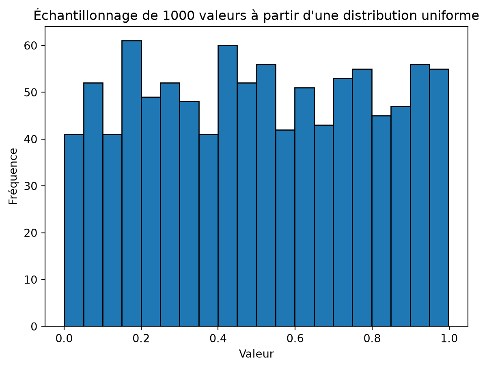
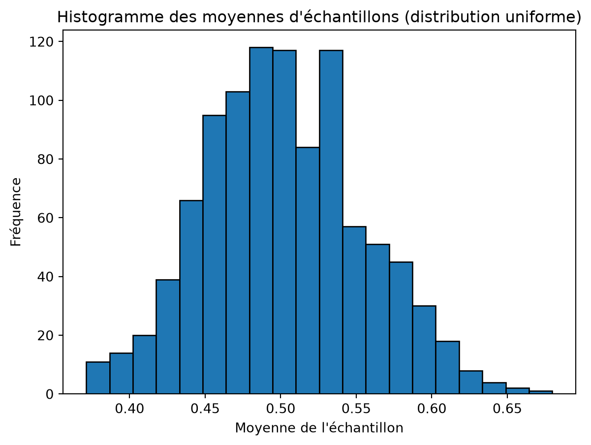
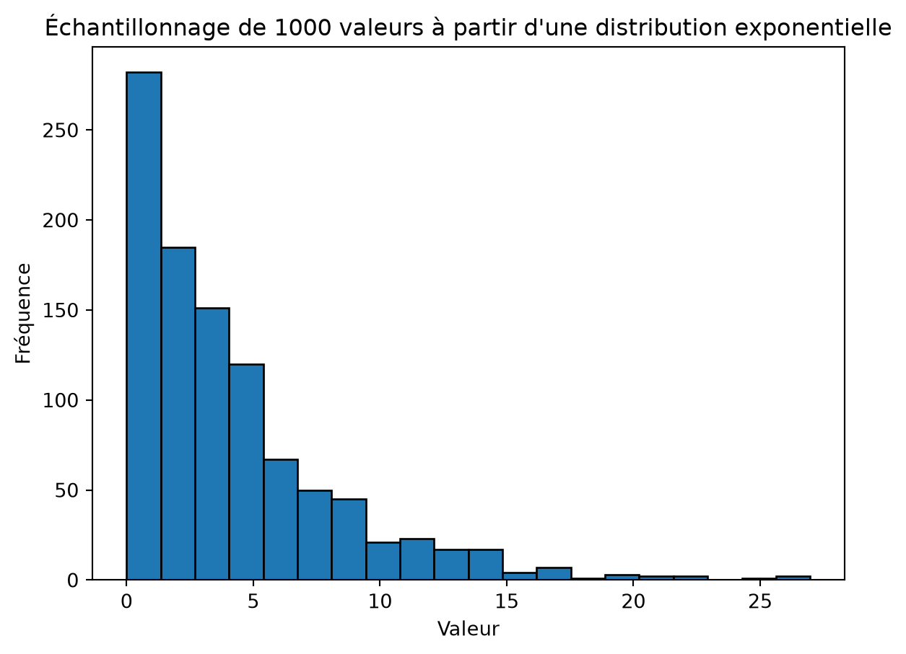
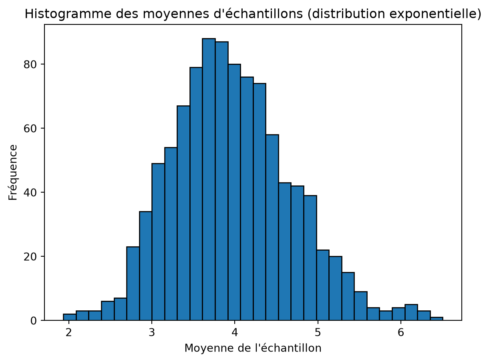

# Jupyter Notebook - Théorème Central Limite

CSI4506 Introduction à l’intelligence artificielle

Auteur·rice

Affiliations

Marcel Turcotte [](mailto:marcel.turcotte@uottawa.ca)

École de science informatique et de génie électrique

Université d’Ottawa

Date de publication

5 septembre 2025

Cet exemple est tiré de mes notes personnelles. Les notebooks Jupyter peuvent être utilisés efficacement pour rédiger des notes interactives et explorer des idées.

# Théorème Central Limite

Le Théorème Central Limite est un concept statistique fondamental qui stipule que la distribution des moyennes d’échantillons tend vers une distribution normale (courbe en cloche) à mesure que la taille de l’échantillon augmente, indépendamment de la forme de la distribution de la population, à condition que les échantillons soient indépendants et identiquement distribués.

Illustrons le concept avec deux distributions de probabilités populaires mais dissemblables.

Pour rafraîchir notre mémoire, nous allons générer 1000 valeurs à partir d’une distribution uniforme avec un intervalle de 0 à 1 et en tracer le résultat.

``` python
import numpy as np
import matplotlib.pyplot as plt

# Taille de l'échantillon
sample_size = 1000

# Générer des valeurs
values = np.random.uniform(0, 1, sample_size)

# Tracer l'histogramme
plt.hist(values, bins=20, edgecolor='black')

plt.title(f'Échantillonnage de {sample_size} valeurs à partir d\'une distribution uniforme')

plt.xlabel('Valeur')
plt.ylabel('Fréquence')

plt.show()
```



Dans ce premier exemple, 1000 échantillons sont générés, chacun avec 31 valeurs échantillonnées d’une distribution uniforme avec un intervalle \\\[0,1\]\\

``` python
import numpy as np
import matplotlib.pyplot as plt

# Nombre d'échantillons et taille de l'échantillon
num_samples = 1000
sample_size = 31

# Générer des échantillons et calculer leurs moyennes

sample_means = [np.mean(np.random.uniform(0, 1, sample_size)) for _ in range(num_samples)]

# Tracer l'histogramme des moyennes d'échantillons
plt.hist(sample_means, bins=20, edgecolor='black')

plt.title('Histogramme des moyennes d\'échantillons (distribution uniforme)')

plt.xlabel('Moyenne de l\'échantillon')
plt.ylabel('Fréquence')

plt.show()
```



L’histogramme ci-dessus présente la caractéristique de la forme en cloche.

Pour le prochain exemple, nous nous tournerons vers la distribution de probabilité exponentielle. Encore une fois, nous allons rafraîchir notre mémoire. Ce qui suit montre l’histogramme pour 1000 valeurs générées à partir d’une distribution exponentielle avec un taux \\\lambda = \frac{1}{4}\\. Par conséquent, l’échelle, \\\beta=\frac{1}{\lambda}\\, est \\4\\.

``` python
import numpy as np
import matplotlib.pyplot as plt

# Taille de l'échantillon
sample_size = 1000

# Générer des valeurs
values = np.random.exponential(scale=4, size=sample_size)

# Tracer l'histogramme
plt.hist(values, bins=20, edgecolor='black')

plt.title(f'Échantillonnage de {sample_size} valeurs à partir d\'une distribution exponentielle')

plt.xlabel('Valeur')
plt.ylabel('Fréquence')

plt.show()
```



Maintenant, générons 1000 échantillons, chacun avec 31 valeurs échantillonnées d’une distribution exponentielle.

``` python
import numpy as np
import matplotlib.pyplot as plt

# Nombre d'échantillons et taille de l'échantillon
num_samples = 1000
sample_size = 31

# Paramètre d'échelle pour la distribution exponentielle
scale_parameter = 4

# Générer les échantillons et calculer leurs moyennes
sample_means = [np.mean(np.random.exponential(scale=scale_parameter, size=sample_size)) for _ in range(num_samples)]

# Tracer l'histogramme des moyennes d'échantillons
plt.hist(sample_means, bins=30, edgecolor='black')

plt.title('Histogramme des moyennes d\'échantillons (distribution exponentielle)')

plt.xlabel('Moyenne de l\'échantillon')
plt.ylabel('Fréquence')

plt.show()
```



Pourquoi cela importe-t-il? Dans le travail expérimental, nous manquons souvent de connaissances sur la distribution sous-jacente des données. Cependant, lorsque nous résumons les résultats expérimentaux en utilisant la moyenne, nous pouvons être confiants que ces moyennes suivront une distribution normale. Cela nous permet d’appliquer des techniques statistiques telles que le calcul des intervalles de confiance, la réalisation de tests t pour comparer les moyennes de deux échantillons différents, ou la réalisation d’une ANOVA pour déterminer s’il existe des différences entre les moyennes de trois échantillons ou plus.

En règle générale, la taille de l’échantillon doit être d’au moins 30 pour que le Théorème Central Limite soit applicable. Cette directive n’est pas universellement applicable. Pour les populations avec une forte asymétrie ou des valeurs aberrantes, des tailles d’échantillon plus grandes peuvent être nécessaires pour que le Théorème Central Limite soit valide. À l’inverse, si la distribution de la population est déjà normale, même des tailles d’échantillon plus petites produiront une distribution des moyennes d’échantillons approximativement normale. \`\`\`
