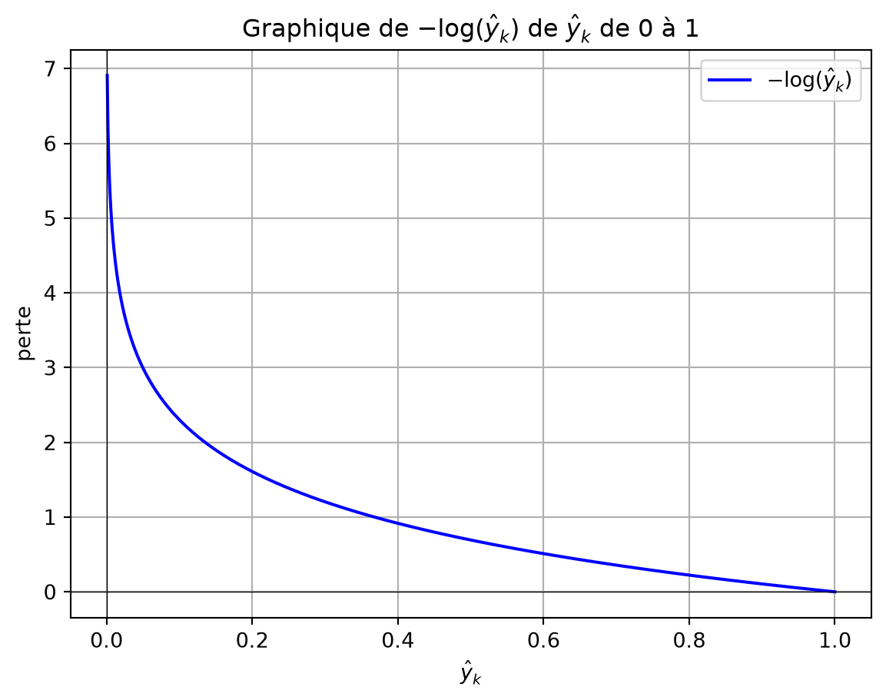

# Glossaire

Entropie croisée

Auteur·rice

Affiliations

Marcel Turcotte [](mailto:marcel.turcotte@uottawa.ca)

École de science informatique et de génie électrique

Université d’Ottawa

Date de publication

28 août 2025

L’entropie croisée (*cross-entropy*) mesure la différence entre une distribution de probabilités prédites et la distribution réelle, généralement représentée par des étiquettes encodées en « *one-hot* ». Elle quantifie la pénalité ou l’erreur de prédiction, couramment utilisée comme fonction de perte dans les tâches de classification, avec des valeurs plus faibles indiquant une meilleure performance du modèle.

L’équation de l’entropie croisée \\H(p, q)\\ est :

\\ H(p, q) = -\sum\_{k} p_k \log(q_k) \\

où :

- \\p_k\\ est la distribution de probabilités réelle (typiquement des étiquettes encodées en « *one-hot* »),
- \\q_k\\ est la distribution de probabilités prédites,
- la somme est effectuée sur toutes les classes \\k\\.

Dans la classification binaire, cela se simplifie en :

\\ H(y, \hat{y}) = -\[y \log(\hat{y}) + (1-y) \log(1-\hat{y})\] \\

où :

- \\y\\ est l’étiquette réelle (soit 0 soit 1),
- \\\hat{y}\\ est la probabilité prédite de la classe positive.

Lorsque \\y\\, l’étiquette réelle, est encodée en « *one-hot* » pour la classification multiclasses, elle représente la classe sous forme de vecteur où l’élément correspondant à la classe correcte est 1, et tous les autres éléments sont 0. Cet encodage permet à la perte d’entropie croisée de se concentrer uniquement sur la probabilité prédite pour la classe correcte, pénalisant le modèle en fonction de l’écart de la probabilité prédite à 1 pour la classe correcte.

Dans les réseaux de neurones, les valeurs de \\\hat{y}\_k\\ sont généralement obtenues en appliquant la fonction softmax aux sorties de la dernière couche.

Le programme Python ci-dessous montre comment la perte d’entropie croisée pour un exemple varie avec les changements de la probabilité prédite, représentée par \\-\log(\hat{y}\_k)\\, lorsque celle-ci s’écarte de 1 pour l’étiquette de classe réelle (\\y_k\\). Lorsque \\\hat{y}\_k\\ approche 1, la perte pour un seul exemple approche 0, indiquant aucune pénalité. Inversement, lorsque \\\hat{y}\_k\\ approche 0, la perte tend vers l’infini positif, imposant une pénalité substantielle pour l’attribution d’une faible probabilité à la classe correcte. Cette relation logarithmique garantit que la fonction de perte pénalise fortement les prédictions incorrectes, notamment lorsque la probabilité prédite pour la classe correcte est proche de zéro.

``` python
import numpy as np
import matplotlib.pyplot as plt

# Générer un tableau de valeurs p de juste au-dessus de 0 à 1
p_values = np.linspace(0.001, 1, 1000)

# Calculer le logarithme naturel de chaque valeur p
ln_p_values = - np.log(p_values)

# Tracer le graphique
plt.plot(p_values, ln_p_values, label=r'$-\log(\hat{y}_k)$', color='b')

# Ajouter des étiquettes et un titre
plt.xlabel(r'$\hat{y}_k$')
plt.ylabel(r'perte')
plt.title(r'Graphique de $-\log(\hat{y}_k)$ de $\hat{y}_k$ de 0 à 1')
plt.grid(True)
plt.axhline(0, color='black', lw=0.5) # Ajouter une ligne horizontale à y=0
plt.axvline(0, color='black', lw=0.5) # Ajouter une ligne verticale à x=0

# Afficher le graphique
plt.legend()
plt.show()
```

[](cross-entropy_files/figure-html/cell-2-output-1.png)

Considérons un problème de classification multiclasses avec trois classes \\(C_1, C_2, C_3)\\. Supposons que la classe réelle de l’exemple donné soit \\C_2\\, et que le modèle produise les probabilités prédites suivantes :

\\ \hat{y} = \[0.2, 0.7, 0.1\] \\

L’étiquette réelle encodée en « *one-hot* » \\{y}\\ pour \\C_2\\ est :

\\ {y} = \[0, 1, 0\] \\

En utilisant la formule de l’entropie croisée :

\\ H({y}, \hat{y}) = -\sum\_{k} y_k \log(\hat{y}\_k) \\

En substituant les valeurs :

\\ H({y}, \hat{y}) = -\[0 \cdot \log(0.2) + 1 \cdot \log(0.7) + 0 \cdot \log(0.1)\] \\

Puisque seul le terme correspondant à la classe réelle (deuxième classe) est non nul, le calcul se simplifie en :

\\ H({y}, \hat{y}) = -\log(0.7) \\

Ce qui donne :

\\ H({y}, \hat{y}) \approx -(-0.357) = 0.357 \\

Ainsi, la perte d’entropie croisée pour cet exemple est d’environ 0.357, indiquant la pénalité pour l’écart du modèle par rapport à la probabilité de la classe correcte.

Lors du calcul de la perte moyenne d’entropie croisée sur un ensemble de données avec plusieurs exemples, la fonction de perte est sommée sur tous les exemples puis divisée par le nombre d’exemples pour obtenir la perte moyenne. L’équation pour la perte moyenne d’entropie croisée est :

\\ L = -\frac{1}{N} \sum\_{i=1}^{N} \sum\_{k=1}^{K} y\_{i,k} \log(\hat{y}\_{i,k}) \\

où :

- \\N\\ est le nombre total d’exemples dans l’ensemble de données,
- \\K\\ est le nombre de classes,
- \\y\_{i,k}\\ est l’indicateur binaire réel (0 ou 1) pour savoir si le \\i\\-ème exemple appartient à la classe \\k\\,
- \\\hat{y}\_{i,k}\\ est la probabilité prédite que le \\i\\-ème exemple appartienne à la classe \\k\\.

Cette formulation calcule la perte moyenne sur tous les exemples, fournissant une valeur scalaire unique qui représente la performance du modèle sur l’ensemble du jeu de données.
