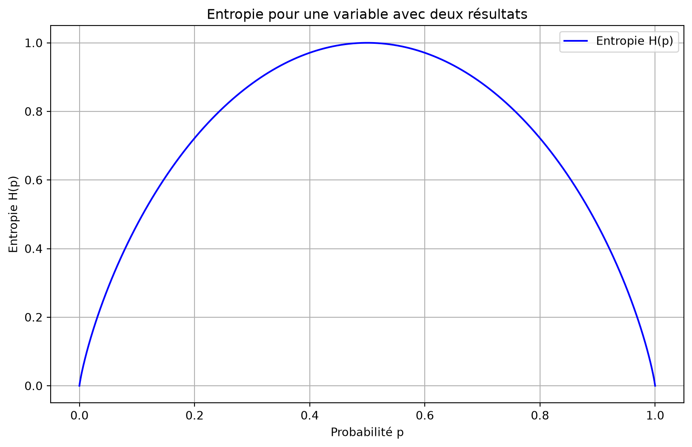

# Glossaire

Entropie

Auteur·rice

Affiliations

Marcel Turcotte [](mailto:marcel.turcotte@uottawa.ca)

École de science informatique et de génie électrique

Université d’Ottawa

Date de publication

28 août 2025

L’entropie en théorie de l’information quantifie l’incertitude ou l’imprévisibilité des résultats possibles d’une variable aléatoire. Elle mesure la quantité moyenne d’information produite par une source de données stochastique et est généralement exprimée en bits pour les systèmes binaires. L’entropie \\H\\ d’une variable aléatoire discrète \\X\\ avec des résultats possibles \\\\x_1, x_2, \ldots, x_n\\\\ et une fonction de masse de probabilité \\P(X)\\ est donnée par :

\\ H(X) = -\sum\_{i=1}^n P(x_i) \log_2 P(x_i) \\

L’entropie est maximisée lorsque tous les résultats sont également probables, auquel cas elle est égale au logarithme du nombre de résultats :

\\ H\_{\text{max}} = \log_2(n) \\

Utiliser la base logarithmique 2 est courant car cela mesure l’entropie en bits, ce qui est en accord avec les systèmes binaires et le traitement de l’information numérique. Une entropie élevée indique plus de hasard et moins de prévisibilité, tandis qu’une entropie faible suggère plus de prévisibilité et moins de contenu informatif.

Voici un programme Python qui visualise l’entropie d’une seule variable avec deux résultats. Le programme utilise Matplotlib pour tracer l’entropie en fonction de la probabilité de l’un des résultats (puisque la probabilité de l’autre résultat est simplement 1 moins la probabilité du premier résultat).

L’entropie \\H(p)\\ pour une variable binaire (avec des résultats 0 et 1) est donnée par :

\\ H(p) = -p \log_2(p) - (1 - p) \log_2(1 - p) \\

où \\p\\ est la probabilité de l’un des résultats, et \\1 - p\\ est la probabilité de l’autre résultat.

Voici le programme Python :

``` python
import numpy as np
import matplotlib.pyplot as plt

# Fonction pour calculer l'entropie
def entropy(p):
    if p == 0 or p == 1:
        return 0
    return -p * np.log2(p) - (1 - p) * np.log2(1 - p)

# Générer des probabilités de 0 à 1
probabilities = np.linspace(0, 1, 1000)

# Calculer l'entropie pour chaque probabilité
entropies = [entropy(p) for p in probabilities]

# Tracer les résultats
plt.figure(figsize=(10, 6))
plt.plot(probabilities, entropies, label='Entropie H(p)', color='blue')
plt.title('Entropie pour une variable avec deux résultats')
plt.xlabel('Probabilité p')
plt.ylabel('Entropie H(p)')
plt.grid(True)
plt.legend()
plt.show()
```

[](entropy_files/figure-html/cell-2-output-1.png)

## Explication :

1.  **Fonction d’Entropie** : La fonction `entropy` calcule l’entropie pour une probabilité donnée \\p\\. Elle gère les cas particuliers où \\p\\ est 0 ou 1, renvoyant 0 pour ces cas puisque l’entropie est nulle lorsqu’il n’y a pas d’incertitude (surprise).

2.  **Plage de Probabilités** : Le tableau `probabilities` contient 1000 valeurs également espacées entre 0 et 1.

3.  **Calcul des Entropies** : La liste `entropies` stocke les valeurs d’entropie calculées pour chaque probabilité dans le tableau `probabilities`.

4.  **Traçage** : Le programme utilise Matplotlib pour tracer l’entropie \\H(p)\\ en fonction de la probabilité \\p\\. Le tracé comprend des étiquettes, un titre, une grille pour une meilleure lisibilité et une légende.

Cette visualisation illustre la relation entre l’entropie et la probabilité d’un résultat dans une variable binaire. Lorsque les deux résultats sont également probables (\\p = 0.5\\), l’entropie atteint sa valeur maximale de 1,0 bit. À l’inverse, lorsque la probabilité d’un résultat approche 0 ou 1, l’entropie diminue jusqu’à 0. Cela démontre que l’incertitude maximale se produit avec des probabilités égales, tandis que la certitude (ou prévisibilité) apparaît lorsqu’un résultat domine.
