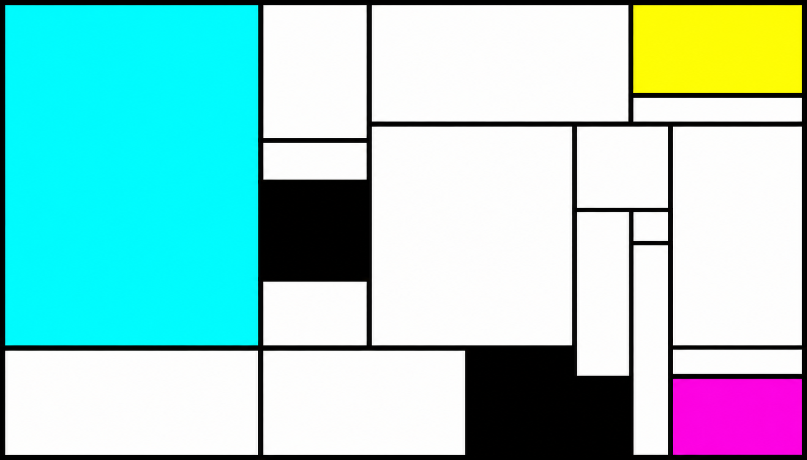

# CSI 4506: Introduction à l’intelligence artificielle

Auteur·rice

Marcel Turcotte

Date de publication

9 août 2026

# Description

Concepts et méthodes de base de l’intelligence artificielle. Connaissances et représentation des connaissances. Recherche, recherche stratégique, jeux de stratégie. Raisonnement et déduction. Incertitude en intelligence artificielle. Introduction au traitement du langage naturel. Éléments de base de la planification. Éléments de base de l’apprentissage automatique.

 - Composition avec cyan, magenta et jaune (2026)")

**Piet Mondrian (série contemporaine) - Composition avec cyan, magenta et jaune (2026)**

Créé avec DALL·E 3 le 2026-08-07 à l’aide de l’invite suivante : Créez une image panoramique en orientation paysage (1792x1024 pixels) d’une peinture géométrique abstraite inspirée du style De Stijl de Piet Mondrian. La composition doit utiliser un fond blanc avec une grille de lignes noires épaisses, horizontales et verticales, formant des rectangles et des carrés de tailles différentes. La philosophie du néoplasticisme de Piet Mondrian cherchait une vérité universelle en réduisant le langage visuel à ses éléments les plus purs et irréductibles. Si Mondrian travaillait en 2026, sa quête de fondements absolus le conduirait probablement à adopter de véritables couleurs primaires soustractives scientifiques. Remplissez certaines sections de cyan, de magenta et de jaune, tout en en laissant d’autres blanches ou légèrement ombrées. L’agencement doit paraître équilibré tout en demeurant asymétrique, en mettant l’accent sur la clarté, la structure et la simplicité, sans courbes ni dégradés. Incluez une grande zone cyan dominant le côté gauche, une plus petite zone jaune en haut à droite, un petit rectangle magenta en bas à droite, ainsi que des blocs noirs pour donner du poids visuel.

[Composition avec rouge, bleu et jaune (1930)](https://collection.kunsthaus.ch/en/collection/item/2455/) de [Piet Mondrian](https://www.moma.org/artists/4057-piet-mondrian) illustre comment les contraintes orientent la recherche ou l’optimisation en intelligence artificielle (p. ex., la régularisation dans les réseaux profonds, les problèmes de satisfaction de contraintes).
