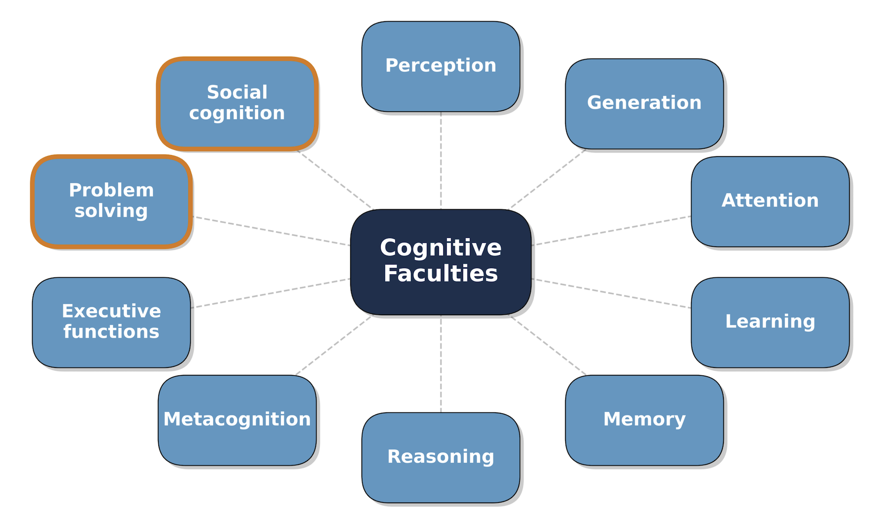

# Bienvenue à CSI 4506!

CSI 4506 - automne 2026

Auteur·rice

Marcel Turcotte

Date de publication

Version: sept. 9, 2026 10h55

# Préambule

## Message du jour (MOTD)

[](https://www.uottawa.ca/about-us/sites/g/files/bhrskd336/files/2026-05/Joelle%20Pineau.jpg)

**Joëlle Pineau — une dirigeante de l’IA originaire d’Ottawa**

- 2026-08 – [TIME100 AI 2026](https://time.com/collection/time100-ai/2026/joelle-pineau/)
- 2026-06 – [Doctorat honorifique de l’Université d’Ottawa](https://www.uottawa.ca/notre-universite/rectrice/doctorats-honorifiques/joelle-pineau)
- 2025-08 – Directrice de l’IA, [Cohere](https://cohere.com)
- 2023-2025 – Vice-présidente, recherche en IA, Meta
- 2017–2023 – A dirigé Facebook AI Research (FAIR), Montréal
- 2004-08 – [Professeure](https://www.cs.mcgill.ca/~jpineau/), Université McGill

[Cohere raises US\$500-million, hires former Meta AI expert Joelle Pineau](https://www.theglobeandmail.com/business/article-cohere-fundraising-former-meta-executive-joelle-pineau-ai/), Joe Castaldo, The Globe and Mail, 2025-08-14.

[Joëlle Pineau](https://www.uottawa.ca/about-us/president/honorary-doctorates/joelle-pineau) est une chercheuse canadienne en IA née à Ottawa. Femme devenue une chef de file internationale en IA, elle offre aux étudiantes et étudiants un exemple local des personnes qui façonnent ce domaine. Elle est directrice de l’IA chez Cohere, professeure à l’Université McGill et membre académique principal de [Mila](https://mila.quebec/en). Auparavant, elle a dirigé l’équipe Fundamental AI Research (FAIR) de Meta à titre de vice-présidente de la recherche en IA.

Ses travaux portent sur l’apprentissage par renforcement et la robotique : comment une machine peut-elle apprendre à prendre des décisions par interaction avec son environnement? Les applications comprennent les soins de santé et les robots d’assistance. Elle défend également la reproductibilité : la communication des méthodes, du code et des détails expérimentaux afin que d’autres puissent vérifier et prolonger les résultats de recherche. Ces liens sont utiles pour les algorithmes et les pratiques expérimentales que nous étudierons dans ce cours.

Elle a reçu un doctorat honorifique de l’Université d’Ottawa lors de la collation des grades de juin 2026, en reconnaissance de ses contributions à la recherche en IA et à la science ouverte et responsable. Elle a également été nommée au TIME100 AI en août 2026.

[Cohere](https://cohere.com) est une entreprise canadienne d’IA qui développe des modèles de langage, des outils de recherche et des assistants d’IA pour les entreprises et les organismes du secteur public. Parmi ses produits figurent les modèles de langage Command et North, une plateforme d’IA en milieu de travail. Par exemple, une organisation peut utiliser ces outils pour rechercher dans ses documents internes et y répondre à des questions. Cohere met l’accent sur la confidentialité, la sécurité et des options de déploiement qui permettent aux organisations de conserver le contrôle de leurs données et de leur infrastructure. L’entreprise a récemment acquis la société allemande Aleph Alpha afin d’accélérer son expansion européenne dans le domaine des services-conseils en intelligence artificielle, dans le cadre d’une opération stratégique soutenue par un investissement de 800 millions de dollars ([Cohere s’étend en Allemagne](https://www.lapresse.ca/affaires/entreprises/2026-04-24/intelligence-artificielle/cohere-s-etend-en-allemagne.php)).

Les cofondateurs de Cohere sont Aidan Gomez, Nick Frosst et Ivan Zhang. Gomez est co-auteur de l’article de 2017 « [Attention Is All You Need](https://arxiv.org/abs/1706.03762) », qui a introduit l’architecture Transformer à l’origine de nombreux modèles de langage modernes.

Sources : [biographie de l’Université d’Ottawa](https://www.uottawa.ca/about-us/president/honorary-doctorates/joelle-pineau), [récipiendaires des doctorats honorifiques de 2026](https://www.uottawa.ca/about-us/president/honorary-doctorates), [profil de recherche du CRSNG](https://nserc-crsng.canada.ca/en/profile/joelle-pineau), [liste de vérification de reproductibilité de McGill](https://www.cs.mcgill.ca/~jpineau/), et [profil sur le lieu de naissance à Ottawa](https://www.lepoint.fr/technologie/intelligence-artificielle-il-faut-distinguer-ce-qui-est-possible-de-l-affabulation-01-11-2019-2344768_58.php).

- [Le gouvernement fédéral fait appel à Cohere pour travailler sur l’utilisation de l’IA dans la fonction publique](https://www.cbc.ca/news/politics/cohere-ai-public-service-1.7613424), Anja Karadeglija, The Canadian Press, 2025-08-20.

- [Cérémonie 13 - Faculté de génie](https://www.youtube.com/live/DkNm-T9kpyc?si=AnwtNVWhbYtns3iV&t=5004) : regardez l’allocution de collation des grades de Joëlle Pineau du 12 juin 2026 (commence à 1 h 23 min 24 s).

------------------------------------------------------------------------

# An error occurred.

Unable to execute JavaScript.

La présentation comprend quatre vidéos, mais nous n’en visionnerons qu’une seule. Ces vidéos ont été choisies pour leur aspect science-fiction et leur utilisation de l’IA générative.

L’approche de Figure se distingue nettement des méthodes antérieures. Ces dernières reposaient souvent sur des modules séparés pour résoudre différents problèmes. Par exemple, un robot utilisait un algorithme de planification pour trouver un chemin optimal, et le raisonnement était fortement scripté («on rails»), limitant ainsi les tâches et les capacités d’apprentissage.

Nous voyons ici une approche de bout en bout basée sur des réseaux de neurones. L’apprentissage profond vise à produire des systèmes flexibles, généraux et capables d’apprendre. Inspiré par les grands modèles de langage (LLMs), nous observons maintenant le développement de grands modèles d’actions (LAMs).

Les vidéos sur les nouveaux modèles de Google DeepMind sont tout aussi impressionnantes.

Comment vous sentez-vous face à ces développements?

Quelle est votre vidéo d’IA préférée ? Partager l’information dans le forum général sur Brightspace ou me l’envoyer par courriel.

------------------------------------------------------------------------

# An error occurred.

Unable to execute JavaScript.

------------------------------------------------------------------------

# An error occurred.

Unable to execute JavaScript.

------------------------------------------------------------------------

# An error occurred.

Unable to execute JavaScript.

## Objectifs d’apprentissage

- **Clarifier** la proposition
- **Discuter** le plan de cours
- **Articuler** les attentes
- **Explorer** les différentes définitions de “l’intelligence artificielle”

Il est probable que notre premier cours se termine assez tôt, ce qui nous laissera du temps pour discuter après la présentation, si vous le souhaitez.

Je souhaite clarifier ma proposition. J’ai opté pour une approche spécifique pour introduire les concepts et je souhaite expliquer les raisons de ce choix.

Après vous avoir présenté le plan de cours et les attentes, nous discuterons des différentes définitions de l’intelligence articificielle.

# Proposition

## Aperçu du cours

> **NOTE:**
>
> Concepts et méthodes de base de l’intelligence artificielle. Connaissances et représentation des connaissances. Recherche, recherche stratégique, jeux de stratégie. Raisonnement et déduction. Incertitude en intelligence artificielle. Introduction au traitement du langage naturel. Éléments de base de la planification. Éléments de base de l’apprentissage automatique.

Voici la description officielle du cours. À la fin de cette présentation, vous trouverez le code Python que j’ai utilisé afin de produire cet extrait sonore.

Cette description de cours date de plusieurs années, plaçant l’apprentissage automatique à la fin de l’énumération.

## Buts: Apprentissage profond tôt

> **NOTE:**
>
> Pour la communauté plus large de l’informatique et des technologies de l’information, **l’IA** est généralement **identifiée par les techniques qui en ont émergé**, lesquelles, à **différentes époques**, peuvent inclure la **démonstration de théorèmes**, la **recherche heuristique**, les **jeux**, les **systèmes experts**, les **réseaux neuronaux**, les **réseaux bayésiens**, le **fouille de données**, les **agents**, et récemment, **l’apprentissage profond**.

- **L’apprentissage profond** est tellement dominant que j’ai choisi de structurer tout autour de celui-ci.

## Qu’est-ce que cela signifie?

**La bonne vieille IA de style classique** (**GOFAI**) reposait sur **l’ingénierie des connaissances faite à la main**, mais elle a été largement remplacée par **l’apprentissage automatique** en raison de la disponibilité accrue des données, des ressources informatiques et des nouveaux algorithmes.

. . .

**L’apprentissage profond** a eu un impact significatif sur divers domaines, notamment le traitement du langage naturel, la robotique et la vision par ordinateur.

. . .

Cependant, l’apprentissage profond présente actuellement des **limites**, notamment en matière de **raisonnement**, où l’IA symbolique excelle et pourrait potentiellement offrir des perspectives précieuses.

## Mais aussi

[](https://m.media-amazon.com/images/I/81xA5147ATL._AC_UF1000,1000_QL80_.jpg)

- Dans **[A Brief History of Intelligence](https://www.abriefhistoryofintelligence.com/book)** ([Bennett 2023](#ref-Bennett:2023aa)), Max Bennett discute des **étapes importantes de l’évolution de l’intelligence humaine** et établit des parallèles avec les progrès de l’intelligence artificielle (IA).
- L’apprentissage lui-même représente l’une des premières étapes et la plus largement comprise dans l’évolution de l’intelligence.

Curieusement, le développement de l’IA a été largement influencé par des approches logiques (IA symbolique). Le développement de l’IA a été fortement marqué par des courants intellectuels ancrés dans la philosophie et les mathématiques, plutôt que dans la biologie et son évolution. Les raisonnements en philosophie et en mathématiques reposent sur des fonctions cognitives complexes, peut-être moins bien comprises et ayant évolué plus tardivement.

L’apprentissage lui-même représente l’une des premières étapes et la plus largement comprise dans l’évolution de l’intelligence.

Il aurait été logique d’aborder l’étude de l’intelligence en progressant des formes les plus simples aux formes les plus complexes.

## Buts: Appliqué

> **NOTE:**
>
> De nombreux développeurs de logiciels craignent que les **grands modèles de langage** ne rendent **les programmeurs humains obsolètes.** Nous doutons que l’IA remplace les programmeurs, mais nous croyons que **les programmeurs qui utilisent l’IA remplaceront ceux qui ne le font pas**.
>
> (traduction GPT-4o)

- Chaque fois que possible, les concepts seront introduits avec du code.

## Buts: Appliqué

> **NOTE:**
>
> Ce que je ne peux pas construire. Je ne comprends pas.

## Philosophie et attentes du cours

- **Théorie** vers la **pratique**
- La nécessité du **code** et des **mathématiques**
  - **Remarque :** le code de visualisation des données est exempté des examens.
- **Engagement** **actif**
- La valeur de l’**investigation**

**Philosophie et attentes du cours**

- **Théorie vers la pratique :** Afin de bâtir une compréhension rigoureuse des concepts fondamentaux, nous mettrons en œuvre les principaux algorithmes à partir de zéro. Par exemple, vous construirez une régression logistique pour maîtriser la descente de gradient et implémenterez la rétropropagation pour comprendre les mécanismes de l’apprentissage profond. Parallèlement, nous exploiterons des bibliothèques standard de l’industrie, telles que **scikit-learn**, **Keras** et **TensorFlow**, afin de traiter des problèmes complexes du monde réel.
- **La nécessité du code et des mathématiques :** Une compréhension approfondie de l’intelligence artificielle exige un engagement actif à la fois envers les mathématiques sous-jacentes et les implémentations en Python. Négliger ces éléments fondamentaux laissera d’importantes lacunes dans vos connaissances. L’expérience révèle une tendance claire : les étudiants qui lisent, écrivent et exécutent activement du code acquièrent une compréhension supérieure et durable de la matière.
  - **Remarque :** Bien que la compréhension du code algorithmique fondamental soit essentielle, le code de visualisation des données est fourni strictement à des fins pédagogiques et est exempté des examens.
- **Engagement actif** : La maîtrise résulte de la combinaison d’une conception structurée du cours et de votre travail rigoureux. Il est attendu que vous révisiez en profondeur l’ensemble du matériel, exécutiez les exemples computationnels fournis, assistiez aux cours et participiez activement.
- **La valeur de l’investigation :** Un grand groupe apporte une diversité de perspectives qui enrichit l’environnement académique. Apportez vos questions en classe ; vos commentaires sont continuellement intégrés aux notes de cours et influencent fréquemment l’élaboration des questions d’examen.
- **Résultats futurs :** Cette double approche, fondée sur les bases théoriques et l’application pratique, a fait ses preuves. Les diplômés rapportent constamment que cette méthodologie les a efficacement préparés tant à des carrières dans l’industrie qu’à des recherches avancées aux cycles supérieurs.

## Sites Web

- [turcotte.xyz/teaching/csi-4506](https://turcotte.xyz/teaching/csi-4506)
  - [Horaire](https://turcotte.xyz/teaching/csi-4506/course-schedule.html)
  - [Plan de cours](https://turcotte.xyz/teaching/csi-4506/course-syllabus.html)
  - miroir : [turcotte.github.io/csi-4506](https://turcotte.github.io/csi-4506/)
- [uottawa.brightspace.ca](https://uottawa.brightspace.ca)

Les renseignements sur le cours sont fournis sur deux sites web : Brightspace et mon site personnel. Le site personnel comprend le plan de cours, les notes de cours (diapositives), des liens utiles et une FAQ. Afin d’assurer une disponibilité continue, ce même contenu est reproduit sur `github.io` à l’adresse [turcotte.github.io/csi-4106](https://turcotte.github.io/csi-4106). Brightspace est utilisé pour la remise des travaux et la participation aux groupes de discussion.

## Testeurs bêta

Ce sera ma troisième itération de ce contenu. Votre aide pour identifier ce qui fonctionne et ce qui ne fonctionne pas sera très appréciée.

## Avertissements

CSI 4506 est un cours d’introduction à l’intelligence artificielle, offrant un aperçu bref de divers sujets dans ce domaine vaste. **Chaque sujet couvert pourrait être exploré beaucoup plus en profondeur à travers un ou plusieurs cours de niveau supérieur.** L’objectif principal de CSI 4506 est de fournir aux étudiants une compréhension de base des principaux domaines qui constituent l’intelligence artificielle.

. . .

Les chevauchements avec d’autres cours sont inévitables, mais je ferai de mon mieux pour les minimiser.

. . .

Ce cours n’est pas un cours sur l’impact de l’IA sur la société, y compris les questions d’éthique, d’équité, de confiance et de sécurité.

Cet avertissement est en réalité pour moi. Ce sont des sujets qui me passionnent, et j’aimerais vous transmettre tout ce que je sais. Cependant, cela n’est évidemment pas possible. De manière générale, je vais essayer de me concentrer sur un petit nombre d’approches pour bien comprendre les sujets, plutôt que d’adopter une approche exhaustive.

# Préparer le terrain : IA, apprentissage profond et vues divergentes sur l’intelligence.

## AI, ML, DL

[](https://upload.wikimedia.org/wikipedia/commons/3/34/Unraveling_AI_Complexity_-_A_Comparative_View_of_AI%2C_Machine_Learning%2C_Deep_Learning%2C_and_Generative_AI.png)

**Attribution:** Lily Popova Zhuhadar, [CC BY-SA 4.0](https://creativecommons.org/licenses/by-sa/4.0), via Wikimedia Commons, 2026-09-08.

L’apprentissage profond est tellement répandu aujourd’hui que certaines personnes pourraient le confondre avec l’intelligence artificielle. Comme le montre la figure, l’apprentissage profond (deep learning) est l’une des nombreuses techniques utilisées dans l’apprentissage automatique (machine learning). L’apprentissage automatique, à son tour, est l’une des plusieurs disciplines au sein de l’intelligence artificielle. D’autres disciplines de l’IA incluent la représentation des connaissances, le raisonnement et la planification, le traitement du langage naturel, la vision par ordinateur et la robotique.

D’ici la fin de la session, cette distinction devrait être bien évidente.

## Écoles de pensée

- **IA symbolique** (essentiellement basée sur la logique)
- **Connexionnisme** (principalement des réseaux de neurones)

Longtemps considérées comme mutuellement exclusives

Au début de ce cours, il est important de reconnaître qu’il existe deux grandes écoles de pensée en IA : **l’IA symbolique** et **le connexionnisme**. Initialement, l’approche symbolique était dominante dans le domaine de l’IA, mais aujourd’hui, l’approche connexionniste prévaut.

Toute tentative d’imposer une taxonomie rigide à des concepts complexes risque d’occulter autant qu’elle révèle. Dans *The Master Algorithm: How the Quest for the Ultimate Learning Machine Will Remake Our World* ([Domingos 2018](#ref-Domingos:2018aa)), Pedro Domingos identifie cinq « tribus » de l’apprentissage automatique : les symbolistes, les connexionnistes, les évolutionnistes, les bayésiens et les analogistes. Inévitablement, certains concepts et algorithmes ne s’inscrivent pas aisément dans une seule catégorie. De plus, certaines approches sont délibérément conçues comme des méthodes hybrides.

## Tours de Hanoï

(pour information uniquement)

# An error occurred.

Unable to execute JavaScript.

**Voir aussi:** Binary, Hanoi and Sierpinski, [Partie 1](https://www.youtube.com/watch?v=2SUvWfNJSsM) et [Partie 2](https://www.youtube.com/watch?v=bdMfjfT0lKk), de [3Blue1Brown](https://www.youtube.com/@3blue1brown).

## IA symbolique (Planification)

## Problème

Les **Tours de Hanoï** est un jeu avec **trois piquets** et **plusieurs disques de tailles différentes**. Il **commence** avec tous les **disques empilés par ordre décroissant sur un piquet**, et l’**objectif est de déplacer la pile entière sur un autre piquet**, en respectant ces règles.

1.  **Un seul disque** peut être déplacé à la fois.
2.  Un disque ne peut être placé **que sur un disque plus grand** ou **sur un piquet vide**.

## Codage

``` prolog
Action Move(X,Y,Z):
    Preconditions = {Clear(X), On(X,Y), Clear(Z), Smaller(X,Z)};
    Effects = {-On(X,Y), Clear(Y), On(X,Z), -Clear(Z)};
```

## Départ

`D1, D2, D3, P1, P2, P3` sont des symboles, où `D1`, `D2`, et `D3` sont des disques, et `P1`, `P2`, et `P3` sont des piquets.

``` prolog
On(D1, D2), On(D2, D3), On(D3, P1),
Clear(D1), Clear(P2), Clear(P3),
Smaller(D1, D2), Smaller(D1, D3), Smaller(D2, D3),
Smaller(D1, P1), Smaller(D1, P2), Smaller(D1, P3),
Smaller(D2, P1), Smaller(D2, P2), Smaller(D2, P3),
Smaller(D3, P1), Smaller(D3, P2), Smaller(D3, P3).
```

## Objectif

``` prolog
On(D1, D2), On(D2, D3), On(D3, P3).
```

## Solution

``` prolog
Move(D1, D2, P3)
Move(D2, D3, P2)
Move(D1, P3, D2)
Move(D3, P1, P3)
Move(D1, D2, P1)
Move(D2, P2, D3)
Move(D1, P1, D2)
```

Afin de compléter le code, il convient de préciser qu’un piquet est considéré comme plus large que l’ensemble des disques.mak

**STRIPS (Stanford Research Institute Problem Solver, 1971)** est un **système de planification en IA classique** qui représente les problèmes en termes de :

- **États** : ensembles de prédicats logiques décrivant le monde.
- **Opérateurs (Actions)** : définis par
  - *Préconditions* : prédicats qui doivent être vérifiés pour appliquer l’action,
  - *Liste d’ajout* : prédicats rendus vrais après exécution,
  - *Liste de suppression* : prédicats rendus faux après exécution.
- **But** : un ensemble de prédicats à atteindre.

Un plan est trouvé en appliquant des actions pour transformer l’état initial en un état but, en mettant à jour le monde via les listes d’ajout/suppression.

Ces méthodes seront examinées de manière approfondie à partir du cours 16, consacré aux méthodes de recherche.

## IA Symbolique (Parenté)

## Problème

Étant donné quelques **faits** concernant qui est parent de qui (**symboles**) et une poignée de **règles en forme de Horn**, déduisez de nouvelles relations (par exemple, **ancêtre**, **frères et sœurs**, **grand-parent**) par *déduction logique*.

## Règles

``` prolog
father(F,C) :- male(F), parent(F,C).

mother(M,C) :- female(M), parent(M,C).

sibling(X,Y) :- parent(P,X), parent(P,Y), X \= Y.

grandparent(G,C) :- parent(G,P), parent(P,C).

ancestor(A,D) :- parent(A,D).
ancestor(A,D) :- parent(A,X), ancestor(X,D).
```

## Faits

``` prolog
% faits/symboles

male(alan). female(brenda).
male(chris). female(dina).
male(eli). female(fiona).

parent(alan, chris).
parent(brenda, chris).
parent(chris, dina).
parent(dina, eli).
parent(dina, fiona).
```

## Requête

``` prolog
?- grandparent(G, dina).
% Attendu : G = alan ; G = brenda.

?- ancestor(A, fiona).
% Attendu : A = dina ; A = alan ; A = brenda ; A = chris ;

?- sibling(eli, fiona).
% Attendu : vrai.
```

L’exemple précédent démontre l’application de la programmation logique, spécifiquement Prolog, pour articuler les relations entre les entités.

- **Séparation claire** des connaissances (faits) et du raisonnement (règles).
- **Explications** : les arbres de preuve de Prolog rendent les déductions inspectables.
- **Récursion** illustre la puissance expressive (par exemple, ancestor/2).

## IA Symbolique (Prérequis)

## Problème

Étant donné les **prérequis des cours** et l’ensemble **complété** d’un étudiant, déduire quels cours ils **peuvent suivre ensuite**. Cela montre le *raisonnement par contraintes symboliques*.

## Règles

``` prolog
all_prereqs_met(Etudiant, Cours) :-
    \+ (prereq(Cours, P), \+ completed(Etudiant, P)).
    
can_take(Etudiant, Cours) :-
    all_prereqs_met(Etudiant, Cours),
    \+ completed(Etudiant, Cours).
```

## Cours

``` prolog
% --- Graphe des cours (faits, symboles) ---

prereq(csi2120, csi2110).
prereq(csi2110, iti1121).
prereq(csi2110, mat1338).
prereq(iti1121, iti1120).
```

## Étudiants

``` prolog
% --- Dossier étudiant (faits, symboles) ---

completed(alex, iti1121).
completed(alex, iti1120).
completed(alex, mat1338).
```

## Requête

``` prolog
?- can_take(alex, csi2110).
% true

?- can_take(alex, csi2120).
% false

?- can_take(alex, iti1121).
% false

?- all_prereqs_met(alex, csi2110).
% true
```

Un autre exemple utilisant la programmation logique (Prolog).

- Montre **la satisfaction des contraintes** et **la négation dans le monde clos**.
- Facile à étendre avec des cours optionnels, co-requis ou anti-requis.
- Produit des **recommandations auditables** (pourquoi/pourquoi pas).

La négation par échec, qui est représentée par `\+` (antislash-plus), en Prolog.

- `\+ Goal` réussit si `Goal` ne peut pas être prouvé.
- Sémantique : **hypothèse du monde clos** — si ce n’est pas dans la base de connaissances, nous supposons que c’est faux.

La règle

``` prolog
all_prereqs_met(Étudiant, Cours) :-
    \+ (prereq(Cours, P), \+ completed(Étudiant, P)).
```

se lit comme suit :

> “`all_prereqs_met(Etudiant, Cours)` est vrai **s’il n’existe pas** un prérequis `P` pour `Cours` tel que `Etudiant` n’a pas complété `P`.”

Ou, plus naturellement :

> “Un étudiant a satisfait tous les prérequis pour un cours lorsque chaque cours qui est listé comme prérequis a déjà été complété par cet étudiant.”

## IA symbolique

- “Leur principe fondateur était que **la connaissance** peut être représentée par un **ensemble de règles**, et les programmes informatiques peuvent utiliser **la logique** pour manipuler cette connaissance.” ([Strickland 2021](#ref-Strickland:2021aa))
- “Les chercheurs développant l’IA symbolique ont entrepris d’**enseigner explicitement aux ordinateurs** le monde.” ([Strickland 2021](#ref-Strickland:2021aa))
- “(\\\ldots\\) un **système de symboles** a les **moyens nécessaires** et **suffisants** pour **une action intelligente générale**.”\
  ([Newell et Herbert A. Simon 1976b](#ref-Newell:1976aa))

Notez l’importance du mot « explicitement » dans cet énoncé. Il ne s’agit pas de fournir des exemples à l’ordinateur, mais bien de décrire les connaissances humaines à l’aide de la logique.

Les chercheurs de l’époque étaient convaincus que l’approche symbolique est la clé du succès.

## IA symbolique

- Qu’est-ce qui, selon vous, rendait l’**IA symbolique** **difficile** en pratique ?

Les principaux défis de l’IA symbolique sont généralement formulés comme suit :

- **Goulot d’étranglement de l’acquisition des connaissances**
  - Il est difficile d’encoder manuellement tous les faits, règles et exceptions dont un système a besoin ([Feigenbaum 1977](#ref-Feigenbaum:1977aa)).
- **Fragilité**
  - Les systèmes symboliques fonctionnent souvent bien uniquement dans des domaines étroitement définis et échouent lorsque les conditions changent ou que les entrées sont bruitées/ambiguës ([Lenat et Guha 1989](#ref-Lenat:1989aa))
- **Explosion combinatoire**
  - La recherche et l’inférence peuvent devenir intractables à mesure que le nombre de symboles et de règles augmente ([Lighthill 1973](#ref-Lighthill:1973aa)).
- **Gestion de l’incertitude**
  - L’IA symbolique classique n’est pas naturellement adaptée aux informations probabilistes, incomplètes ou vagues ([Pearl 1988](#ref-Pearl:1988aa)).
- **Perception et ancrage**
  - Les symboles peuvent être détachés du monde physique ou des données sensorielles, ce qui rend difficile la mise en relation des représentations abstraites avec le sens dans le monde réel ([Harnad 1990](#ref-Harnad:1990aa)).
- **Raisonnement de sens commun**
  - Les humains s’appuient sur de vastes quantités de connaissances implicites de sens commun qu’il est difficile de formaliser explicitement ([McCarthy et Hayes 1969](#ref-McCarthy:1969aa)).
- **Apprentissage à partir des données**
  - Les systèmes purement symboliques n’apprennent généralement pas de manière aussi flexible à partir d’exemples que les approches modernes fondées sur les données ([Rumelhart et al. 1986](#ref-Rumelhart:1986ab)).
- **Sensibilité au contexte**
  - La compréhension humaine dépend fortement du contexte, mais les règles symboliques sont souvent trop rigides pour le capturer ([Dreyfus 1972](#ref-Dreyfus:1972aa)).

Cependant, les chercheurs de l’époque étaient convaincus que l’approche symbolique était la clé du succès ([Newell et Herbert A. Simon 1976a](#ref-Newell:1976ab)).

## Connexionniste

Inspirés par la biologie, les **réseaux de neurones artificiels** (ANNs) sont des modèles computationnels conçus pour **imiter le réseau de neurones du cerveau humain**. Ils sont constitués de couches de **nœuds interconnectés (neurones)**, chaque **connexion** ayant un **poids** associé.

. . .

Les ANNs traitent les données d’entrée à travers ces connexions pondérées, et l’**apprentissage** se produit en **ajustant les poids** en fonction des **erreurs** dans les **données d’entraînement**.

**Voir:** [playground.tensorflow.org](https://playground.tensorflow.org)

Le terme “connexionnistes” vient de l’idée que les nœuds dans ces modèles sont interconnectés. Au lieu d’être explicitement programmés, ces modèles apprennent leur comportement par l’entraînement.

L’apprentissage profond est une approche connexioniste.

## Connexionniste

[](https://raw.githubusercontent.com/alexlenail/NN-SVG/master/example.svg)

**Attribution**: LeNail, (2019). NN-SVG: Publication-Ready Neural Network Architecture Schematics. Journal of Open Source Software, 4(33), 747, https://doi.org/10.21105/joss.00747 ([GitHub](https://github.com/alexlenail/NN-SVG))

# Définir l’IA

## Sondage

Perceptions et attitudes face à l’intelligence artificielle

- La majorité des étudiants manifestent une disposition généralement positive envers l’IA. Si votre perspective diffère, veuillez élaborer.
- Il existe une large gamme d’opinions concernant la probabilité d’issues catastrophiques dues à l’IA (P(doom)).
- Un nombre relativement restreint d’étudiants exprime des inquiétudes quant au remplacement de leurs emplois par l’IA.
- Peu d’étudiants perçoivent les systèmes d’IA actuels comme véritablement intelligents.
- Les opinions sur l’Intelligence Artificielle Générale (AGI) et la Super-intelligence varient considérablement.
- Les préoccupations principales entourant l’IA incluent le déplacement potentiel des emplois et l’utilisation abusive, avec des problèmes de confidentialité également notés.
- De nombreux étudiants considèrent que les secteurs médical et de la santé sont des domaines où l’IA pourrait exercer une influence significative.
- Une portion substantielle d’étudiants croit que l’IA est excessivement médiatisée.
- Moins de 20 % des étudiants possèdent une expérience substantielle en intelligence artificielle.

## Pourquoi définir l’IA ?

- **Améliorer la clarté et la communication** : Établir une compréhension mutuelle des critères d’évaluation, des tests de référence et des jalons.

- **Aborder les implications éthiques, sociales et juridiques** : Permettre aux décideurs de développer des réglementations minimisant les risques liés à l’IA.

## Une définition opérationnelle

> **NOTE:**
>
> Pour la grande communauté de l’informatique et de la technologie de l’information, l’IA est généralement identifiée par les techniques issues de celle-ci, qui à différentes périodes peuvent inclure la **démonstration de théorèmes**, la **recherche heuristique**, les **jeux**, les **systèmes experts**, les **réseaux de neurones**, les **réseaux bayésiens**, l’**exploration de données**, les **agents**, et récemment, l’**apprentissage profond**.

## Contexte

- **Engouement** (*«hype»*) significatif.

- Plusieurs entreprises de premier plan, dont [DeepMind](https://deepmind.google) et [OpenAI](https://openai.com), se concentrent principalement sur le développement de l’**intelligence artificielle générale** (IAG).

- Si l’IAG devenait une réalité, **ses implications pourraient profondément impacter divers aspects de nos vies**, y compris l’éducation, l’emploi, les structures économiques et les avancées scientifiques.

L’IA a donc un grand potentiel pour influencer le cours de vos vies. Il est donc pertinent de prendre le temps de définir ce qu’est l’IA et d’explorer ses différentes approches.

Je vous préviens tout de suite, il n’existe pas de consensus sur la définition de l’IA, pas plus que sur celle de l’intelligence.

------------------------------------------------------------------------

[](https://substackcdn.com/image/fetch/f_auto,q_auto:good,fl_progressive:steep/https%3A%2F%2Fsubstack-post-media.s3.amazonaws.com%2Fpublic%2Fimages%2F4fa37e16-8495-4038-85ca-73d988ad592b_1404x966.png?utm_source=substack&utm_medium=email)

**Attribution:** Melanie Mitchell, Substack, [The Turing Test and Our Shifting Conceptions of Intelligence](https://aiguide.substack.com/p/the-turing-test-and-our-shifting), 15 août 2024.

## Il y 4 jours

## Question

**User:** The man and the goat want to enjoy a picnic near a river, but there’s a wolf. What to do with the zucchini?

. . .

> **ChatGPT 5:** You’ve got the classic river‐crossing (wolf–goat–cabbage ⇒ here, zucchini).
>
> Boat carries you + one item. Unsafe pairings: wolf with goat; goat with zucchini.
>
> Minimal plan:
>
> 1.  Take goat over.
> 2.  Return alone.
> 3.  Take wolf over.
> 4.  Bring goat back.
> 5.  Take zucchini over.
> 6.  Return alone.
> 7.  Take goat over.
>
> Conclusion: keep the zucchini never alone with the goat; ferry it on step 5.

. . .

**Source:** Andriy Burkov, publié sur [LinkedIn](https://www.linkedin.com/posts/andriyburkov_when-its-a-word-pattern-matcher-its-a-activity-7360444799662923776-BKUt?utm_source=share&utm_medium=member_desktop&rcm=ACoAAAFnW4wBVjZqAGXTDClUO4u_oEKrFR3kMUI) en août 2025.

## Question

**User:** Surgeon but child, hopsital, it have a no, why it so?

. . .

> **ChatGPT 5:** You’re pointing to the classic riddle:
>
> Car crash → injured child → surgeon says “I can’t operate—this is my child.”
>
> Resolution: the surgeon is the child’s mother (or another parent in a non-heteronormative family).
>
> The “paradox” arises from implicit gender assumptions about surgeons.

. . .

**Source:** Andriy Burkov, publié sur [LinkedIn](https://www.linkedin.com/posts/andriyburkov_when-its-a-word-pattern-matcher-its-a-activity-7360444799662923776-BKUt?utm_source=share&utm_medium=member_desktop&rcm=ACoAAAFnW4wBVjZqAGXTDClUO4u_oEKrFR3kMUI) il y a 3 semaines.

## La nature complexe de l’intelligence

. . .

- **Artificielle** concerne la création d’entités ou de phénomènes qui imitent les processus naturels en utilisant la technologie ou des matériaux synthétiques, une définition largement reconnue et acceptée.

- Par conséquent, définir **l’intelligence artificielle** nécessite fondamentalement de clarifier d’abord ce que nous entendons par **intelligence.** Étonnamment, “malgré une longue histoire de recherche et de débat, il n’y a toujours pas de définition standard de l’intelligence.” ([Legg et Hutter 2007](#ref-Legg:2007aa), traduction GPT4o)

## Comment définissez-vous l’intelligence?

- Quelles sont les **caractéristiques** que vous associez avec l’**intelligence**?

- “**Intelligence** is a very general mental capability that, among other things, involves the ability to **reason**, **plan**, **solve problems**, **think abstractly**, **comprehend complex ideas**, **learn quickly and learn from experience**.”

  - Publié à l’origine dans le Wall Street Journal en 1994, le contenu a été réimprimé en 1997: ([Gottfredson 1997](#ref-Gottfredson:1997aa))

Une IA peut-elle faire des erreurs?

## Penser, agir, humainement, rationnellement

Russell & Norvig considèrent deux axes.

|  | Penser | Agir |
|----|----|----|
| **Humain** | penser humainement (simulation) | agir humainement (test de Turing) |
| **Rationalité** | penser rationnellement (logique) | agir rationnellement (agent) |

**Voir aussi** l’annexe – [Section 8](#sec-on-intelligence) Sur la définition de l’intelligence artificielle

La question de l’intelligence a fait l’objet de nombreux débats dans la littérature et les médias, en particulier lorsqu’il s’agit d’animaux ou d’ordinateurs. Cette abondance d’informations peut biaiser notre réflexion.

Un simple exercice de pensée pourrait offrir une nouvelle perspective : seriez-vous capable de reconnaître l’intelligence chez une entité extraterrestre ?

## Rationalité

[](https://upload.wikimedia.org/wikipedia/commons/e/e2/Spock_and_T%27Pring.jpg)

> **NOTE:**
>
> La rationalité implique l’**évaluation des choix pour atteindre un objectif ou trouver la solution optimale à un problème**. Simon (1972, p. 161) définit la rationalité comme “un style de comportement approprié à la **réalisation des objectifs fixés**, dans les **limites imposées par les conditions et contraintes données**.”
>
> (traduction GPT-4o)

**Attribution:** [NBC Television, domaine public, via Wikimedia Commons](https://commons.wikimedia.org/wiki/File:Spock_and_T%27Pring.jpg)

## Taxonomie cognitive

[](../../assets/images/burnell-2026aa_fig-1.png)

[**Deconstructing general intelligence**](https://blog.google/innovation-and-ai/models-and-research/google-deepmind/measuring-agi-cognitive-framework/).

## Taxonomie cognitive (suite)

- **Perception :**
  - La capacité d’extraire et de traiter des **informations sensorielles** provenant de l’environnement.
- **Génération :**
  - La capacité de produire des sorties telles que la **parole**, le **texte**, les **mouvements moteurs** et des **actions** de contrôle informatique.
- **Attention :**
  - La capacité de **focaliser** les ressources cognitives sur des aspects spécifiques des stimuli perceptifs, des pensées ou des exigences de la tâche.

Burnell et al. ([2026](#ref-Burnell:2026aa))

## Taxonomie cognitive (suite)

- **Apprentissage :**
  - La capacité d’**acquérir** de nouvelles **connaissances**, **compétences** ou **compréhensions** par **l’expérience**, l’**étude** ou l’**instruction**.
- **Mémoire :**
  - La capacité de **stocker** et de **récupérer** des informations au fil du temps.
- **Raisonnement :**
  - La capacité de **tirer des conclusions valides** et de **faire des inférences** en appliquant des principes logiques.

Burnell et al. ([2026](#ref-Burnell:2026aa))

## Taxonomie cognitive (suite)

- **Métacognition :**
  - La **connaissance** qu’un système possède de ses **propres processus cognitifs** et sa capacité à **surveiller** et à **contrôler** ces processus.
- **Fonctions exécutives :**
  - Des capacités qui facilitent le **comportement orienté vers un but**. Comprend la **planification**, l’**inhibition** et la flexibilité cognitive.

Burnell et al. ([2026](#ref-Burnell:2026aa))

## Taxonomie cognitive (suite)

- **Résolution de problèmes :**
  - La capacité de **trouver des solutions efficaces** à des **problèmes spécifiques à un domaine**.
- **Cognition sociale :**
  - La capacité de **traiter** et d’**interpréter** l’information sociale et de **répondre de manière appropriée** dans des situations sociales.

Pour Burnell et al. ([2026](#ref-Burnell:2026aa)), la résolution de problèmes et la cognition sociale exigent l’application intégrée des facultés décrites ci-dessus.

Voici quelques-unes des opinions couramment défendues par d’éminents chercheurs dans le domaine.

> **NOTE:**
>
> Personne ne sait où se situe la frontière entre un comportement non intelligent et un comportement intelligent, en fait, suggérer qu’il existe une frontière nette est probablement absurde. Mais les capacités essentielles pour l’intelligence sont certainement :
>
> 1.  répondre aux situations de manière très **flexible**;
> 2.  tirer parti des circonstances **fortuites**;
> 3.  donner un sens à des messages **ambigus** ou **contradictoires**;
> 4.  reconnaître l’**importance relative des différents éléments** d’une situation;
> 5.  trouver des **similarités** entre des situations malgré les différences qui peuvent les séparer;
> 6.  établir des **distinctions** entre les situations malgré les similarités qui peuvent les lier;
> 7.  **synthétiser** de nouveaux concepts en prenant des anciens concepts et en les assemblant de nouvelles façons;
> 8.  proposer des **idées qui sont nouvelles**.”

Pour certains concepts complexes, tracer une frontière claire peut s’avérer difficile. Prenons l’exemple du concept de vie. Les humains, les plantes et les insectes sont considérés comme vivants, tout comme les microorganismes tels que les bactéries. En revanche, les virus et les viroïdes ne le sont pas.

> **NOTE:**
>
> L’intelligence réelle ne consiste pas à maîtriser une compétence individuelle, a-t-il soutenu, mais à **appliquer ce qui a été appris à une nouvelle situation différente**.
>
> Selon lui, l’intelligence est la capacité à **acquérir efficacement de nouvelles compétences** que la formation n’a pas préparées, dans le but d’accomplir des tâches suffisamment différentes de celles qu’un système a vues auparavant.
>
> **Plus l’étendue des nouvelles compétences est large, plus l’ordinateur se rapproche de l’intelligence générale artificielle.**
>
> “Si vous pouvez rendre le processus d’apprentissage aussi efficace en termes d’information qu’un esprit humain, alors vous avez une IGA,” a déclaré Chollet.
>
> Jusqu’à présent, les machines sont très en retard, environ 10 000 fois moins efficaces que les cerveaux humains. Par exemple, **il a fallu des millions d’images pour apprendre aux ordinateurs à reconnaître des images de chats, alors que les humains apprennent à les identifier avec seulement une ou deux exemples**.
>
> Savage ([2024](#ref-Savage:2024aa)) (traduction GPT-4o)

# Étroite vs générale

## Intelligence Artificielle Générale (AGI)

L’intelligence artificielle générale (AGI) se réfère à une forme d’intelligence artificielle (IA) qui **égale** ou **dépasse** la compétence humaine dans une **large gamme de fonctions cognitives**.

Alias **intelligence de niveau humain**. Par opposition à l’**intelligence étroite** (*«narrow»*), le statut actuel de l’IA, qui effectue une tâche spécifique ou une gamme limitée de tâches.

## AlphaFold (1, 2, et 3)

- Je le répète, **il n’y a rien de mal à l’IA étroite**.

- «Two papers in this week’s issue dramatically expand our structural understanding of proteins. Researchers at **DeepMind**, Google’s London-based sister company, present the latest version of their **AlphaFold** neural network.»

  - Jumper et al. ([2021](#ref-Jumper:2021aa))

In l’IA étroite, plusieurs systèmes surpassent déjà les performances humaines dans des domaines spécifiques, notamment [AlphaZero](https://deepmind.google/research/alphazero-and-muzero/), [Stockfish](https://stockfishchess.org/), et [AlphaFold](https://deepmind.google/science/alphafold/).

## Effet/paradoxe de l’IA

> **NOTE:**
>
> (\\\ldots\\) dès qu’un système informatique est construit pour résoudre un problème avec succès, le problème n’est plus “seulement solvable par l’esprit humain,” donc n’a plus besoin d’intelligence. Par conséquent, **“l’IA est ce qui n’a pas encore été fait”** (Hofstadter, 1979 ; Schank, 1991), ce qui est connu sous le nom de “**l’effet IA**” ([McCorduck 2004](#ref-McCorduck:2004aa), traduction GPT-4o).

Le paradoxe de l’IA est tout à fait fascinant. Aux débuts de l’IA, les chercheurs se concentraient sur des problèmes comme les équations différentielles ou les échecs.

Chaque fois qu’un ordinateur résout l’un de ces grands problèmes, nous en venons à penser que ce problème ne nécessitait finalement pas vraiment d’intelligence pour être résolu.

La défaite de Garry Kasparov aux mains d’IBM Watson en est un parfait exemple.

# Impact

## Économique

> **NOTE:**
>
> Les recherches de McKinsey estiment que **l’IA générative** pourrait ajouter à l’économie entre **2,6 billions et 4,4 billions de dollars par an** tout en augmentant l’impact de toute l’intelligence artificielle de 15 à 40 pour cent.
>
> En fait, il semble possible que **dans les trois prochaines années**, **tout ce qui n’est pas connecté à l’IA sera considéré comme obsolète ou inefficace**.

## Sous-domaines de l’IA

1.  **Apprentissage Automatique (Machine Learning):** Détection de fraude par carte de crédit

2.  **Apprentissage Profond (Deep Learning):** Reconnaissance d’images et de visages

3.  **Traitement Automatique du Langage Naturel (Natural Language Processing):** Assistants virtuels comme Siri ou Alexa

4.  **Vision par Ordinateur (Computer Vision):** Véhicules autonomes

5.  **Robotique (Robotics):** Automatisation industrielle dans la fabrication

6.  **Systèmes Experts (Expert Systems):** Support au diagnostic médical

7.  **Reconnaissance Vocale (Speech Recognition):** Services de transcription vocale

8.  **Planification et Prise de Décision (Planning and Decision Making):** Optimisation de la chaîne d’approvisionnement

9.  **Apprentissage par Renforcement (Reinforcement Learning):** IA de jeu dans les jeux de stratégie complexes

10. **Représentation des Connaissances (Knowledge Representation):** Technologies du web sémantique pour la recherche d’information

## Notre dernière invention

> **NOTE:**
>
> L’expert en **IA** Kai-Fu Lee prédit que son **impact** sera **“plus important que tout ce qui s’est passé dans l’histoire de l’humanité.”**

------------------------------------------------------------------------

# An error occurred.

Unable to execute JavaScript.

[What Does the AI Boom Really Mean for Humanity? \| The Future With Hannah Fry](https://youtu.be/ixgunKpy61s). Bloomberg Originals, publié sur YouTube le 2024-09-12.

------------------------------------------------------------------------

# An error occurred.

Unable to execute JavaScript.

## Questions

- Le concept d’intelligence peut-il être considéré **indépendamment** des entités qui l’expriment ? C’est le problème de l’**incarnation** (*embodiment*).

- Une **machine** peut-elle manifester une intelligence de niveau humain ?

- Est-il possible de **dissocier** les concepts suivants de celui de l’intelligence?

  - **Agentivité** (*agency*).
  - **Sentience** (*sentience*).
  - **Conscience** (*consciousness*).
  - **Émotions**.
  - **Language**.
  - **Esprit** (*mind*).

- Est-ce qu’une IA peut **souffrir** ?

Pour moi, une définition intéressante de l’intelligence serait de nature similaire à celle du calcul.

Utiliser le **calcul** comme concept analogue peut aider à clarifier cette question. Théoriquement, le calcul est souvent considérée de manière abstraite, indépendamment de toute implémentation physique. Le **théorème de Church-Turing**, un principe fondamental en informatique, affirme que tout calcul réalisable par une machine (plus précisément, une machine de Turing) est universellement applicable. Cela implique que le concept de calcul peut exister indépendamment de son matériel ou de sa forme physique spécifique.

Je dois vous faire une confidence : jusqu’en 2022, j’étais plutôt sceptique. Je faisais souvent un parallèle entre l’intelligence artificielle et l’alchimie. Les alchimistes n’ont jamais réussi à transmuter le plomb en or, car c’est un processus physique, mais leur démarche a conduit au développement de la chimie. De la même manière, nous ne serons peut-être jamais capables de reproduire l’intelligence humaine, mais les retombées de l’IA sont immenses et souvent insoupçonnées, comme le ramasse-miettes introduit par Lisp.

Puis, cela m’a frappé : je suis un scientifique, et je me suis demandé ce que cela signifierait si nous n’étions pas capables de produire une intelligence comparable à celle de l’humain.

Richard Feynman, qui a reçu le prix Nobel de physique en 1965, a dit célèbrement : « Ce que je ne peux pas construire. Je ne comprends pas. »

Pourquoi chercher à dissocier l’intelligence d’autres concepts tels que l’agentivité, la conscience et les émotions ? Un système informatique dénué de ces attributs semble, en effet, nettement moins inquiétant.

## Approfondir la réflexion

[](https://media.springernature.com/full/springer-static/image/art%3A10.1038%2Fs42256-024-00955-y/MediaObjects/42256_2024_955_Fig1_HTML.png)

Rouleau, N. & Levin, M. (2024). [Discussions of machine versus living intelligence need more clarity.](https://doi.org/10.1038/s42256-024-00955-y) *Nature Machine Intelligence*, 6(12), 1424–1426.

# Prologue

## Résumé

- **Discuté** le syllabus
- **Distinguer** le concept d’intelligence artificielle du concept d’apprentissage automatique
- **Distinguer** l’IA symbolique de l’IA connectionniste
- **Exploré** les différentes définitions de “l’intelligence artificielle”

## Prochain cours

- Introduction à l’apprentissage automatique

## Références

Bennett, Max S. 2023. *A brief history of intelligence: evolution, AI, and the five breakthroughs that made our brains*. First edition. Mariner Books.

Burnell, Ryan, Yumeya Yamamori, Orhan Firat, et al. 2026. « Measuring Progress Toward AGI: A Cognitive Framework ». *arXiv*, publication en ligne anticipée. <https://doi.org/10.48550/arxiv.2605.28405>.

Domingos, Pedro. 2018. *The Master Algorithm: How the Quest for the Ultimate Learning Machine Will Remake Our World*. Basic Books, Inc.

Dreyfus, Hubert L. 1972. *What Computers Can’t Do: The Limits of Artificial Intelligence*. Harper & Row.

Feigenbaum, Edward A. 1977. « The art of artificial intelligence: Themes and case studies of knowledge engineering ». *Proceedings of the 5th International Joint Conference on Artificial Intelligence* 2: 1014‑29.

Gottfredson, Linda S. 1997. « Mainstream science on intelligence: An editorial with 52 signatories, history, and bibliography ». *Intelligence* 24 (1): 13‑23. <https://doi.org/10.1016/s0160-2896(97)90011-8>.

Harnad, Stevan. 1990. « The symbol grounding problem ». *Physica D: Nonlinear Phenomena* 42 (1-3): 335‑46.

Jumper, John, Richard Evans, Alexander Pritzel, et al. 2021. « Highly accurate protein structure prediction with AlphaFold ». *Nature*, 1‑11. <https://doi.org/10.1038/s41586-021-03819-2>.

Legg, Shane, et Marcus Hutter. 2007. « A Collection of Definitions of Intelligence ». *Advances in Artificial General Intelligence: Concepts, Architectures and Algorithms:* (NLD), 17‑24. <https://doi.org/10.5555/1565455.1565458>.

Lenat, Douglas B, et Ramanathan V Guha. 1989. *Building Large Knowledge-Based Systems: Representation and Inference in the Cyc Project*. Addison-Wesley.

Lighthill, James. 1973. *Artificial Intelligence: A General Survey*. Science Research Council.

McCarthy, John, et Patrick J Hayes. 1969. « Some philosophical problems from the standpoint of artificial intelligence ». In *Machine Intelligence 4*, édité par Bernard Meltzer et Donald Michie. Edinburgh University Press.

McCorduck, Pamela. 2004. *Machines Who Think, A Personal Inquiry into the History and Prospects of Artificial Intelligence*. Taylor & Francis Group, LLC. <https://doi.org/10.1201/9780429258985>.

Mohammed, Anne-Marie, Sandra Sookram, et George Saridakis. 2019. « Rationality ». In *Encyclopedia of Law and Economics*, édité par Alain Marciano et Giovanni Battista Ramello. Springer New York. <https://doi.org/10.1007/978-1-4614-7753-2_404>.

Newell, Allen, et Herbert A Simon. 1976a. « Computer science as empirical inquiry: Symbols and search ». *Communications of the ACM* 19 (3): 113‑26.

Newell, Allen, et Herbert A. Simon. 1976b. « Computer science as empirical inquiry: symbols and search ». *Commun. ACM* (New York, NY, USA) 19 (3): 113‑26. <https://doi.org/10.1145/360018.360022>.

Nilsson, Nils J. 2005. « Human-Level Artificial Intelligence? Be Serious! » *AI Mag.* 26 (4): 68‑75. <https://doi.org/10.1609/AIMAG.V26I4.1850>.

Pearl, Judea. 1988. *Probabilistic Reasoning in Intelligent Systems: Networks of Plausible Inference*. Morgan Kaufmann.

Rumelhart, David E, James L McClelland, et PDP Research Group. 1986. *Parallel Distributed Processing: Explorations in the Microstructure of Cognition, Volume 1: Foundations*. MIT Press.

Russell, Stuart, et Peter Norvig. 2020. *Artificial Intelligence: A Modern Approach*. 4ᵉ éd. Pearson. <http://aima.cs.berkeley.edu/>.

Savage, Neil. 2024. « Beyond Turing: Testing LLMs for Intelligence ». *Commun. ACM* (New York, NY, USA), publication en ligne anticipée, juin. <https://doi.org/10.1145/3673427>.

Strickland, Eliza. 2021. « The Turbulent Past and Uncertain Future of AI: Is there a way out of AI’s boom-and-bust cycle? » *IEEE Spectrum* 58 (10): 26‑31. <https://doi.org/10.1109/MSPEC.2021.9563956>.

Wang, Pei. 2019. « On Defining Artificial Intelligence ». *Journal of Artificial General Intelligence* 10 (2): 1‑37. <https://doi.org/10.2478/jagi-2019-0002>.

## Annexe : Sur la définition de l’intelligence artificielle

## Wang ([2019](#ref-Wang:2019ao))

Un **agent** et son **interaction avec l’environnement** sont spécifiés comme un tuple : \\ \langle P,S,A \rangle \\ où

- \\P\\ une séquence de **signaux d’entrée**, \\P = \langle p_0,\ldots,p_t \rangle\\
- \\S\\ une séquence d’**états internes**, \\S = \langle s_0,\ldots,s_t \rangle\\
- \\A\\ une séquence d’**actions**, \\A = \langle a_0,\ldots,a_t \rangle\\

Pour une séquence de moments, \\0,\ldots,t\\.

## Humain (H) vs Ordinateur (C)

> **NOTE:**
>
> L’IA est conçue comme des systèmes informatiques similaires à l’esprit humain dans un certain sens, bien qu’un ordinateur et un esprit humain ne puissent pas être identiques en tous aspects.

\\ \langle P^H,S^H,A^H \rangle \approx \langle P^C,S^C,A^C \rangle \\

. . .

Wang ([2019](#ref-Wang:2019ao)) propose 5 perspectives: **Structure-IA**, **Comportement-IA**, **Capacité-IA**, **Fonction-IA**, et **Principe-IA**.

## 1. Structure-IA

(modélisation du cerveau, sciences cognitives)

> **NOTE:**
>
> J’appelle ce type de définition **“Structure-IA,”** car il nécessite qu’un système IA traverse des **états isomorphes** ou des changements de structure comme le fait le cerveau lorsqu’il reçoit des **entrées similaires**, ce qui produira des **sorties similaires**, donc les trois composants des deux sont par paires similaires les uns aux autres :

\\ P^H \approx P^C, S^H \approx S^C, A^H \approx A^C \\

## 2. Comportement-IA

(Test de Turing)

> **NOTE:**
>
> Une façon de reconnaître un esprit semblable à celui de l’homme sans exiger un cerveau semblable à celui de l’homme est d’associer l’intelligence aux comportements externes de l’agent. Après tout, **si un agent se comporte comme un humain, il doit être considéré comme intelligent**, peu importe s’il ressemble à un humain, à l’intérieur ou à l’extérieur.

\\ P^H \approx P^C, A^H \approx A^C \\

## 3. Capacité-IA (Test d’emploi)

> **NOTE:**
>
> Dans le cadre de l’agent, cela signifie que \\C\\ est similaire à \\H\\ dans le sens où il y a des moments \\i\\ et \\j\\ que :

\\ p_i^C \approx p_j^H, a_i^C \approx a_j^H \\

> **NOTE:**
>
> l’action (solution) que l’ordinateur produit pour une perception (problème) est similaire à l’action produite par un humain pour une perception similaire (\\\ldots\\) De cette manière, **l’intelligence d’un système est identifiée par un ensemble de problèmes qu’il peut résoudre**, *peu importe si ces problèmes sont résolus de la “manière humaine”*.

## Capacité-IA (suite)

> **NOTE:**
>
> “Je suggère que nous remplacions le test de Turing par ce que j’appellerai le ‘test d’emploi.’ Pour passer le test d’emploi, **les programmes d’IA doivent être capables de réaliser les tâches normalement effectuées par les humains**. Les progrès vers une IA au niveau humain pourraient alors être mesurés par la fraction de ces tâches qui peuvent être acceptablement réalisées par des machines”

## 4. Fonction-IA

> **NOTE:**
>
> Dans le cadre de l’agent, cette perspective de **“Fonction-IA”** considère que \\C\\ est similaire à \\H\\ dans le sens où il y a des moments \\i\\ et \\j\\ que :

\\ a_i^C \approx f^C(p_i^C), a_j^H \approx f^H(p_j^H), f^C \approx f^H \\

> **NOTE:**
>
> Ici, la fonction peut correspondre à la recherche, au **raisonnement**, à l’**apprentissage**, etc., et puisque **l’accent est mis sur les fonctions** (c’est-à-dire les correspondances entrée-sortie), les valeurs concrètes d’entrée et de sortie des deux agents n’ont pas besoin d’être similaires les unes aux autres.

## 5. Principe-IA (rationalité, logiciste)

> **NOTE:**
>
> Comme dans tout domaine, il y a des chercheurs en IA qui essaient de trouver des **principes fondamentaux** qui peuvent uniformément expliquer les phénomènes pertinents. Ici, l’idée vient de l’utilisation de l’intelligence comme une forme de *rationalité* (\\\ldots\\) qui peut prendre la **meilleure décision possible** dans diverses situations, en fonction de l’expérience ou de l’histoire du système.

\\ A^C = F^C(P^C), A^H = F^H(P^H), F^C \approx F^H \\

> **NOTE:**
>
> Le \\F\\ ci-dessus n’est souvent pas spécifié formellement, mais décrit de manière informelle comme un certain **“principe,”** qui ne concerne pas seulement un type de problème et sa solution, mais **l’histoire de vie de l’agent dans diverses situations**, lorsqu’il traite divers types de problèmes.

## Code source du jour

``` python
#!/usr/bin/env python3
# -*- Mode: Python -*-
# ai_lecture-01.py
# Author          : Marcel Turcotte & ChatGPT 5
# Created On      : Tue Feb 13 16:29:41 2024
# Last Modified By: Marcel Turcotte
# Last Modified On: Sun Sep  6 09:58:08 EDT 2026

# The initial version of this script was developed in 2024. 
# In 2025, ChatGPT was used to revise the code to align with the 
# latest API version, expand the comments to improve its instructional value, 
# and enhance its suitability as a teaching example. In 2026, the script was 
# further updated using Codex ChatGPT 5.6 Sol. 
# Attempts to use Codex ChatGPT 6 Astra Light were disappointing.

"""Generate bilingual narration and speech for the first lecture.

The script uses the OpenAI API to write an English narration, translate it
into Canadian French, and synthesize both versions as audio files.

Required:
    python -m pip install openai

OPENAI_API_KEY can be exported by the shell or injected by a secret manager:
    export OPENAI_API_KEY="your_api_key_here"
    python ai_lecture-01-v04.py --voice marin

With a 1Password environment file containing a secret reference:
    op run --env-file="$HOME/.env" -- python ai_lecture-01-v04.py --voice marin

Optional .env support:
    python -m pip install python-dotenv

Keep API keys private and exclude .env files from version control.
When presenting the recordings, disclose that the voices are AI-generated.
"""

from __future__ import annotations

import argparse
import os
import sys
from pathlib import Path
from typing import Optional

from openai import (
    APIConnectionError,
    APITimeoutError,
    AuthenticationError,
    OpenAI,
    OpenAIError,
    RateLimitError,
)

try:
    from dotenv import load_dotenv
except ImportError:
    load_dotenv = None


TEXT_MODEL = "gpt-4o"
SPEECH_MODEL = "gpt-4o-mini-tts"

WELCOME_SENTENCE = 'Welcome to CSI 4106, "Introduction to Artificial Intelligence"!'

# Quoted verbatim from the official uOttawa calendar.
OFFICIAL_CALENDAR_DESCRIPTION = (
    "The roots and scope of Artificial Intelligence. Knowledge and knowledge "
    "representation. Search, informed search, adversarial search. Deduction and "
    "reasoning. Uncertainty in Artificial Intelligence. Introduction to Natural "
    "Language Processing. Elements of planning. Basics of Machine Learning."
)

TEACHING_APPROACH = (
    "The calendar description establishes the broad scope of the course rather than its "
    "teaching order. This offering uses a modernized, machine-learning-first structure and "
    "introduces deep learning as early as the necessary foundations allow. Deep learning "
    "is central to contemporary AI, so studying it early connects the course with "
    "technologies that attract students' attention. It also provides a framework for "
    "introducing and defining central AI ideas. We will examine cases in which deep "
    "learning has displaced or changed the role of earlier approaches, as well as cases "
    "in which its limitations make earlier, purpose-built methods valuable. A further "
    "motivation is to treat learning as an early and extensively studied milestone in the "
    "development of intelligence. This foundation will later help us compare learning-based "
    "and search-based approaches when studying Monte Carlo Tree Search."
)

LEARNING_OUTCOMES = (
    "Explain the fundamental concepts of Artificial Intelligence (AI)",
    "Apply problem-solving strategies using AI techniques",
    "Critically analyze and compare different AI approaches",
    "Demonstrate independent learning and exploration",
)

PRELIMINARY_COURSE_OUTLINE = (
    "Defining AI",
    "Introduction to machine learning",
    "Linear regression",
    "Training",
    "Logistic regression",
    "Evaluation",
    "Hyperparameter tuning",
    "Machine learning engineering",
    "Introduction to artificial neural networks",
    "Backpropagation",
    "Softmax, cross-entropy, and regularization",
    "Convolutional neural networks",
    "Introduction to search",
    "Informed search",
    "Local search",
    "Population-based metaheuristics",
    "Adversarial search",
    "Monte Carlo Tree Search",
)


# -------------------------------------------------------
# Setup
# -------------------------------------------------------

def prepare_api_key() -> bool:
    """Load an optional .env file and check for an API key."""
    if not os.getenv("OPENAI_API_KEY") and load_dotenv is not None:
        load_dotenv(override=False)

    api_key = os.getenv("OPENAI_API_KEY", "")

    if api_key.startswith("op://"):
        print(
            "OPENAI_API_KEY is an unresolved 1Password reference. Run:\n"
            f'  op run --env-file="$HOME/.env" -- python {Path(__file__).name}',
            file=sys.stderr,
        )
        return False

    if not api_key:
        print(
            "No OpenAI API key was found. You can:\n"
            "  • export OPENAI_API_KEY=\"your_api_key_here\"\n"
            "  • use a secret manager to inject OPENAI_API_KEY\n"
            "  • install python-dotenv and store the key in a local .env file\n\n"
            "An exported key or a secret manager does not require python-dotenv.",
            file=sys.stderr,
        )
        return False

    return True


# -------------------------------------------------------
# Prompt builders
# -------------------------------------------------------

def build_course_context() -> str:
    """Organize the source material while keeping its roles unambiguous."""
    outcomes = "\n".join(f"- {outcome}" for outcome in LEARNING_OUTCOMES)
    outline = "\n".join(
        f"{number}. {topic}"
        for number, topic in enumerate(PRELIMINARY_COURSE_OUTLINE, start=1)
    )

    return f'''REQUIRED OPENING SENTENCE:
{WELCOME_SENTENCE}

OFFICIAL UOTTAWA CALENDAR DESCRIPTION:
{OFFICIAL_CALENDAR_DESCRIPTION}

INSTRUCTOR'S DESIGN FOR THIS OFFERING:
{TEACHING_APPROACH}

LEARNING OUTCOMES:
Upon completion of the course, students will be able to:
{outcomes}

PRELIMINARY AND AMBITIOUS COURSE OUTLINE:
{outline}'''


def build_instructions_en(tone: Optional[str]) -> str:
    """Build instructions for the English narration."""
    instructions = (
        "Write a natural spoken welcome of 180 to 240 words for the first lecture of an "
        "undergraduate AI course at the bilingual University of Ottawa. Begin with the "
        "required opening sentence exactly as supplied. Clearly identify the calendar "
        "paragraph as the official uOttawa course description, then explain that this "
        "offering uses a modernized, machine-learning-first structure and reaches deep "
        "learning as early as its foundations permit. Do not present the calendar "
        "description as the teaching sequence or the preliminary outline as official "
        "calendar text. Explain both reasons for teaching deep learning early: its "
        "importance to current AI and its use as a framework for discussing other AI "
        "ideas. Contrast cases where deep learning has changed earlier approaches with "
        "cases where its limitations make specialized methods valuable. State all four "
        "learning outcomes naturally, preserving their action verbs. Describe the "
        "preliminary and ambitious sequence as an arc from machine-learning foundations "
        "through neural networks and then search, ending with Monte Carlo Tree Search; do "
        "not recite all eighteen topics. Do not imply that deep learning is a prerequisite "
        "for Monte Carlo Tree Search. The students have varied backgrounds, languages, and "
        "prior exposure to AI. Be welcoming, inclusive, clear, and encouraging. Use plain "
        "language and short sentences. Return only the narration."
    )
    if tone:
        instructions += f" Writing style: {tone}"
    return instructions


def build_instructions_fr() -> str:
    """Build instructions for the Canadian French translation."""
    return (
        "Translate the supplied English narration into natural Canadian French. "
        "The University of Ottawa is bilingual, and CSI 4506 is the French-language "
        "course corresponding to CSI 4106. Replace 'CSI4106' or 'CSI 4106' with "
        "'CSI 4506'. Translate the course title as 'Introduction à l’intelligence "
        "artificielle'. Preserve the distinction between the official calendar description "
        "and the way this offering is organized, along with all other ideas and the "
        "welcoming tone. Return only the translation."
    )


def build_speech_instructions(language: str, tone: Optional[str]) -> str:
    """Build language-specific delivery instructions."""
    if language == "en":
        instructions = (
            "Speak as a welcoming university instructor. Use natural Canadian English, "
            "a conversational tone, and a measured pace. Pause briefly between the main "
            "ideas. Pronounce 'CSI 4106' as 'C S I four one zero six'."
        )
    else:
        instructions = (
            "Parlez comme une personne qui accueille sa classe à l’université. Utilisez "
            "un français canadien naturel, un ton chaleureux et un débit mesuré. Faites "
            "une courte pause entre les idées principales. Prononcez « CSI 4506 » comme "
            "« cé esse i, quatre cinq zéro six »."
        )

    if tone:
        instructions += f" Additional delivery instruction: {tone}"
    return instructions


# -------------------------------------------------------
# OpenAI utilities
# -------------------------------------------------------

def generate_text(client: OpenAI, source: str, instructions: str) -> str:
    """Generate text with the Responses API."""
    response = client.responses.create(
        model=TEXT_MODEL,
        instructions=instructions,
        input=source,
        temperature=0.2,
        max_output_tokens=800,
    )
    return (response.output_text or "").strip()


def synthesize_speech(
    client: OpenAI,
    text: str,
    output_path: Path,
    *,
    voice: str,
    instructions: str,
    response_format: str,
) -> None:
    """Stream synthesized speech to an audio file."""
    with client.audio.speech.with_streaming_response.create(
        model=SPEECH_MODEL,
        voice=voice,
        input=text,
        instructions=instructions,
        response_format=response_format,
    ) as response:
        response.stream_to_file(output_path)


# -------------------------------------------------------
# Script logic
# -------------------------------------------------------

def main(audio_format: str, voice: str, tone: Optional[str]) -> int:
    """Generate English and French narrations and audio files."""
    if not prepare_api_key():
        return 1

    course_context = build_course_context()

    try:
        client = OpenAI()

        narration_en = generate_text(
            client, course_context, build_instructions_en(tone)
        )
        if not narration_en:
            print("The text model returned an empty English narration.", file=sys.stderr)
            return 1

        narration_fr = generate_text(
            client, narration_en, build_instructions_fr()
        )
        if not narration_fr:
            print("The text model returned an empty French translation.", file=sys.stderr)
            return 1

        narrations = (
            ("en", narration_en),
            ("fr", narration_fr),
        )

        for language, narration in narrations:
            output_path = Path(
                f"01_tts_course_intro-{language}-{voice}.{audio_format}"
            )
            synthesize_speech(
                client,
                narration,
                output_path,
                voice=voice,
                instructions=build_speech_instructions(language, tone),
                response_format=audio_format,
            )
            print(f"[OK] {language.upper()} audio → {output_path}")

    except AuthenticationError:
        print(
            "OpenAI rejected the API key. Check OPENAI_API_KEY or the secret manager.",
            file=sys.stderr,
        )
        return 1
    except (APIConnectionError, APITimeoutError) as error:
        print(f"Could not reach the OpenAI API: {error}", file=sys.stderr)
        return 1
    except RateLimitError:
        print(
            "The request was rate-limited. Check the account's limits and API credit.",
            file=sys.stderr,
        )
        return 1
    except OpenAIError as error:
        print(f"OpenAI API error: {error}", file=sys.stderr)
        return 1
    except OSError as error:
        print(f"Could not write an audio file: {error}", file=sys.stderr)
        return 1

    print("Reminder: disclose that the narration uses AI-generated voices.")
    return 0


# -------------------------------------------------------
# Command-line interface
# -------------------------------------------------------

if __name__ == "__main__":
    parser = argparse.ArgumentParser(
        description="Generate bilingual first-lecture narration and speech."
    )
    parser.add_argument(
        "--format",
        default="mp3",
        choices=("mp3", "wav", "aac", "flac", "opus", "pcm"),
        help="Audio output format (default: mp3).",
    )
    parser.add_argument(
        "--voice",
        default="marin",
        help="Speech voice (default: marin). Try cedar or nova.",
    )
    parser.add_argument(
        "--tone",
        default=None,
        help=(
            "Optional writing and delivery instruction, for example: "
            "'Sound warm, calm, and optimistic.'"
        ),
    )
    args = parser.parse_args()

    raise SystemExit(main(args.format, args.voice, args.tone))
```

------------------------------------------------------------------------

Marcel **Turcotte**

École de **science informatique** et de génie électrique (**SI**GE)

Université d’Ottawa
