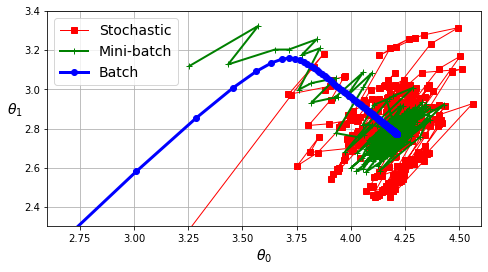
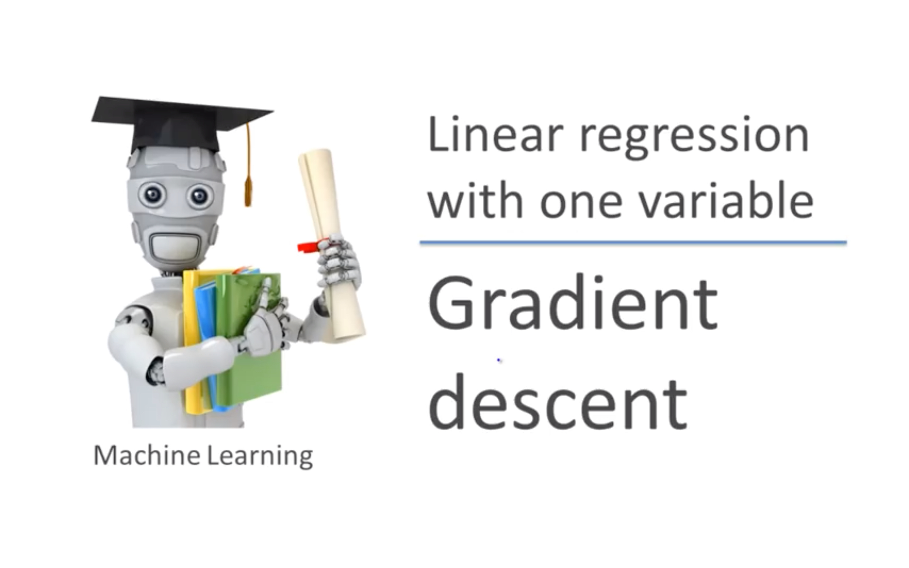

# Régression linéaire et descente de gradient

CSI 4506 - automne 2026

Auteur·rice

Marcel Turcotte

Date de publication

Version : 20 septembre 2026 16h40

# Préambule

## Message du jour

[](https://substackcdn.com/image/fetch/$s_!qtq_!,w_1456,c_limit,f_webp,q_auto:good,fl_progressive:steep/https%3A%2F%2Fsubstack-post-media.s3.amazonaws.com%2Fpublic%2Fimages%2F9248c7ff-f9f6-4180-907d-ad7674a2f02a_1536x1024.jpeg)

[The Invention of Hugo Larochelle](https://www.amiral.info/p/the-invention-of-hugo-larochelle), Amiral Ventures, 14 septembre 2026.

Hugo Larochelle est directeur scientifique de Mila et chercheur canadien en informatique spécialisé en apprentissage profond. Avant de rejoindre la direction de Mila, il a dirigé le laboratoire montréalais de Google Brain, qui a ensuite été intégré à Google DeepMind, et a été professeur agrégé à l’Université de Sherbrooke. Il est aussi connu pour avoir rendu gratuitement accessibles en ligne des cours avancés d’apprentissage automatique.

J’ai choisi ce portrait pour deux raisons. Premièrement, il présente les trois instituts nationaux d’IA du Canada : Mila, Vector et Amii. Deuxièmement, il montre comment la formation et les premiers travaux de recherche de Larochelle ont façonné sa carrière. Il rejoint aussi directement le sujet du jour : Larochelle décrit la régression linéaire comme le moment où la statistique a commencé à prendre tout son sens pour lui en tant que forme d’apprentissage automatique fondée sur les mathématiques.

- **Mila – Institut québécois d’intelligence artificielle (Montréal) :** communauté de recherche universitaire reconnue pour ses travaux en apprentissage profond, en IA générative et en IA socialement responsable. Parmi les chercheurs associés à Mila figurent **Yoshua Bengio**, **Aaron Courville**, **Doina Precup** et **Irina Rish**.
- **Institut Vecteur (Toronto) :** organisme indépendant sans but lucratif qui fait progresser la recherche en IA, forme des spécialistes et soutient l’adoption de l’IA dans l’industrie et les soins de santé au Canada. Parmi les chercheurs associés à Vector figurent **Geoffrey Hinton**, **Richard Zemel**, **David Duvenaud** et **Bo Wang**.
- **Amii (Alberta Machine Intelligence Institute, Edmonton) :** organisme indépendant sans but lucratif qui possède une expertise de longue date en apprentissage par renforcement et en apprentissage automatique. Il aide aussi les organisations à adopter l’IA. Parmi les chercheurs associés à Amii figurent **Richard Sutton**, **Michael Bowling**, **Martha White** et **Alona Fyshe**.

## Objectifs d’apprentissage

- **Reconnaître** la régression comme une tâche d’apprentissage supervisé dont l’étiquette est une valeur réelle.
- **Définir** une hypothèse linéaire et son objectif d’erreur quadratique moyenne.
- **Distinguer** l’espace des paramètres de l’espace des hypothèses, et expliquer comment un vecteur de paramètres détermine une hypothèse.
- **Expliquer** comment le gradient et le taux d’apprentissage déterminent une mise à jour par descente de gradient.
- **Expliquer** l’importance de la convexité dans l’optimisation d’un modèle de régression linéaire.
- **Comparer** les descentes de gradient par lot, stochastique et par mini-lots.

Lors du cours précédent, nous avons examiné deux algorithmes d’apprentissage distincts : les k plus proches voisins (KNN) et les arbres de décision, chacun utilisant des méthodes uniques pour l’entraînement et la représentation des modèles. Le KNN n’implique pas d’apprentissage explicite ; en revanche, les données elles-mêmes constituent le modèle. Les arbres de décision, à l’inverse, utilisent un algorithme glouton qui commence avec un arbre vide et l’ensemble complet de données d’entraînement. L’algorithme ajoute progressivement des nœuds de décision, en partitionnant l’ensemble de données parent en sous-ensembles pour atteindre une plus grande homogénéité (ou pureté) au sein de chaque classification résultante par rapport au nœud parent. Ce processus récursif se termine lorsque les données d’un nœud satisfont des critères d’arrêt prédéfinis, tels que l’obtention d’une classe unique, l’atteinte d’un niveau de pureté minimum, ou l’atteinte d’une profondeur d’arbre maximale. Une fois que l’arbre de décision est construit, les données originales ne sont plus nécessaires. Ce cours visait à démontrer que les modèles d’apprentissage supervisé peuvent être représentés de diverses manières, chaque algorithme d’« apprentissage » étant adapté à son modèle spécifique.

Dans le cours d’aujourd’hui, nous explorerons un algorithme d’apprentissage applicable à une large gamme de modèles, y compris les réseaux de neurones.

# Régression linéaire

## Justification

**La régression linéaire** est introduite pour présenter de manière pratique un algorithme d’apprentissage bien connu, **la descente de gradient**. De plus, elle sert de base pour introduire la **régression logistique** – un algorithme de classification – qui facilite davantage les discussions sur les **réseaux de neurones artificiels**.

- Régression linéaire
  - Descente de gradient
  - Régression logistique
    - Réseaux de neurones

De 2 à **2 billions** de paramètres!

Les algorithmes d’apprentissage pour les modèles d’apprentissage automatique peuvent varier considérablement en fonction du modèle (par exemple, arbres de décision, SVM, etc.). Afin de respecter notre emploi du temps, nous nous concentrerons sur cette séquence spécifique.

Le concept de régression linéaire remonte aux premiers travaux de Sir Francis Galton à la fin du 19ème siècle. Galton a introduit l’idée de “régression” dans son article de 1886, qui portait sur la relation entre la taille des parents et celle de leurs enfants. Il a observé que la taille des enfants avait tendance à régresser vers la moyenne, ce qui a conduit au terme “régression”.

Karl Pearson a par la suite formalisé des idées importantes sur la corrélation et la régression. La méthode des moindres carrés est toutefois antérieure à ces travaux : Adrien-Marie Legendre l’a publiée en 1805, et Carl Friedrich Gauss l’a développée indépendamment pour l’analyse de données astronomiques.

**Voir :** Stanton ([2001](#ref-Stanton:2001aa)).

## Apprentissage supervisé - régression

- Les **données d’entraînement** sont une collection d’exemples **étiquetés**.
  - \\(x_i,y_i)\\\_{i=1}^N
    - Chaque x_i est un **vecteur d’attributs** avec D dimensions.
    - x_i^{(j)} est la valeur de l’**attribut** j de l’exemple i, pour j \in 1 \ldots D et i \in 1 \ldots N.
  - L’**étiquette** y_i est un **nombre réel**.
- **Problème** : Étant donné l’ensemble de données en entrée, créer un **modèle** pouvant être utilisé pour prédire la valeur de y pour un x non vu.

Pouvez-vous penser à des exemples de tâches de régression ?

1.  **Prédiction du Prix de l’Habitation** :
    - **Application** : Estimation de la valeur marchande de propriétés résidentielles en fonction de attributs tels que l’emplacement, la taille, le nombre de chambres, l’âge et les commodités.
2.  **Prévision Boursière** :
    - **Application** : Prédire les prix futurs des actions ou des indices en se basant sur des données historiques, des indicateurs financiers et des variables économiques.
3.  **Prédiction Météorologique** :
    - **Application** : Estimer les températures futures, les précipitations et d’autres conditions météorologiques en utilisant des données historiques et des variables atmosphériques.
4.  **Prévision des Ventes** :
    - **Application** : Prédire les volumes de ventes futurs pour des produits ou services en analysant les données de ventes passées, les tendances du marché et les schémas saisonniers.
5.  **Prédiction de la Consommation Énergétique** :
    - **Application** : Prévoir la consommation énergétique future pour les ménages, les industries ou les villes en fonction des données historiques de consommation, des conditions météorologiques et des facteurs économiques.
6.  **Estimation des Coûts Médicaux** :
    - **Application** : Prédire les coûts de santé pour les patients en se basant sur leur historique médical, leurs informations démographiques et leurs plans de traitement.
7.  **Prédiction du Flux de Trafic** :
    - **Application** : Estimer les volumes de trafic futurs et les niveaux de congestion sur les routes et autoroutes en utilisant des données historiques de trafic et des entrées de capteurs en temps réel.
8.  **Estimation de la Valeur à Vie du Client (CLV)** :
    - **Application** : Prédire le revenu total qu’une entreprise peut attendre d’un client sur la durée de leur relation, basé sur le comportement d’achat et les données démographiques.
9.  **Prévision des Indicateurs Économiques** :
    - **Application** : Prédire les principaux indicateurs économiques tels que la croissance du PIB, les taux de chômage et l’inflation en utilisant des données économiques historiques et des tendances du marché.
10. **Prévision de la Demande** :
    - **Application** : Estimer la demande future pour des produits ou services dans divers secteurs comme le commerce de détail, la fabrication et la logistique pour optimiser la gestion des stocks et de la chaîne d’approvisionnement.
11. **Évaluation Immobilière** :
    - **Application** : Évaluer la valeur marchande de propriétés commerciales comme les immeubles de bureaux, les centres commerciaux et les espaces industriels en fonction de l’emplacement, de la taille et des conditions du marché.
12. **Évaluation du Risque d’Assurance** :
    - **Application** : Prédire le risque associé à l’assurance d’individus ou de propriétés, ce qui aide à déterminer les taux de primes, basé sur les données historiques de réclamations et les facteurs démographiques.
13. **Prédiction du Taux de Clics (CTR) des Annonces** :
    - **Application** : Estimer la probabilité qu’un utilisateur clique sur une annonce en ligne en fonction du comportement de l’utilisateur, des attributs de l’annonce et des facteurs contextuels.
14. **Prédiction du Défaut de Paiement de Prêt** :
    - **Application** : Prédire la probabilité qu’un emprunteur fasse défaut sur un prêt en fonction de l’historique de crédit, des revenus, du montant du prêt et d’autres indicateurs financiers.

En se concentrant sur les applications pouvant fonctionner sur un appareil mobile.

1.  **Prédiction de la Durée de Vie de la Batterie** :
    - **Application** : Estimer la durée de vie restante de la batterie en fonction des habitudes d’utilisation, des applications en cours d’exécution et des paramètres de l’appareil.
2.  **Suivi de la Santé et de la Forme Physique** :
    - **Application** : Prédire la consommation de calories, la fréquence cardiaque ou la qualité du sommeil en fonction de l’activité de l’utilisateur, des données biométriques et de l’historique de santé.
3.  **Gestion des Finances Personnelles** :
    - **Application** : Prévoir les dépenses ou économies futures en fonction des habitudes de dépense, des modèles de revenus et des objectifs budgétaires.
4.  **Prévision Météorologique** :
    - **Application** : Fournir des prévisions météorologiques personnalisées basées sur la localisation actuelle et les données météorologiques historiques.
5.  **Estimation du Temps de Trajet et de Trafic** :
    - **Application** : Prédire les temps de trajet et suggérer des itinéraires optimaux en se basant sur les données historiques de trafic, les conditions en temps réel et le comportement de l’utilisateur.
6.  **Amélioration de la Qualité des Images et Vidéos** :
    - **Application** : Ajuster les paramètres de qualité d’image ou de vidéo (par exemple, luminosité, contraste) en fonction des conditions d’éclairage et des préférences de l’utilisateur.
7.  **Atteinte des Objectifs de Fitness** :
    - **Application** : Estimer le temps nécessaire pour atteindre des objectifs de fitness tels que la perte de poids ou le gain musculaire en fonction de l’activité de l’utilisateur et des apports alimentaires.
8.  **Optimisation des Performances des Appareils Mobiles** :
    - **Application** : Prédire les paramètres optimaux pour la performance de l’appareil et la durée de vie de la batterie en fonction des habitudes d’utilisation et de l’activité des applications.

## Éruptions du Old Faithful

``` python
import pandas as pd

WOLFRAM_CSV = "https://raw.githubusercontent.com/turcotte/csi4106-f26/refs/heads/main/datasets/old_faithful_eruptions/Sample-Data-Old-Faithful-Eruptions.csv"
df = pd.read_csv(WOLFRAM_CSV)

# Renommer les colonnes
df = df.rename(columns={"Duration": "eruptions", "WaitingTime": "waiting"})
print(df.shape)
df.head(6)
```

    (272, 2)

|     | eruptions | waiting |
|-----|-----------|---------|
| 0   | 3.600     | 79      |
| 1   | 1.800     | 54      |
| 2   | 3.333     | 74      |
| 3   | 2.283     | 62      |
| 4   | 4.533     | 85      |
| 5   | 2.883     | 55      |

**Attribution :** Wolfram Research, “Sample Data: Old Faithful Eruptions” du Wolfram Data Repository (2016) [doi: 10.24097/wolfram.50727.data](https://doi.org/10.24097/wolfram.50727.data)

Le jeu de données utilisé dans cette présentation provient du Wolfram Research Data Repository, avec sa publication initiale détaillée dans Azzalini et Bowman ([1990](#ref-Azzalini:1990aa)).

## Geyser Old Faithful

# An error occurred.

Unable to execute JavaScript.

**Attribution :** Yellowstone National Park Trips

Old Faithful, situé dans le parc national de Yellowstone, est connu comme le geyser le plus célèbre au monde. Il peut atteindre des hauteurs d’éruption allant jusqu’à 140 pieds. Notamment, ses intervalles d’éruption varient entre 60 et 110 minutes, en fonction de la durée de l’éruption précédente.

## Visualisation rapide

Code

``` python
import matplotlib.pyplot as plt

plt.figure(figsize=(6,4))
plt.scatter(df["eruptions"], df["waiting"], s=20)
plt.xlabel("Durée de l'éruption (min)")
plt.ylabel("Temps d'attente jusqu'à la prochaine éruption (min)")
plt.title("Old Faithful : éruptions vs attente")
plt.tight_layout()
plt.show()
```

[](slides_files/figure-html/cell-3-output-1.png)

La durée de l’éruption actuelle semble avoir une relation linéaire avec le temps d’attente suivant : des durées d’éruption plus courtes tendent à précéder des temps d’attente plus courts, tandis que des durées d’éruption plus longues sont associées à des temps d’attente plus longs.

## Problème

- Prédire le **temps d’attente jusqu’à la prochaine éruption**, y, en fonction de la **durée de l’éruption actuelle**, x.

Choisir un problème caractérisé par un seul attribut nous permet de mieux concentrer notre discussion et d’améliorer la clarté de la visualisation.

------------------------------------------------------------------------

# An error occurred.

Unable to execute JavaScript.

## Régression linéaire

Un **modèle linéaire** suppose que la valeur de l’**étiquette**, \hat{y_i}, peut être exprimée comme une **combinaison linéaire** des valeurs des attributs, x_i^{(j)} : \hat{y_i} = \theta_0 + \theta_1 x_i^{(1)} + \theta_2 x_i^{(2)} + \ldots + \theta_D x_i^{(D)}

. . .

Ici, \theta\_{j} est le j-ième paramètre du **modèle** (linéaire), avec \theta_0 étant le terme/paramètre de **biais**, et \theta_1 \ldots \theta_D étant les **poids des attributs**.

Dans mes présentations, j’utilise \hat{y_i} et h(x_i) de manière synonyme.

Dans les contextes statistiques, la notation \hat{y_i} est employée pour désigner l’estimateur de la vraie valeur y_i. Cela représente le résultat prédit ou estimé basé sur un modèle donné.

À l’inverse, en apprentissage automatique, on utilise la notation h(x_i), où h représente la fonction d’hypothèse ou le modèle appliqué aux données d’entrée x_i. La fonction d’hypothèse h est dérivée d’un espace d’hypothèses prédéfini, qui englobe l’ensemble de tous les modèles possibles pouvant être utilisés pour mapper les données d’entrée aux résultats prédits.

Le paramètre \theta_0 est appelé le **terme de biais** (aussi “intercepte”) parce que :

- Il **décale la prédiction indépendamment des entrées**.
- Géométriquement, il déplace l’hyperplan de régression vers le haut ou vers le bas (ou à gauche/droite en classification), de sorte que le modèle n’est pas obligé de passer par l’origine.
- En termes d’apprentissage automatique, il agit comme un **décalage constant**, compensant les effets systématiques non expliqués par les attributs.

Ainsi, on l’appelle “biais” parce qu’il introduit une base fixe à laquelle s’ajoutent les contributions des autres paramètres.

Dans un modèle d’apprentissage automatique, les **paramètres** sont les **poids** et les **biais**.

## Définition

**Problème :** trouver les valeurs de tous les paramètres afin que le modèle **s’ajuste au mieux** aux données d’entraînement.

. . .

- L’**erreur quadratique moyenne** (EQM) est un objectif courant pour les problèmes de régression.

J(\theta) = \frac{1}{N}\sum\_{i=1}^N \[h\_\theta(x_i) - y_i\]^2

La racine de l’erreur quadratique moyenne (REQM) est la racine carrée de l’EQM. Comme la racine carrée est strictement croissante, l’EQM et la REQM possèdent les mêmes paramètres minimisants. Nous optimisons l’EQM parce que sa dérivée est plus simple; la REQM demeure utile pour exprimer l’erreur dans les mêmes unités que l’étiquette.

## Minimisation de l’EQM

[](https://thumb.wikimedia.org/wikipedia/commons/thumb/b/b0/Linear_least_squares_example2.svg/1280px-Linear_least_squares_example2.svg.png)

**Attribution** : [Krishnavedala](https://commons.wikimedia.org/wiki/File:Linear_least_squares_example2.svg), [CC BY-SA 3.0](https://creativecommons.org/licenses/by-sa/3.0), via Wikimedia Commons

## Apprentissage

Code

``` python
from sklearn.linear_model import LinearRegression, SGDRegressor
from sklearn.model_selection import train_test_split
from sklearn.metrics import mean_squared_error, r2_score

# Préparer les données
X = df[["eruptions"]].values  # shape (n_samples, 1)
y = df["waiting"].values      # shape (n_samples,)

X_train, X_test, y_train, y_test = train_test_split(
    X, y, test_size=0.2, random_state=42
)

# Ajuster via SGDRegressor — modèle linéaire via descente de gradient
sgd = SGDRegressor(
    loss="squared_error",
    penalty=None,
    learning_rate="constant",
    eta0=0.01,  # Taux d'apprentissage initial (alpha dans notre notation).
    max_iter=2000,
    tol=None,
    random_state=42
)

sgd.fit(X_train, y_train)

print("Paramètres appris :")
print(f"  intercept = {sgd.intercept_[0]:.3f}")
print(f"  pente     = {sgd.coef_[0]:.3f}")

y_pred = sgd.predict(X_test)
print(f"MSE test = {mean_squared_error(y_test, y_pred):.2f}")
print(f"R² test  = {r2_score(y_test, y_pred):.3f}")
```

    Paramètres appris :
      intercept = 32.910
      pente     = 10.503
    MSE test = 43.02
    R² test  = 0.671

## Visualisation

Code

``` python
import numpy as np

# Disperser les données
plt.figure(figsize=(6,4))
plt.scatter(X, y, color="steelblue", s=30, alpha=0.7, label="données")

# Tracer la ligne ajustée
x_line = np.linspace(0, X.max(), 100).reshape(-1, 1)
y_line = sgd.predict(x_line)
plt.plot(x_line, y_line, color="red", linewidth=2, label="ligne ajustée")

plt.xlabel("Durée de l'éruption (min)")
plt.ylabel("Temps d'attente jusqu'à la prochaine éruption (min)")
plt.title("Old Faithful : Régression linéaire via SGD")
plt.legend()
plt.tight_layout()
plt.show()
```

[](slides_files/figure-html/cell-5-output-1.png)

Dans le graphique ci-dessus, la ligne x=0 est incluse pour faciliter la visualisation de l’intercept, qui est donné par \theta_0 = 32.910.

## Caractéristiques

Un **algorithme d’apprentissage** typique comprend les composants suivants :

1.  Un **modèle**, souvent composé d’un ensemble de **paramètres** dont les valeurs seront **“apprises”**.
2.  Une **fonction objectif** qui mesure l’erreur de prédiction sur les données d’entraînement.
    - L’**erreur quadratique moyenne** est un objectif courant pour les problèmes de régression. \frac{1}{N}\sum\_{i=1}^N \[h\_\theta(x_i) - y_i\]^2
3.  Un **algorithme d’optimisation**.

## Optimisation

**Jusqu’à** ce que certains critères d’arrêt soient atteints[^1] :

- **Évaluer** la fonction de perte, en comparant h(x_i) à y_i.
- **Apporter de petites modifications aux poids**, de manière à réduire la valeur de la fonction de perte.

## Remarques

- Il est important de séparer l’**algorithme d’optimisation** du **problème** qu’il traite.
- Pour la **régression linéaire**, une solution analytique exacte existe, mais elle présente certaines limitations.
- La **descente de gradient** sert d’algorithme général applicable non seulement à la régression linéaire, mais aussi à la régression logistique, l’apprentissage profond, t-SNE (t-distributed Stochastic Neighbor Embedding), parmi divers autres problèmes.
- Il existe une gamme diversifiée d’algorithmes d’optimisation qui **ne reposent pas sur des méthodes basées sur le gradient**.

## Optimisation — un attribut

- **Modèle** (hypothèse) :\
  h(x_i; \theta) = \theta_0 + \theta_1 x_i^{(1)}

- **Fonction de perte/coût** :\
  J(\theta_0, \theta_1) = \frac{1}{N}\sum\_{i=1}^N \[h(x_i;\theta) - y_i\]^2

**Objectif** : trouver \theta_0, \theta_1 qui minimisent J, en mettant à jour les paramètres de manière itérative.

Cette diapositive établit la distinction entre l’espace des hypothèses et l’espace des paramètres.

L’espace des paramètres est \Theta=\mathbb{R}^2. Chaque point \theta=(\theta_0,\theta_1) sélectionne une hypothèse, h\_\theta(x)=\theta_0+\theta_1x, dans l’espace des hypothèses \mathcal{H}=\\h\_\theta\mid\theta\in\Theta\\. À la fin de l’entraînement, les paramètres choisis demeurent fixes et le modèle transforme une nouvelle entrée x\_{\mathrm{new}} en prédiction.

Pour un jeu de données fixe D, l’objectif J_D associe à chaque paire de paramètres une EQM non négative : J_D:\Theta\to\mathbb{R}\_{\ge0}. Modifier \theta sélectionne une autre hypothèse, tandis que le jeu de données demeure fixe.

La descente de gradient opère dans l’espace des paramètres. Elle ajuste \theta afin de réduire J_D(\theta).

La notation h(x_i; \theta) indique que la valeur de la fonction h (du modèle) dépend de l’exemple en entrée x_i ainsi que des paramètres \theta. Le point-virgule sert à différencier de manière sémantique ces deux ensembles de valeurs. Cette convention est issue du domaine des statistiques. En apprentissage automatique, on emploie également la notation h\_{\theta}(x_i), qui peut être considérée comme plus appropriée. Dans ce contexte, on parle d’une famille indexée de fonctions, où \theta détermine spécifiquement quelle fonction h\_\theta doit être utilisée. Cette notation se lit comme suit : « la fonction h, paramétrée par \theta, appliquée à l’entrée x_i. »

## Hypothèses et espace des paramètres

Code

``` python
# L'objectif est défini sur le jeu de données complet et fixe.
x = X.squeeze().astype(float)
y = y.astype(float)

# Erreur quadratique moyenne J.
def mse(theta0, theta1, x, y):
    yhat = theta0 + theta1 * x
    return np.mean((y - yhat) ** 2)

# Minimum exact des moindres carrés sur le jeu de données complet.
full_data_model = LinearRegression().fit(X, y)
theta_star = np.array([
    full_data_model.intercept_,
    full_data_model.coef_[0],
])

# Grille pour θ0∈[0,100] et θ1∈[0,20].
t0_vals = np.linspace(0, 100, 200)
t1_vals = np.linspace(0, 20, 200)
T0, T1 = np.meshgrid(t0_vals, t1_vals)

J = np.empty_like(T0, dtype=float)
for i in range(T0.shape[0]):
    for j in range(T0.shape[1]):
        J[i, j] = mse(T0[i, j], T1[i, j], x, y)

# Séquence illustrative de paramètres qui se termine au minimum.
traj = np.array([
    (0.000,   0.000),
    (10.000,  2.000),
    (20.000,  4.000),
    (30.000,  7.000),
    theta_star,
])
traj_J = np.array([mse(t0, t1, x, y) for (t0, t1) in traj])

# À gauche : hypothèses choisies. À droite : leurs valeurs dans l'espace des paramètres.
fig = plt.figure(figsize=(12, 4.8))

# Panneau de gauche : hypothèses dans l'espace entrée-sortie
ax1 = fig.add_subplot(1, 2, 1)
order = np.argsort(x)
ax1.scatter(x, y, s=18, alpha=0.75, label="données")
ax1.axhline(y.mean(), color="gray", ls="--", lw=1, label=r"$\bar y$")
for k, (t0, t1) in enumerate(traj):
    yline = t0 + t1 * x
    ax1.plot(
        x[order], yline[order],
        lw=2 if k == len(traj) - 1 else 1.2,
        alpha=1.0 if k == len(traj) - 1 else 0.85,
        label=fr"$\theta_0={t0:.3f},\ \theta_1={t1:.3f}$"
    )
ax1.set_xlabel("Durée de l'éruption (min)")
ax1.set_ylabel("Temps d'attente jusqu'à la prochaine éruption (min)")
ax1.set_title("Hypothèses choisies dans l'espace entrée-sortie")
ax1.legend(fontsize=8, loc="best")

# Panneau de droite : objectif dans l'espace des paramètres
ax2 = fig.add_subplot(1, 2, 2, projection='3d')

vmin = np.percentile(J, 5)
vmax = np.percentile(J, 95)

surf = ax2.plot_surface(
    T0, T1, J, rstride=3, cstride=3,
    cmap="viridis", linewidth=0, antialiased=False,
    vmin=vmin, vmax=vmax, alpha=0.6
)

# Superposer la séquence illustrative.
ax2.plot(traj[:,0], traj[:,1], traj_J, color='crimson', marker='o', lw=2, label="séquence illustrative")

ax2.set_xlabel(r'$\theta_0$')
ax2.set_ylabel(r'$\theta_1$')
ax2.set_zlabel(r'$J(\theta)$ (EQM)')
ax2.set_title("Objectif dans l'espace des paramètres")
ax2.legend(loc="best", fontsize=8)

ax2.view_init(elev=30, azim=-60)

fig.colorbar(surf, ax=ax2, shrink=0.7, pad=0.05, label="EQM")
plt.tight_layout()
plt.show()
```

[](slides_files/figure-html/cell-6-output-1.png)

Dans cet exemple, nous utilisons le jeu de données des éruptions du geyser Old Faithful.

La figure de gauche montre des membres choisis de l’espace des hypothèses dans le plan entrée-sortie. Chaque paire de paramètres (\theta_0,\theta_1) définit une fonction complète, h\_\theta(x)=\theta_0+\theta_1x, représentée par une droite.

La figure de droite représente l’espace des paramètres, \Theta=\mathbb{R}^2. Chaque position horizontale est une paire de paramètres; la hauteur de la surface est l’EQM obtenue par l’hypothèse correspondante sur le jeu de données complet et fixe.

La séquence de paramètres est illustrative; ce n’est pas une trajectoire réelle de descente de gradient. Chaque déplacement dans l’espace des paramètres sélectionne une nouvelle hypothèse à gauche et réduit J(\theta) à droite. La dernière paire est le minimum des moindres carrés calculé sur le jeu de données complet.

## Hypothèses et espace des paramètres

Code

``` python
# Réutiliser le même jeu de données, le même objectif, la même grille
# et la même séquence de paramètres.
fig, (ax1, ax2) = plt.subplots(1, 2, figsize=(12, 4.5))

# Gauche : données + les lignes spécifiées
order = np.argsort(x)
ax1.scatter(x, y, s=18, alpha=0.75, label="données")
for k, (t0, t1) in enumerate(traj):
    yline = t0 + t1 * x
    ax1.plot(x[order], yline[order], lw=2 if k == len(traj) - 1 else 1.2,
             alpha=1.0 if k == len(traj) - 1 else 0.8,
             label=fr"$\theta_0={t0:.3f},\ \theta_1={t1:.3f}$")
ax1.axhline(y.mean(), color="gray", ls="--", lw=1, label=r"$\bar y$")
ax1.set_xlabel("Durée de l'éruption (min)")
ax1.set_ylabel("Temps d'attente jusqu'à la prochaine éruption (min)")
ax1.set_title("Hypothèses choisies dans l'espace entrée-sortie")
ax1.legend(fontsize=8, loc="best")

# Montrer le même objectif dans l'espace des paramètres sous forme de contours.
cs = ax2.contour(T0, T1, J, levels=30)
ax2.clabel(cs, inline=True, fontsize=8)
ax2.plot(traj[:,0], traj[:,1], 'r-o', lw=2, ms=4, label="séquence illustrative")
for (t0, t1, jval) in zip(traj[:,0], traj[:,1], traj_J):
    ax2.annotate(f"{jval:.1f}", (t0, t1), textcoords="offset points",
                 xytext=(4,4), fontsize=8)
ax2.set_xlim(0, 100); ax2.set_ylim(0, 20)
ax2.set_xlabel(r'$\theta_0$'); ax2.set_ylabel(r'$\theta_1$')
ax2.set_title("Contours de l'objectif dans l'espace des paramètres")
ax2.legend(loc="best", fontsize=8)

plt.tight_layout()
plt.show()
```

[](slides_files/figure-html/cell-7-output-1.png)

Ces figures montrent la même correspondance, mais représentent l’objectif à l’aide de courbes de niveau plutôt que d’une surface tridimensionnelle.

# Dérivée

## Dérivée

Code

``` python
import sympy as sp
from matplotlib import style

style.use("seaborn-v0_8-whitegrid")
t = sp.symbols("t")
quadratic_expression = t**2 + 4*t + 7
sp.plot(quadratic_expression, size=(5, 5))
```

Code

``` python
sp.plot(quadratic_expression, size=(5, 5))
```

[](slides_files/figure-html/cell-9-output-1.png)

- Nous commencerons par une **fonction à une variable**.
- Considérez cela comme notre **fonction de perte**, que nous visons à minimiser; pour réduire la disparité moyenne entre les valeurs attendues et les valeurs prédites.
- J’utilise le symbol t pour la variable afin d’éviter toute confusion avec les attributs des exemples de notre jeu de données.

## Code source

Code

``` python
quadratic_derivative = sp.diff(quadratic_expression, t)
quadratic_function = sp.lambdify(t, quadratic_expression, "numpy")
derivative_function = sp.lambdify(t, quadratic_derivative, "numpy")
t_values = np.linspace(-5, 2, 400)

def plot_quadratic_and_derivative(shade=None, objective=False):
    function_values = quadratic_function(t_values)
    derivative_values = derivative_function(t_values)
    function_label = r"$J$" if objective else r"$f(t) = t^2 + 4t + 7$"
    derivative_label = (
        r"$\frac{\partial J}{\partial \theta_j}$"
        if objective else r"$f'(t) = 2t + 4$"
    )

    plt.plot(t_values, function_values, label=function_label, color="blue")
    plt.plot(t_values, derivative_values, label=derivative_label, color="red")
    if shade == "positive":
        plt.fill_between(
            t_values, derivative_values,
            where=(derivative_values > 0), color="red", alpha=0.3,
        )
    elif shade == "negative":
        plt.fill_between(
            t_values, derivative_values,
            where=(derivative_values < 0), color="red", alpha=0.3,
        )

    plt.axhline(0, color="black", linewidth=1)
    plt.axvline(0, color="black", linewidth=1)
    plt.xlabel(r"$\theta_j$" if objective else "$t$")
    plt.ylabel("$J$" if objective else "$f(t)$")
    plt.legend()
    plt.grid(True)
    plt.show()
```

Sur l’écran précédent, j’ai utilisé [**SymPy**](https://www.sympy.org/), une bibliothèque pour les **mathématiques symboliques**.

## Dérivée

Code

``` python
plot_quadratic_and_derivative()
```

Code

``` python
plot_quadratic_and_derivative()
```

[](slides_files/figure-html/cell-12-output-1.png)

- Le graphe de la **dérivée**, f^{'}(t), est représenté en **rouge**.

- La **dérivée** indique comment les changements dans l’entrée affectent la sortie, f(t).

- La magnitude de la **dérivée** en t = -2 est 0.

- Ce point correspond au **minimum** de notre fonction.

Près de t = -2, les variations de t ont un impact minimal sur la variable de sortie y.

## Dérivée

Code

``` python
plot_quadratic_and_derivative()
```

[](slides_files/figure-html/cell-13-output-1.png)

- Lorsqu’elle est évaluée en un **point spécifique**, la dérivée indique la **pente** de la **ligne tangente** au graphe de la fonction à ce point.

- À t= -2, la **pente** de la **ligne tangente** est de 0.

## Dérivée

Code

``` python
plot_quadratic_and_derivative(shade="positive")
```

Code

``` python
plot_quadratic_and_derivative(shade="positive")
```

[](slides_files/figure-html/cell-15-output-1.png)

- Une **dérivée positive** indique qu’**augmenter la variable d’entrée** entraînera une **augmentation de la valeur de sortie**.

- De plus, la **magnitude** de la dérivée quantifie la **rapidité** du changement de la sortie.

## Dérivée

Code

``` python
plot_quadratic_and_derivative(shade="negative")
```

Code

``` python
plot_quadratic_and_derivative(shade="negative")
```

[](slides_files/figure-html/cell-17-output-1.png)

- Une **dérivée négative** indique qu’**augmenter la variable d’entrée** entraînera une **diminution de la valeur de sortie**.

- De plus, la **magnitude** de la dérivée quantifie la **rapidité** du changement de la sortie.

## Code source

``` python
plot_quadratic_and_derivative(shade="positive")
```

# Descente de gradient

## Descente de gradient — un attribut

- **Modèle** (hypothèse) :\
  h(x_i; \theta) = \theta_0 + \theta_1 x_i^{(1)}

- **Fonction de perte/coût** :\
  J(\theta_0, \theta_1) = \frac{1}{N}\sum\_{i=1}^N \[h(x_i;\theta) - y_i\]^2

## Descente de gradient - intuition

# An error occurred.

Unable to execute JavaScript.

## Descente de gradient - étape par étape

# An error occurred.

Unable to execute JavaScript.

## Descente de gradient - une variable

- **Initialisation :** \theta_0 et \theta_1 - soit avec des valeurs aléatoires, soit avec des zéros.
- **Boucle :**
- répéter jusqu’à convergence : \theta_j := \theta_j - \alpha \frac {\partial}{\partial \theta_j}J(\theta_0, \theta_1) , \text{pour } j=0 \text{ et } j=1
- \alpha est appelé le **taux d’apprentissage** - c’est la taille de chaque pas.
- \frac {\partial}{\partial \theta_j}J(\theta_0, \theta_1) est la **dérivée partielle** par rapport à \theta_j.

Une **dérivée partielle** représente le taux de changement d’une fonction multivariable **par rapport à l’une de ses variables**, tout en **gardant les autres variables constantes**.

Pour que l’algorithme soit mathématiquement valide, tous les \theta_j doivent être mis à jour **simultanément**.

## Mise à jour unidimensionnelle

Code

``` python
plot_quadratic_and_derivative(objective=True)
```

Code

``` python
plot_quadratic_and_derivative(objective=True)
```

[](slides_files/figure-html/cell-20-output-1.png)

- Lorsque \theta_j \in (-\infty,-2), \frac {\partial}{\partial \theta_j}J(\theta) est **négative**.

- Par conséquent, - \alpha \frac {\partial}{\partial \theta_j}J(\theta) est **positif**.

- En conséquence, la valeur de \theta_j est **augmentée**.

Règle de mise à jour : \theta_j := \theta_j - \alpha \frac {\partial}{\partial \theta_j}J(\theta_0, \theta_1) , \text{pour } j=0 \text{ et } j=1.

## Mise à jour unidimensionnelle

Code

``` python
plot_quadratic_and_derivative(objective=True)
```

[](slides_files/figure-html/cell-21-output-1.png)

- Lorsque \theta_j \in (-2,\infty), \frac {\partial}{\partial \theta_j}J(\theta) est **positive**.

- Par conséquent, - \alpha \frac {\partial}{\partial \theta_j}J(\theta) est **négatif**.

- En conséquence, la valeur de \theta_j est **diminuée**.

Règle de mise à jour: \theta_j := \theta_j - \alpha \frac {\partial}{\partial \theta_j}J(\theta_0, \theta_1) , \text{pour } j=0 \text{ et } j=1.

## Dérivées partielles

Étant donnée

J(\theta_0, \theta_1) = \frac{1}{N}\sum\_{i=1}^N \[h\_\theta(x_i) - y_i\]^2 = \frac{1}{N}\sum\_{i=1}^N \[\theta_0 + \theta_1 x_i - y_i\]^2

. . .

Nous avons

\frac {\partial}{\partial \theta_0}J(\theta_0, \theta_1) = \frac{2}{N} \sum\limits\_{i=1}^{N} \[\theta_0 + \theta_1 x_i - y_i\]

. . .

et

\frac {\partial}{\partial \theta_1}J(\theta_0, \theta_1) = \frac{2}{N} \sum\limits\_{i=1}^{N} x_i \[\theta_0 + \theta_1 x_i - y_i\]

## Dérivée partielle (SymPy)

``` python
from IPython.display import Math, display
import sympy as sp

# Définir l'indice, les paramètres et les données indexées.
i, N = sp.symbols("i N", integer=True, positive=True)
theta_0, theta_1 = sp.symbols("theta_0 theta_1")
x_data = sp.IndexedBase("x")
y_data = sp.IndexedBase("y")
h_i = theta_0 + theta_1 * x_data[i]

print("Fonction d'hypothèse :")
display(Math(r"h_\theta(x_i) = " + sp.latex(h_i)))
```

    Fonction d'hypothèse :

\displaystyle h\_\theta(x_i) = \theta\_{0} + \theta\_{1} {x}\_{i}

## Dérivée partielle (SymPy)

``` python
# Définir l'erreur quadratique moyenne en sommant sur l'indice i.
J_symbolic = sp.Sum((h_i - y_data[i])**2, (i, 1, N)) / N

print("Fonction de perte :")
display(Math(r"J = " + sp.latex(J_symbolic)))
```

    Fonction de perte :

\displaystyle J = \frac{\sum\_{i=1}^{N} \left(\theta\_{0} + \theta\_{1} {x}\_{i} - {y}\_{i}\right)^{2}}{N}

## Dérivée partielle (SymPy)

``` python
# Calculer la dérivée partielle par rapport à theta_0

partial_derivative_theta_0 = sp.diff(J_symbolic, theta_0)

print("Dérivée partielle par rapport à theta_0 :")

display(Math(sp.latex(partial_derivative_theta_0)))
```

    Dérivée partielle par rapport à theta_0 :

\displaystyle \frac{\sum\_{i=1}^{N} \left(2 \theta\_{0} + 2 \theta\_{1} {x}\_{i} - 2 {y}\_{i}\right)}{N}

## Dérivée partielle (SymPy)

``` python
# Calculer la dérivée partielle par rapport à theta_1

partial_derivative_theta_1 = sp.diff(J_symbolic, theta_1)

print("Dérivée partielle par rapport à theta_1 :")

display(Math(sp.latex(partial_derivative_theta_1)))
```

    Dérivée partielle par rapport à theta_1 :

\displaystyle \frac{\sum\_{i=1}^{N} 2 \left(\theta\_{0} + \theta\_{1} {x}\_{i} - {y}\_{i}\right) {x}\_{i}}{N}

## Régression linéaire multivariée

h\_\theta(x_i) = \sum\_{j=0}^{D}\theta_j x_i^{(j)} = \theta^\top x_i, \qquad x_i^{(0)}=1

\begin{align\*} x_i^{(j)} &= \text{valeur de l'attribut } j \text{ dans le } i \text{ème exemple} \\ D &= \text{le nombre d'attributs} \end{align\*}

## Descente de gradient — cas multivarié

La nouvelle **fonction de perte** est

J(\theta) = \dfrac {1}{N} \displaystyle \sum \_{i=1}^N \[h\_\theta(x_i) - y_i\]^2

Sa **dérivée partielle** :

\frac {\partial}{\partial \theta_j}J(\theta) = \frac{2}{N} \sum\limits\_{i=1}^N x_i^{(j)} \[\theta^\top x_i - y_i\]

Ici, \theta et x_i sont des vecteurs. Leur produit scalaire, \theta^\top x_i, et l’étiquette y_i sont des scalaires.

## Vecteur gradient

Le vecteur contenant la dérivée partielle de J (par rapport à \theta_j, pour j \in \\0, 1 \ldots D\\) est appelé le **vecteur gradient**.

\nabla\_\theta J(\theta) = \begin{pmatrix} \frac {\partial}{\partial \theta_0}J(\theta) \\ \frac {\partial}{\partial \theta_1}J(\theta) \\ \vdots \\ \frac {\partial}{\partial \theta_D}J(\theta)\\ \end{pmatrix}

. . .

- Ce vecteur donne la direction de la **plus forte pente ascendante**.
- Il donne son nom à l’algorithme de **descente de gradient** :

\theta^{(t+1)} = \theta^{(t)} - \alpha \nabla\_\theta J(\theta^{(t)})

## Descente de gradient - multivariée

L’algorithme de descente de gradient devient :

**Répétez jusqu’à convergence :**

\begin{aligned} \\ & \\ \theta_j := & \theta_j - \alpha \frac {\partial}{\partial \theta_j}J(\theta_0, \theta_1, \ldots, \theta_D) \\ & \text{pour } j \in \\0, \ldots, D\\ \textbf{ (mettre à jour simultanément)} \\ \\ & \end{aligned}

## Descente de gradient - multivariée

**Répétez jusqu’à convergence :**

\begin{aligned} \\ \\ & \\ \\ & \theta_0 := \theta_0 - \alpha \frac{2}{N} \sum\limits\_{i=1}^{N} x_i^{(0)}\[h\_\theta(x_i) - y_i\] \\ \\ & \theta_1 := \theta_1 - \alpha \frac{2}{N} \sum\limits\_{i=1}^{N} x_i^{(1)}\[h\_\theta(x_i) - y_i\] \\ \\ & \theta_2 := \theta_2 - \alpha \frac{2}{N} \sum\limits\_{i=1}^{N} x_i^{(2)}\[h\_\theta(x_i) - y_i\] \\ & \cdots \\ \\ & \end{aligned}

Pour chaque exemple, x_i^{(0)}=1.

## Hypothèses

Quelles étaient nos **hypothèses** ?

. . .

- La fonction (objectif/de perte) est **différentiable**.

## Minimum local ou global

- Une fonction est **convexe** si, pour toute paire de points sur son graphe, le segment qui les relie se trouve au-dessus du graphe ou sur celui-ci.

  - Tout minimum local d’une fonction convexe est un **minimum global**.
  - Une fonction convexe peut avoir plus d’un minimum global.
  - L’objectif EQM de la régression linéaire est convexe.

- Pour une fonction non convexe, la descente de gradient peut s’approcher d’un minimum local ou d’un autre point stationnaire, ou encore ne pas converger.

- Les objectifs standards de la régression linéaire, de la régression logistique et des machines à vecteurs de support linéaires sont convexes par rapport à leurs paramètres. Les objectifs d’entraînement des réseaux de neurones ne le sont généralement pas.

Une fonction est concave lorsque le segment entre deux points de son graphe se trouve sous le graphe ou sur celui-ci.

## Minimum local ou global

[](https://upload.wikimedia.org/wikipedia/commons/1/1e/Extrema_example.svg)

**Attribution :** [commons.wikimedia.org/wiki/File:Extrema_example.svg](https://commons.wikimedia.org/wiki/File:Extrema_example.svg)

## Objectif non borné

Code

``` python
# 1. Définir la variable symbolique et la fonction
x = sp.Symbol('x', real=True)
f_expr = 2*x**3 + 4*x**2 - 5*x + 1

# 2. Calculer la dérivée de f
f_prime_expr = sp.diff(f_expr, x)

# 3. Convertir les expressions symboliques en fonctions Python
f = sp.lambdify(x, f_expr, 'numpy')
f_prime = sp.lambdify(x, f_prime_expr, 'numpy')

# 4. Générer une plage de valeurs x
x_vals = np.linspace(-4, 2, 1000)

# 5. Calculer f et f' sur cette plage
y_vals = f(x_vals)
y_prime_vals = f_prime(x_vals)

# 6. Préparer les chaînes LaTeX pour la légende
f_label = rf'$f(x) = {sp.latex(f_expr)}$'
f_prime_label = rf'$f^\prime(x) = {sp.latex(f_prime_expr)}$'

# 7. Tracer f et f', avec les équations dans la légende
plt.figure(figsize=(8, 4))
plt.plot(x_vals, y_vals, label=f_label)
plt.plot(x_vals, y_prime_vals, label=f_prime_label)

# 8. Colorier la région entre l'axe x et f'(x) pour tout le domaine
plt.fill_between(x_vals, y_prime_vals, 0, color='gray', alpha=0.2, interpolate=True,
                 label='Région entre 0 et f\'(x)')

# 9. Ajouter une ligne de référence, des étiquettes, une légende, etc.
plt.axhline(0, color='black', linewidth=0.5)
plt.title(rf'Fonction et sa dérivée avec ombrage pour $f^\prime(x)$')
plt.xlabel('x')
plt.ylabel('y')
plt.legend()
plt.grid(True)
plt.show()
```

[](slides_files/figure-html/cell-26-output-1.png)

Pour les **fonctions dépourvues d’un minimum global**, la descente de gradient peut **continuer à descendre indéfiniment**, empêchant la convergence.

- Le premier objectif de cet exemple est d’illustrer que la descente de gradient est applicable à des fonctions de complexité arbitraire, à condition que le gradient puisse être calculé ou approximé à chaque itération.

- De plus, la fonction doit posséder au moins un minimum local dans l’intervalle d’intérêt.

## Taux d’apprentissage

Code

``` python
sp.plot(quadratic_expression, size=(5, 5))
```

Code

``` python
sp.plot(quadratic_expression, size=(5, 5))
```

[](slides_files/figure-html/cell-28-output-1.png)

- **Petits pas**, des valeurs faibles pour \alpha, feront que l’algorithme **convergera lentement**.
- **Grands pas** peuvent amener l’algorithme à **diverger**.
- Remarquez comment l’algorithme **ralentit** naturellement en approchant d’un minimum.

## Taux d’apprentissage

Code

``` python
import numpy as np
import matplotlib.pyplot as plt

def f(x):
    return x**2

def grad_f(x):
    return 2*x

# Estimation initiale, taux d'apprentissage et nombre d'étapes de descente de gradient
x_current = 2.0
learning_rate = 1.1  # Trop grand => divergence
num_iterations = 5   # Nous ferons cinq mises à jour

# Stocker chaque valeur de x dans une liste (trajectoire) pour l'affichage
trajectory = [x_current]

# Effectuer la descente de gradient
for _ in range(num_iterations):
    g = grad_f(x_current)
    x_current = x_current - learning_rate * g
    trajectory.append(x_current)

# Préparer les données pour l'affichage
x_vals = np.linspace(-5, 5, 1000)
y_vals = f(x_vals)

# Tracer la fonction f(x)
plt.figure(figsize=(6, 5))
plt.plot(x_vals, y_vals, label=r"$f(x) = x^2$")
plt.axhline(0, color='black', linewidth=0.5)

# Tracer la trajectoire, en étiquetant chaque itération
for i, x_t in enumerate(trajectory):
    y_t = f(x_t)
    # Tracer le point
    plt.plot(x_t, y_t, 'ro')
    # Étiqueter le numéro d'itération
    plt.text(x_t, y_t, f"  {i}", color='red')
    # Connecter les points consécutifs
    if i > 0:
        x_prev = trajectory[i - 1]
        y_prev = f(x_prev)
        plt.plot([x_prev, x_t], [y_prev, y_t], 'r--')

# Finitions
plt.title("Divergence de la descente de gradient avec un grand taux d'apprentissage")
plt.xlabel("x")
plt.ylabel("f(x)")
plt.legend()
plt.grid(True)
plt.show()
```

[](slides_files/figure-html/cell-29-output-1.png)

## Descente de gradient par lot

- Cet algorithme est appelé **descente de gradient par lot**, car chaque mise à jour utilise l’ensemble d’entraînement complet.

. . .

- Des attributs sur des échelles très différentes peuvent rendre l’objectif mal conditionné et ralentir la convergence.

## Descente de gradient par lot - inconvénient

- Chaque mise à jour par lot devient plus coûteuse lorsque le **nombre d’exemples d’entraînement augmente**.

. . .

- Chaque mise à jour traite **tous** les exemples d’entraînement; la méthode peut donc devenir impraticable lorsque les données ne tiennent pas en mémoire.

## Descente de gradient stochastique

La **descente de gradient stochastique** utilise **un** exemple d’entraînement pour chaque mise à jour des paramètres. Les exemples sont normalement mélangés avant chaque époque.

``` python
epochs = 10
rng = np.random.default_rng(42)
for epoch in range(epochs):
    for selection in rng.permutation(N):
        # Calculer le gradient à partir d'un seul exemple.
        # Mettre les paramètres à jour.
```

- Chaque mise à jour est peu coûteuse, ce qui convient aux grands jeux de données ou aux flux de données.
- Sa trajectoire est plus bruitée que celle de la descente de gradient par lot.
  - Pour un objectif non convexe, ce bruit peut aider à s’éloigner de certains points selles ou minima locaux peu profonds.
  - Le bruit ne garantit pas la convergence vers un minimum global.

Réduire progressivement le taux d’apprentissage peut limiter les oscillations près d’un minimum. Cette technique est appelée **ordonnancement du taux d’apprentissage**.

La sélection aléatoire ou le mélange réduit le biais systématique causé par l’ordre des exemples, mais ne garantit pas l’atteinte d’un optimum global.

## Descente de gradient par mini-lots

- À chaque étape, plutôt que de sélectionner un exemple d’apprentissage comme le fait la SGD, la **descente de gradient par mini-lots** (*mini-batch*) sélectionne aléatoirement un **petit nombre** d’exemples d’apprentissage pour calculer les gradients.
- Sa trajectoire est plus régulière comparée à la SGD.
- À mesure que la taille des mini-lots augmente, l’algorithme devient de plus en plus similaire à la descente de gradient par lot, qui utilise tous les exemples à chaque étape.
- Il peut profiter de l’accélération matérielle des opérations matricielles, en particulier avec les GPU.

La taille typique d’un mini-lot lors de l’application de la descente de gradient stochastique (SGD) peut varier en fonction de l’application spécifique et du jeu de données, mais les tailles courantes varient souvent entre 32 et 512 échantillons. Voici quelques tailles de mini-lots couramment utilisées en pratique :

1.  **Petits mini-lots** : Des tailles telles que 16, 32 ou 64 sont souvent utilisées lorsqu’on travaille avec des jeux de données plus petits ou lorsque les contraintes de mémoire sont une préoccupation.
2.  **Mini-lots moyens** : Des tailles comme 128, 256 ou 512 sont couramment utilisées et peuvent fournir un bon équilibre entre l’efficacité computationnelle et la vitesse de convergence.
3.  **Grands mini-lots** : Des tailles comme 1024, 2048 ou plus grandes peuvent être utilisées dans des tâches d’apprentissage automatique à grande échelle, surtout lorsque des ressources computationnelles suffisantes sont disponibles.

Le choix de la taille du mini-lot peut influencer plusieurs facteurs tels que :

- **Vitesse d’entraînement** : Les grands mini-lots peuvent mieux exploiter les capacités de traitement parallèle, accélérant potentiellement l’entraînement.
- **Convergence** : Les petits mini-lots peuvent introduire plus de bruit dans l’estimation du gradient, ce qui peut parfois aider à échapper aux minima locaux et améliorer la généralisation.
- **Utilisation de la mémoire** : Les grands mini-lots nécessitent plus de mémoire, ce qui peut être un facteur limitant, surtout sur les GPU avec une VRAM limitée.

En fin de compte, la taille optimale du mini-lot est spécifique à la tâche et est souvent déterminée empiriquement par expérimentation.

## Stochastique, mini-lots, lot

[](../../assets/images/geron_2022-f4_10.png)

**Attribution:** Géron ([2022](#ref-Geron:2022aa)), Figure 4.10, [04_training_linear_models.ipynb](https://github.com/ageron/handson-ml3/blob/main/04_training_linear_models.ipynb)

## Sommaire

- La **descente de gradient par lot** calcule un gradient exact sur toutes les données, mais chaque mise à jour peut être coûteuse pour un grand jeu de données.

- La **descente de gradient stochastique** effectue des mises à jour peu coûteuses mais bruitées, et peut traiter les exemples de façon incrémentale.

- La **descente de gradient par mini-lots** équilibre le bruit du gradient, l’efficacité des opérations matricielles et l’accélération matérielle.

`SGDRegressor` effectue des mises à jour stochastiques. Les variantes par lot et par mini-lots exigent un contrôle explicite de la manière dont chaque gradient est agrégé.

## Optimisation et réseaux profonds

Nous allons brièvement revisiter le sujet en discutant des **réseaux de neurones artificiels profonds**, pour lesquels il existe des **algorithmes d’optimisation spécialisés**.

- Optimisation par Momentum
- Gradient Acceleré de Nesterov
- AdaGrad
- RMSProp
- Adam et Nadam

## Dernier mot

- L’optimisation est un sujet vaste. D’autres algorithmes existent et sont utilisés dans d’autres contextes.
- Parmi eux :
  - L’optimisation par essaims particulaires (PSO), les algorithmes génétiques (GA), et les algorithmes de colonie d’abeilles artificielles (ABC).

# Prologue

## Régression linéaire — sommaire

- Dans une **tâche de régression**, le modèle prédit une étiquette à valeur réelle.
- Un vecteur de paramètres \theta est un point de l’**espace des paramètres**. Chaque valeur de \theta détermine une fonction h\_\theta dans l’**espace des hypothèses**.
- L’**erreur quadratique moyenne** J(\theta) évalue un choix de paramètres sur un jeu de données fixe. L’entraînement cherche des paramètres dont la valeur de l’objectif est plus faible.

## Régression linéaire — sommaire (suite)

- La descente de gradient met à jour tous les paramètres selon \theta \leftarrow \theta - \alpha \nabla J(\theta), où le taux d’apprentissage \alpha contrôle la taille du pas.
- Pour la régression linéaire, l’objectif EQM est **convexe**; tout minimum local est donc aussi un minimum global.
- Les descentes de gradient **par lot**, **stochastique** et **par mini-lots** diffèrent par le nombre d’exemples d’entraînement qui contribuent à chaque mise à jour.

## Andrew Ng

[](../../assets/images/gradient_descent_andrew_ng-1.png)

- [Gradient Descent (Math)](https://youtu.be/sOou4izGINg?si=_Fz1V1tbGk8usJR0)\
  (11:30 m)
- [Intuition](https://youtu.be/DS83GeqWQqs?si=kOfDpHT_4t8hl_YL)\
  (11:51 m)
- [Linear Regression](https://www.youtube.com/watch?v=nOMy9LIcIkI&list=PLb0Gp98iu3OyY9zWJfSMq26nmkNKztNhA&index=6)\
  (10:20 m)
- [ML-005 \| Stanford \| Andrew Ng](https://www.youtube.com/playlist?list=PLoR5VjrKytrCv-Vxnhp5UyS1UjZsXP0Kj)\
  (19 videos)

[Andrew Ng](https://www.andrewng.org) présente l’algorithme de descente de gradient en utilisant une régression linéaire avec une variable.

Andrew Ng est le fondateur de [DeepLearning.AI](https://www.deeplearning.ai/), fondateur et PDG de [Landing AI](https://landing.ai/), partenaire général chez [AI Fund](https://aifund.ai/), président et cofondateur de [Coursera](https://www.coursera.org/) et professeur au département d’informatique de l’Université de Stanford.

Ng a également été cofondateur et responsable de [Google Brain](https://en.wikipedia.org/wiki/Google_Brain "Google Brain") et a été l’ancien scientifique en chef chez [Baidu](https://en.wikipedia.org/wiki/Baidu "Baidu").

## Herman Kamper

# An error occurred.

Unable to execute JavaScript.

# Mathématiques

## 3Blue1Brown

- [Essence de **l’algèbre linéaire**](https://www.youtube.com/playlist?list=PLZHQObOWTQDPD3MizzM2xVFitgF8hE_ab)
  - Une série de 16 vidéos (10 à 15 minutes par vidéo) offrant “une compréhension géométrique des matrices, déterminants, valeurs propres et plus encore.”
    - 6 662 732 vues au 30 septembre 2019.
- [Essence du **calcul**](https://www.youtube.com/playlist?list=PLZHQObOWTQDMsr9K-rj53DwVRMYO3t5Yr)
  - Une série de 12 vidéos (15 à 20 minutes par vidéo) : “L’objectif ici est de faire en sorte que le calcul apparaisse comme quelque chose que vous auriez pu découvrir vous-même.”
    - 2 309 726 vues au 30 septembre 2019.

## Prochain cours

- Régression logistique

# Annexe

## Régression linéaire

Code

``` python
import numpy as np

X = 6 * np.random.rand(100, 1) - 4
y = X ** 2 - 4 * X + 5 + np.random.randn(100, 1)

from sklearn.linear_model import LinearRegression

lin_reg = LinearRegression()
lin_reg.fit(X, y)

X_new = np.array([[-4], [2]])
y_pred = lin_reg.predict(X_new)

import matplotlib as mpl
import matplotlib.pyplot as plt

plt.plot(X, y, "b.")
plt.plot(X_new, y_pred, "r-")
plt.xlabel("$x$", fontsize=18)
plt.ylabel("$y$", rotation=0, fontsize=18)
plt.axis([-4, 2, -1, 35])
# save_fig("regression_linear-01")
plt.show()
```

[](slides_files/figure-html/cell-30-output-1.png)

``` python
from sklearn.linear_model import LinearRegression

lin_reg = LinearRegression()
lin_reg.fit(X, y)
```

Ici, nous examinons un modèle simple impliquant une seule variable.

## Code source

``` python
import numpy as np

X = 6 * np.random.rand(100, 1) - 4
y = X ** 2 - 4 * X + 5 + np.random.randn(100, 1)

from sklearn.linear_model import LinearRegression

lin_reg = LinearRegression()
lin_reg.fit(X, y)

X_new = np.array([[-4], [2]])
y_pred = lin_reg.predict(X_new)
```

Cet écran contient une anomalie. Pouvez-vous l’identifier ?

Les données ont été générées à partir d’un modèle quadratique, x^2 - 4x + 5, avec du bruit gaussien ajouté pour rendre les données synthétiques plus réalistes.

Cet exemple illustre que, dans la pratique, nous avons souvent une connaissance limitée du modèle sous-jacent qui a généré les données.

Malgré cette incertitude, nous faisons des hypothèses—dans ce cas, en supposant la linéarité—lors de la construction de nos modèles.

Plus tard, nous nous référerons à cela comme **biais** (distinct du paramètre de biais dans notre modèle de régression). Le biais et la variance influencent tous deux la performance de nos modèles.

## Interactions GPT 4o (2024-09-14)

**Utilisateur** : Expliquez le code sur l’écran précédent ligne par ligne.

. . .

**IA** : Certainement ! Voici une explication ligne par ligne du code fourni :

``` python
import numpy as np
```

- **Explication** : Cette ligne importe la bibliothèque NumPy, qui est un paquet fondamental pour les calculs numériques en Python. Elle est couramment utilisée pour travailler avec des tableaux et des matrices, ainsi que pour effectuer diverses opérations mathématiques.

``` python
X = 6 * np.random.rand(100, 1) - 4
```

- **Explication** : Cette ligne génère un tableau NumPy `X` contenant 100 lignes et 1 colonne de nombres aléatoires. La fonction `np.random.rand(100, 1)` génère des nombres aléatoires uniformément distribués entre 0 et 1. La multiplication par 6 ajuste ces nombres à la plage \[0, 6), et la soustraction de 4 déplace la plage à \[-4, 2).

``` python
y = X ** 2 - 4 * X + 5 + np.random.randn(100, 1)
```

- **Explication** : Cette ligne génère la variable cible `y` basée sur une équation quadratique avec du bruit ajouté. Plus précisément :

  - `X ** 2` calcule le carré de chaque élément de `X`.
  - `- 4 * X` soustrait quatre fois chaque élément de `X`.
  - `+ 5` ajoute une constante de 5.
  - `+ np.random.randn(100, 1)` ajoute du bruit gaussien avec une moyenne de 0 et un écart-type de 1 à chaque élément, rendant les données plus réalistes en introduisant une certaine variabilité.

``` python
from sklearn.linear_model import LinearRegression
```

- **Explication** : Cette ligne importe la classe `LinearRegression` du module `sklearn.linear_model`, qui fait partie de la bibliothèque Scikit-Learn. Scikit-Learn est largement utilisée pour l’apprentissage automatique en Python.

``` python
lin_reg = LinearRegression()
```

- **Explication** : Cette ligne crée une instance de la classe `LinearRegression` et l’assigne à la variable `lin_reg`. Cet objet sera utilisé pour ajuster le modèle de régression linéaire aux données.

``` python
lin_reg.fit(X, y)
```

- **Explication** : Cette ligne ajuste le modèle de régression linéaire aux données en trouvant la meilleure ligne passant par les points `(X, y)`. La méthode `fit` entraîne le modèle en utilisant les attributs fournis `X` et la variable cible `y`.

``` python
X_new = np.array([[-4], [2]])
```

- **Explication** : Cette ligne crée un nouveau tableau NumPy `X_new` avec deux valeurs : -4 et 2. Ces valeurs représentent de nouveaux points de données pour lesquels nous voulons prédire la variable cible en utilisant le modèle entraîné.

``` python
y_pred = lin_reg.predict(X_new)
```

- **Explication** : Cette ligne utilise le modèle de régression linéaire entraîné pour prédire la variable cible `y_pred` pour les nouveaux points de données dans `X_new`. La méthode `predict` renvoie les valeurs prédites basées sur le modèle ajusté.

En résumé, ce script génère des données synthétiques, ajuste un modèle de régression linéaire à ces données, puis utilise le modèle pour faire des prédictions sur de nouveaux points de données.

## Code source (suite)

``` python
import os
import matplotlib as mpl
import matplotlib.pyplot as plt

def save_fig(fig_id, tight_layout=True, fig_extension="pdf", resolution=300):
    path = os.path.join(fig_id + "." + fig_extension)
    print("Saving figure", fig_id)
    if tight_layout:
        plt.tight_layout()
    plt.savefig(path, format=fig_extension, dpi=resolution)
```

## Code source (suite)

``` python
plt.plot(X, y, "b.")
plt.plot(X_new, y_pred, "r-")
plt.xlabel("$x$", fontsize=18)
plt.ylabel("$y$", rotation=0, fontsize=18)
plt.axis([-4, 2, -1, 35])
save_fig("regression_linear-01")
plt.show()
```

## Références

Azzalini, A., et A. W. Bowman. 1990. « A Look at Some Data on the Old Faithful Geyser ». *Journal of the Royal Statistical Society Series C: Applied Statistics* 39 (3): 357‑65. <https://doi.org/10.2307/2347385>.

Géron, Aurélien. 2022. *Hands-on Machine Learning with Scikit-Learn, Keras, and TensorFlow*. 3ᵉ éd. O’Reilly Media, Inc.

Russell, Stuart, et Peter Norvig. 2020. *Artificial Intelligence: A Modern Approach*. 4ᵉ éd. Pearson. <http://aima.cs.berkeley.edu/>.

Stanton, Jeffrey M. 2001. « Galton, Pearson, and the Peas: A Brief History of Linear Regression for Statistics Instructors ». *Journal of Statistics Education* 9 (3). <https://doi.org/10.1080/10691898.2001.11910537>.

------------------------------------------------------------------------

Marcel **Turcotte**

École de **science informatique** et de génie électrique (**SI**GE)

Université d’Ottawa

## Notes de bas de page

[^1]: Par exemple, la valeur de la **fonction de perte ne diminue plus** ou le **nombre maximal d’itérations**.
