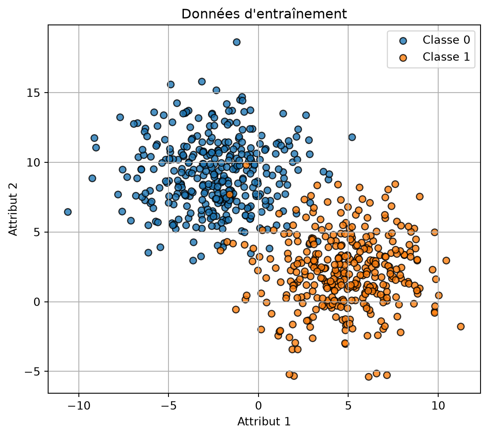
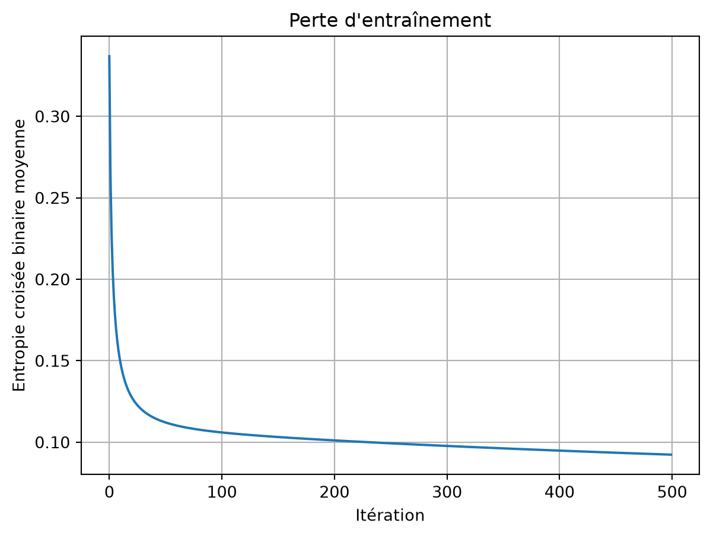
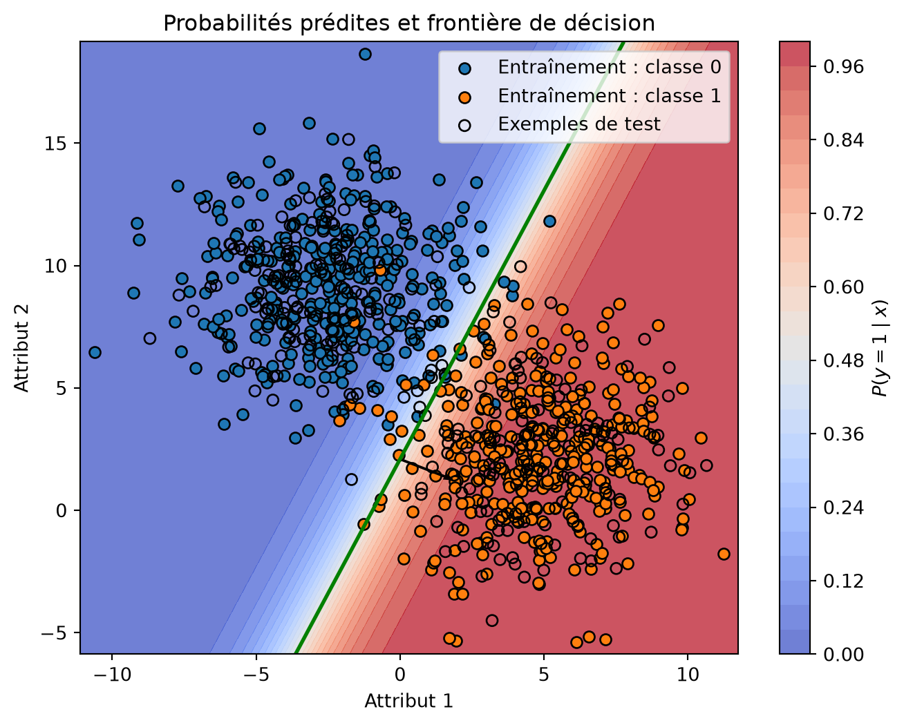

# Régression logistique entraînée par descente de gradient par lot

CSI4506 Introduction à l’intelligence artificielle

Auteur·rice

Affiliations

Marcel Turcotte [](mailto:marcel.turcotte@uottawa.ca)

École de génie électrique et d’informatique

Université d’Ottawa

Date de publication

20 septembre 2026

Ce carnet met en œuvre une régression logistique binaire avec NumPy. Le modèle utilise l’entropie croisée binaire et la descente de gradient par lot, conformément aux équations développées au cours 6.

# Importations

``` python
import matplotlib.pyplot as plt
import numpy as np

from sklearn.datasets import make_blobs
from sklearn.model_selection import train_test_split
```

# Mise en œuvre de la régression logistique

Pour une matrice X_b qui comprend une colonne pour l’ordonnée à l’origine, la mise en œuvre repose sur quatre équations :

z = X_b\theta, \qquad \hat{p} = \sigma(z),

\nabla J(\theta) = \frac{1}{N}X_b^\top(\hat{p}-y), \qquad \theta \leftarrow \theta-\alpha\nabla J(\theta).

Ici, \alpha désigne le taux d’apprentissage.

``` python
class LogisticRegression:
    """Régression logistique binaire entraînée par descente de gradient par lot.

    Paramètres
    ----------
    learning_rate : float, default=0.1
        Pas utilisé par la descente de gradient.
    max_iter : int, default=1000
        Nombre de mises à jour par descente de gradient.

    Remarques
    -----
    La mise en œuvre attend des étiquettes dans {0, 1}. Elle ajoute l'ordonnée
    à l'origine et n'utilise ni régularisation ni arrêt précoce.
    """

    def __init__(self, learning_rate: float = 0.1, max_iter: int = 1000):
        if learning_rate <= 0:
            raise ValueError("learning_rate doit être positif.")
        if max_iter <= 0:
            raise ValueError("max_iter doit être positif.")

        self.learning_rate = learning_rate
        self.max_iter = max_iter
        self._theta = None
        self._loss_history = None
        self._n_features = None
        self._fitted = False

    def fit(self, X: np.ndarray, y: np.ndarray) -> "LogisticRegression":
        """Estimer les paramètres à partir d'un ensemble d'entraînement."""
        X = self._as_2d_array(X, name="X")
        y = self._as_1d_array(y, name="y")

        if X.shape[0] != y.shape[0]:
            raise ValueError("X et y doivent contenir le même nombre d'exemples.")
        self._check_binary_labels(y)

        n_examples, n_features = X.shape
        self._n_features = n_features
        Xb = self._add_intercept(X)

        # Une initialisation à zéro suffit puisque l'objectif est convexe.
        self._theta = np.zeros(n_features + 1, dtype=float)
        self._loss_history = []

        for _ in range(self.max_iter):
            probabilities = self._sigmoid(Xb @ self._theta)
            gradient = (Xb.T @ (probabilities - y)) / n_examples
            self._theta -= self.learning_rate * gradient

            updated_probabilities = self._sigmoid(Xb @ self._theta)
            self._loss_history.append(self._bce_loss(updated_probabilities, y))

        self._fitted = True
        return self

    def predict_proba(self, X: np.ndarray) -> np.ndarray:
        """Retourner la probabilité prédite de la classe positive."""
        self._ensure_fitted()
        X = self._as_2d_array(X, name="X")
        self._ensure_same_n_features(X)
        return self._sigmoid(self._add_intercept(X) @ self._theta)

    def predict(self, X: np.ndarray, threshold: float = 0.5) -> np.ndarray:
        """Retourner les classes prédites en utilisant le seuil spécifié."""
        if not 0 <= threshold <= 1:
            raise ValueError("threshold doit être compris entre 0 et 1.")
        return (self.predict_proba(X) >= threshold).astype(int)

    @property
    def intercept_(self) -> float:
        """Retourner l'ordonnée à l'origine ajustée."""
        self._ensure_fitted()
        return float(self._theta[0])

    @property
    def coef_(self) -> np.ndarray:
        """Retourner une copie des coefficients ajustés des attributs."""
        self._ensure_fitted()
        return self._theta[1:].copy()

    def get_loss_history(self) -> list[float]:
        """Retourner les valeurs d'entropie croisée binaire de l'entraînement."""
        self._ensure_fitted()
        return list(self._loss_history)

    @staticmethod
    def _sigmoid(z: np.ndarray) -> np.ndarray:
        """Calculer la sigmoïde sans débordement pour les grandes valeurs négatives."""
        z = np.asarray(z, dtype=float)
        result = np.empty_like(z)
        positive = z >= 0
        result[positive] = 1.0 / (1.0 + np.exp(-z[positive]))
        exp_z = np.exp(z[~positive])
        result[~positive] = exp_z / (1.0 + exp_z)
        return result

    @staticmethod
    def _bce_loss(probabilities: np.ndarray, y: np.ndarray) -> float:
        probabilities = np.clip(probabilities, 1e-12, 1.0 - 1e-12)
        return float(
            -np.mean(
                y * np.log(probabilities)
                + (1 - y) * np.log(1 - probabilities)
            )
        )

    @staticmethod
    def _as_2d_array(X, name: str) -> np.ndarray:
        X = np.asarray(X, dtype=float)
        if X.ndim != 2:
            raise ValueError(
                f"{name} doit être un tableau 2D de forme (n_examples, n_features)."
            )
        return X

    @staticmethod
    def _as_1d_array(y, name: str) -> np.ndarray:
        y = np.asarray(y, dtype=float)
        if y.ndim != 1:
            raise ValueError(f"{name} doit être un tableau 1D de forme (n_examples,).")
        return y

    @staticmethod
    def _check_binary_labels(y: np.ndarray) -> None:
        if not np.array_equal(np.unique(y), np.array([0.0, 1.0])):
            raise ValueError("y doit contenir les deux étiquettes binaires 0 et 1.")

    @staticmethod
    def _add_intercept(X: np.ndarray) -> np.ndarray:
        return np.column_stack([np.ones(X.shape[0]), X])

    def _ensure_fitted(self) -> None:
        if not self._fitted or self._theta is None:
            raise RuntimeError("Appelez fit(X, y) avant d'utiliser le modèle ajusté.")

    def _ensure_same_n_features(self, X: np.ndarray) -> None:
        if X.shape[1] != self._n_features:
            raise ValueError(
                f"X comporte {X.shape[1]} attributs; le modèle a été ajusté avec "
                f"{self._n_features}."
            )
```

# Exemple bidimensionnel

Les deux attributs permettent de visualiser directement la surface de probabilité, la frontière de décision et le vecteur normal.

``` python
X, y = make_blobs(
    n_samples=1000,
    n_features=2,
    centers=2,
    cluster_std=2.5,
    random_state=42,
)

X_train, X_test, y_train, y_test = train_test_split(
    X,
    y,
    test_size=0.3,
    random_state=42,
    stratify=y,
)
```

Code

``` python
plt.figure(figsize=(7, 6))
plt.scatter(
    X_train[y_train == 0, 0],
    X_train[y_train == 0, 1],
    color="tab:blue",
    edgecolor="black",
    alpha=0.8,
    label="Classe 0",
)
plt.scatter(
    X_train[y_train == 1, 0],
    X_train[y_train == 1, 1],
    color="tab:orange",
    edgecolor="black",
    alpha=0.8,
    label="Classe 1",
)
plt.xlabel("Attribut 1")
plt.ylabel("Attribut 2")
plt.title("Données d'entraînement")
plt.legend()
plt.grid(True)
plt.show()
```



# Entraînement

``` python
model = LogisticRegression(learning_rate=0.1, max_iter=500)
model.fit(X_train, y_train)

print("Ordonnée à l'origine :", model.intercept_)
print("Coefficients des attributs :", model.coef_)
```

    Ordonnée à l'origine : 1.0100587136980153
    Coefficients des attributs : [ 1.06044862 -0.48332183]

La perte diminue à mesure que la descente de gradient par lot met à jour le vecteur de paramètres.

Code

``` python
plt.figure(figsize=(7, 5))
plt.plot(model.get_loss_history())
plt.xlabel("Itération")
plt.ylabel("Entropie croisée binaire moyenne")
plt.title("Perte d'entraînement")
plt.grid(True)
plt.show()
```



# Surface de probabilité et frontière de décision

Le contour vert indique où P(y=1\mid x)=0.5. Soit w=(\theta_1,\theta_2)^\top le vecteur ajusté des poids des attributs. Ce vecteur est normal à la frontière.

Code

``` python
x1_min, x1_max = X[:, 0].min() - 0.5, X[:, 0].max() + 0.5
x2_min, x2_max = X[:, 1].min() - 0.5, X[:, 1].max() + 0.5
x1_grid, x2_grid = np.meshgrid(
    np.linspace(x1_min, x1_max, 250),
    np.linspace(x2_min, x2_max, 250),
)
grid = np.column_stack([x1_grid.ravel(), x2_grid.ravel()])
probability_grid = model.predict_proba(grid).reshape(x1_grid.shape)

plt.figure(figsize=(8, 6))
surface = plt.contourf(
    x1_grid,
    x2_grid,
    probability_grid,
    levels=25,
    cmap="coolwarm",
    alpha=0.75,
)
plt.colorbar(surface, label=r"$P(y=1\mid x)$")
plt.contour(
    x1_grid,
    x2_grid,
    probability_grid,
    levels=[0.5],
    colors="green",
    linewidths=2,
)

plt.scatter(
    X_train[y_train == 0, 0],
    X_train[y_train == 0, 1],
    color="tab:blue",
    edgecolor="black",
    label="Entraînement : classe 0",
)
plt.scatter(
    X_train[y_train == 1, 0],
    X_train[y_train == 1, 1],
    color="tab:orange",
    edgecolor="black",
    label="Entraînement : classe 1",
)
plt.scatter(
    X_test[:, 0],
    X_test[:, 1],
    facecolors="none",
    edgecolors="black",
    marker="o",
    label="Exemples de test",
)

# Tracer le vecteur normal unitaire depuis un point de la frontière où x1 = 0.
normal = model.coef_
normal_unit = normal / np.linalg.norm(normal)
boundary_point = np.array([0.0, -model.intercept_ / normal[1]])
plt.arrow(
    boundary_point[0],
    boundary_point[1],
    normal_unit[0] * 2,
    normal_unit[1] * 2,
    width=0.03,
    head_width=0.18,
    color="black",
    length_includes_head=True,
)

plt.xlabel("Attribut 1")
plt.ylabel("Attribut 2")
plt.title("Probabilités prédites et frontière de décision")
plt.legend(loc="best")
plt.show()
```



La sigmoïde agit sur le score linéaire \theta_0+w^\top x. La distance signée à la frontière divise ce score par \lVert w\rVert; les deux quantités diffèrent donc lorsque le vecteur de poids n’est pas unitaire.
