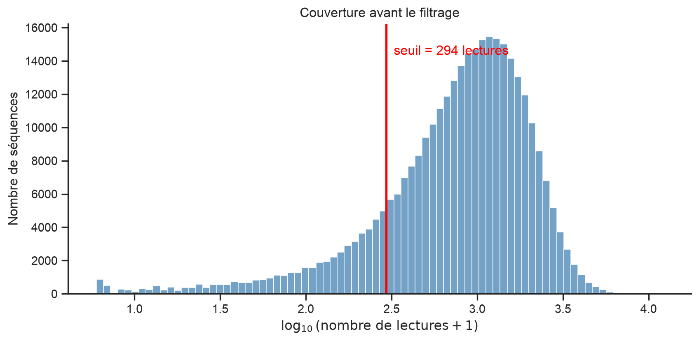
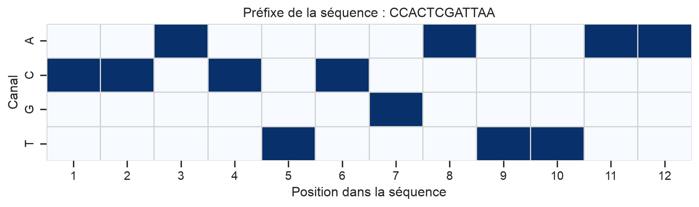
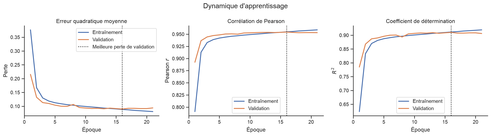
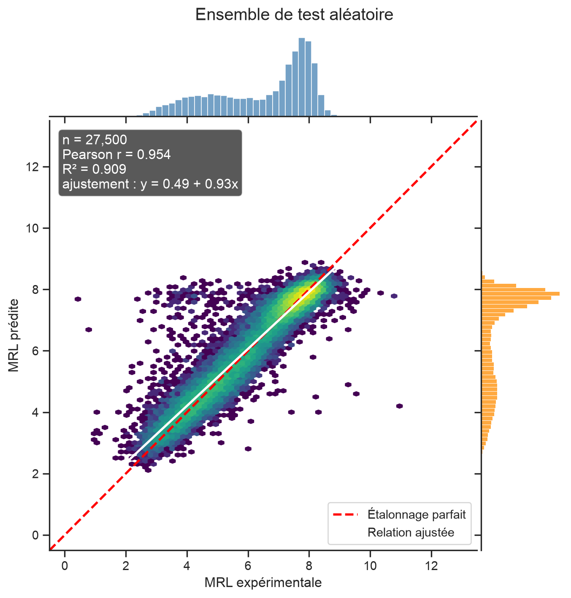
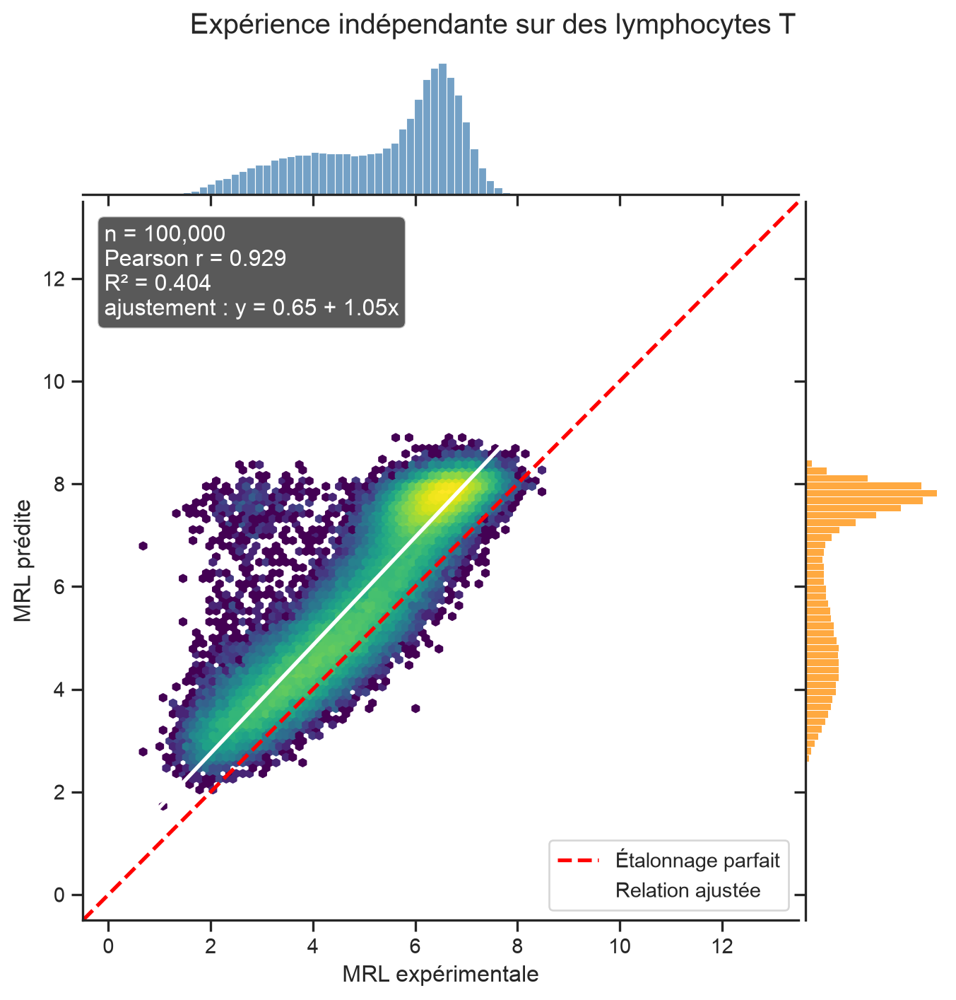
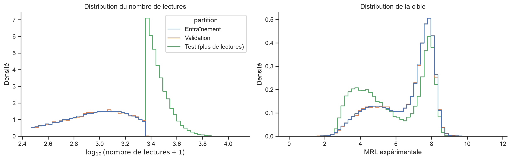
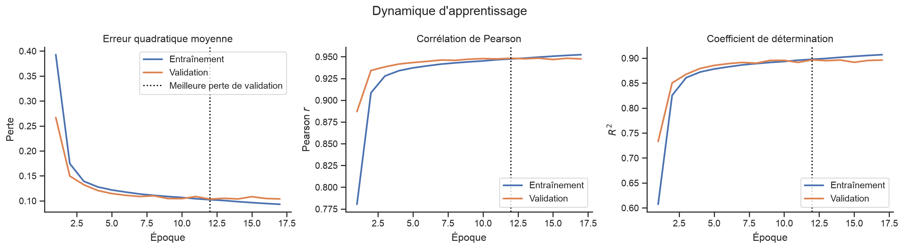
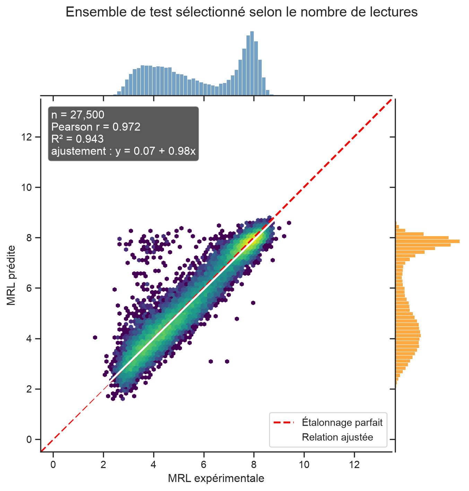
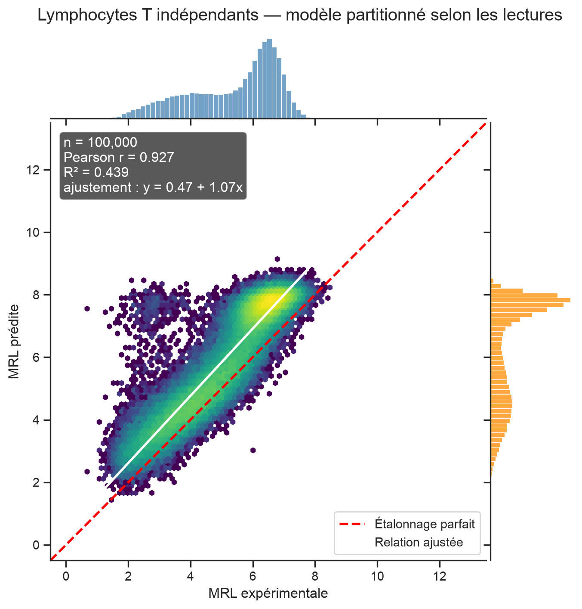

# Prédiction de la charge ribosomique moyenne avec un réseau neuronal convolutif 1D

CSI 4506 — Introduction à l’intelligence artificielle

Auteur·rice

Marcel Turcotte

Date de publication

Version : 31 août 2026, 18h44

# 1 Introduction

Les réseaux neuronaux convolutifs sont le plus souvent présentés à l’aide d’images. Les images fournissent des exemples visuels convaincants, mais l’entraînement de classificateurs d’images peut exiger des ressources de calcul considérables. Dans ce notebook, nous étudions un problème unidimensionnel plus petit pour lequel la convolution est tout aussi naturelle.

Notre tâche d’apprentissage automatique peut s’énoncer sans connaissances préalables en biologie :

> Étant donné une chaîne de longueur 50 sur l’alphabet `{A, C, G, T}`, prédire une valeur continue qui se situe généralement entre 0 et 13.

Les chaînes sont des régions non traduites en 5′ (5′ UTR), et la variable cible est la charge ribosomique moyenne (*mean ribosome load*, MRL). Une 5′ UTR est un segment d’une molécule d’ARN qui précède la région codant une protéine. La MRL résume le nombre de ribosomes associés à l’ARN et fournit donc une mesure expérimentale liée à la traduction.

L’expérience est adaptée de Sample et coll. et reprend des idées d’architecture employées dans des travaux ultérieurs, notamment ceux de Tang et coll. Notre stratégie de partitionnement est volontairement différente. Après avoir retiré les mesures de faible couverture, nous répartissons les données aléatoirement afin que l’ensemble de test provienne de la même population filtrée que l’ensemble d’entraînement.

> **NOTE:**
>
> Un court noyau de convolution examine une sous-chaîne locale à chaque position. Les mêmes poids appris sont réutilisés sur toute la séquence. Un CNN 1D possède ainsi les deux mêmes biais inductifs importants qu’un CNN appliqué aux images : la **connectivité locale** et le **partage des paramètres**.

## 1.1 Objectifs d’apprentissage

À la fin de ce notebook, vous devriez pouvoir :

- représenter des chaînes de longueur fixe par des tenseurs numériques à l’aide d’un encodage à chaud (*one-hot encoding*);
- expliquer comment une couche `Conv1D` traite une séquence;
- distinguer les données d’entraînement, de validation et de test;
- utiliser l’arrêt précoce pour contrôler l’entraînement d’un réseau neuronal;
- interpréter les courbes d’apprentissage de la perte, de la corrélation de Pearson et de \\R^2\\;
- expliquer comment des prédictions peuvent être fortement corrélées aux observations tout en demeurant mal calibrées.

# 2 Préparation

Nous utilisons Keras avec TensorFlow comme moteur. NumPy et pandas servent au traitement des données, tandis que Matplotlib et seaborn permettent de les visualiser. Scikit-learn et SciPy fournissent des fonctions usuelles de prétraitement et d’évaluation.

``` python
from contextlib import redirect_stderr, redirect_stdout
from io import StringIO
from pathlib import Path

import numpy as np
import pandas as pd

import matplotlib.pyplot as plt
import seaborn as sns

from scipy.stats import pearsonr, spearmanr
from sklearn.metrics import mean_squared_error, r2_score
from sklearn.preprocessing import StandardScaler

import tensorflow as tf
from tensorflow import keras
from tensorflow.keras import callbacks, layers
```

Tous les choix importants sont regroupés dans une seule cellule de configuration. Cette organisation facilite l’examen et la reproduction de l’expérience.

``` python
SEED = 42
SEQUENCE_LENGTH = 50

N_RETAINED = 275_000
N_TRAIN = 220_000
N_VALIDATION = 27_500
N_TEST = 27_500

BATCH_SIZE = 256
MAX_EPOCHS = 50
PATIENCE = 5

# Des limites communes rendent les graphiques de prédiction comparables.
MRL_PLOT_LIMITS = (-0.5, 13.5)

DATA_DIR = Path("data")
MODEL_DIR = Path("models")
DATA_DIR.mkdir(exist_ok=True)
MODEL_DIR.mkdir(exist_ok=True)

DATASETS = {
    "GSM3130435_egfp_unmod_1.csv.gz": (
        "https://ftp.ncbi.nlm.nih.gov/geo/samples/GSM3130nnn/"
        "GSM3130435/suppl/GSM3130435_egfp_unmod_1.csv.gz"
    ),
    "GSE232927_processed_defined_end_tcell_r1.csv.gz": (
        "https://ftp.ncbi.nlm.nih.gov/geo/series/GSE232nnn/"
        "GSE232927/suppl/"
        "GSE232927_processed_defined_end_tcell_r1.csv.gz"
    ),
    "GSE232927_processed_defined_end_tcell_r2.csv.gz": (
        "https://ftp.ncbi.nlm.nih.gov/geo/series/GSE232nnn/"
        "GSE232927/suppl/"
        "GSE232927_processed_defined_end_tcell_r2.csv.gz"
    ),
}

assert N_TRAIN + N_VALIDATION + N_TEST == N_RETAINED

keras.utils.set_random_seed(SEED)
sns.set_theme(style="ticks", context="notebook")

accelerators = tf.config.list_physical_devices("GPU")
device_description = "GPU" if accelerators else "CPU"
print(f"TensorFlow {tf.__version__}; dispositif d'entraînement : {device_description}")
```

    TensorFlow 2.21.0; dispositif d'entraînement : CPU

La fonction auxiliaire ci-dessous télécharge un jeu de données seulement s’il n’est pas déjà disponible. `keras.utils.get_file` renvoie aussi le chemin local, que nous pouvons transmettre directement à pandas. L’affichage de la progression est masqué par défaut, car les caractères de contrôle du terminal peuvent produire une très longue sortie dans un notebook généré. Le paramètre `show_progress=True` rétablit la barre de progression interactive.

``` python
def download_dataset(filename, show_progress=False):
    """Télécharge un jeu de données configuré et renvoie son chemin local."""
    if filename not in DATASETS:
        raise KeyError(f"Jeu de données inconnu : {filename}")

    arguments = {
        "fname": filename,
        "origin": DATASETS[filename],
        "cache_dir": str(Path.cwd()),
        "cache_subdir": str(DATA_DIR),
    }

    if show_progress:
        path = keras.utils.get_file(**arguments)
    else:
        with redirect_stdout(StringIO()), redirect_stderr(StringIO()):
            path = keras.utils.get_file(**arguments)

    return Path(path)
```

# 3 Chargement et validation du jeu de données principal

Les fichiers sources utilisent des noms de colonnes légèrement différents. Nous les uniformisons à l’entrée de notre programme afin que toutes les fonctions suivantes puissent employer le même vocabulaire simple : `utr`, `mrl` et `read_count`.

``` python
def load_utr_dataset(path, expected_length=SEQUENCE_LENGTH):
    """Charge et valide un jeu de données UTR traité.

    Le DataFrame renvoyé contient toujours les colonnes ``utr``, ``mrl`` et
    ``read_count``.
    """
    data = pd.read_csv(path)

    if "utr" not in data.columns and "UTR" in data.columns:
        data = data.rename(columns={"UTR": "utr"})

    if "total_reads" in data.columns:
        read_column = "total_reads"
    elif "total" in data.columns:
        read_column = "total"
    else:
        raise ValueError("Le jeu de données ne contient aucune colonne total_reads ou total.")

    required = {"utr", "rl", read_column}
    missing = required.difference(data.columns)
    if missing:
        raise ValueError(f"Colonnes requises manquantes : {sorted(missing)}")

    data = (
        data.loc[:, ["utr", "rl", read_column]]
        .rename(columns={"rl": "mrl", read_column: "read_count"})
        .copy()
    )

    data["utr"] = data["utr"].astype("string").str.upper()
    data["mrl"] = pd.to_numeric(data["mrl"], errors="coerce")
    data["read_count"] = pd.to_numeric(
        data["read_count"], errors="coerce"
    )

    if data[["utr", "mrl", "read_count"]].isna().any().any():
        raise ValueError("Des valeurs manquantes ou non numériques ont été trouvées.")

    valid_sequence = data["utr"].str.fullmatch(
        rf"[ACGTN]{{{expected_length}}}"
    )
    if not valid_sequence.all():
        n_invalid = int((~valid_sequence).sum())
        raise ValueError(
            f"{n_invalid} séquences ne sont pas des chaînes de longueur "
            f"{expected_length} sur A, C, G, T et N."
        )

    if (data["read_count"] < 0).any():
        raise ValueError("Le nombre de lectures doit être positif ou nul.")

    if data["utr"].duplicated().any():
        raise ValueError("Le jeu de données contient des séquences UTR en double.")

    return data.reset_index(drop=True)
```

``` python
main_path = download_dataset("GSM3130435_egfp_unmod_1.csv.gz")
main_data = load_utr_dataset(main_path)

print(f"{len(main_data):,} séquences chargées.")
main_data.head()
```

    326,033 séquences chargées.

|     | utr                                               | mrl      | read_count |
|-----|---------------------------------------------------|----------|------------|
| 0   | CCACTCGATTAACATGTTAACAACATACTCGTCCGGCCGATCAGCG... | 3.039939 | 12126.0    |
| 1   | CAAATCATGTGCAGCCCTGGCGACCGTACTGCGGTACAAGAAAGTA... | 3.895109 | 10368.0    |
| 2   | GTTATACTAGAAGAAACTTGAGATTATGGAGCAGTCCGTCAAGGAC... | 3.334524 | 9963.0     |
| 3   | CTTAGACAAAAACAACGCGCTTTCCAGTATGCGGAGCCTTGACGGT... | 3.575082 | 9934.0     |
| 4   | GTATCAAATCACGGCCAACCCGACGGAGTACCCCGCGTCGATGGTC... | 4.593712 | 9511.0     |

La cible et le nombre de lectures sont mesurés sur des échelles très différentes. Un résumé compact nous donne un premier aperçu des deux variables.

``` python
main_data[["mrl", "read_count"]].describe(
    percentiles=[0.01, 0.25, 0.50, 0.75, 0.99]
).round(3)
```

|       | mrl        | read_count |
|-------|------------|------------|
| count | 326033.000 | 326033.000 |
| mean  | 6.449      | 1068.042   |
| std   | 1.749      | 825.737    |
| min   | 0.000      | 5.000      |
| 1%    | 2.081      | 14.000     |
| 25%   | 5.082      | 453.000    |
| 50%   | 7.090      | 890.000    |
| 75%   | 7.807      | 1488.000   |
| 99%   | 9.109      | 3735.000   |
| max   | 13.000     | 12126.000  |

# 4 Filtrage des mesures selon le nombre de lectures

Les mesures fondées sur un très petit nombre de lectures sont moins précises. Nous conservons donc exactement les 275 000 séquences ayant les nombres de lectures les plus élevés.

``` python
def select_top_by_reads(data, n):
    """Renvoie les n lignes les plus lues et le nombre de lectures à la limite."""
    if not 0 < n <= len(data):
        raise ValueError("n doit être compris entre 1 et le nombre de lignes.")

    ranked = data.sort_values(
        "read_count", ascending=False, kind="stable"
    ).reset_index(drop=True)
    cutoff = float(ranked.loc[n - 1, "read_count"])
    return ranked.iloc[:n].copy(), cutoff


retained_data, read_cutoff = select_top_by_reads(main_data, N_RETAINED)
retained_fraction = N_RETAINED / len(main_data)

print(f"Seuil du nombre de lectures : {read_cutoff:,.0f}")
print(f"Séquences conservées : {N_RETAINED:,} ({retained_fraction:.1%})")
```

    Seuil du nombre de lectures : 294
    Séquences conservées : 275,000 (84.3%)

La distribution du nombre de lectures est fortement asymétrique vers la droite. Nous traçons \\\log\_{10}(\text{nombre de lectures}+1)\\ afin que les mesures de faible et de forte couverture demeurent visibles. La ligne rouge correspond au nombre de lectures de la 275 000e séquence du classement.

``` python
log_read_counts = np.log10(main_data["read_count"].to_numpy() + 1)
log_cutoff = np.log10(read_cutoff + 1)

fig, ax = plt.subplots(figsize=(9, 4.5))
sns.histplot(log_read_counts, bins=80, color="steelblue", ax=ax)
ax.axvline(log_cutoff, color="red", linewidth=2)
ax.text(
    log_cutoff,
    ax.get_ylim()[1] * 0.92,
    f"  seuil = {read_cutoff:,.0f} lectures",
    color="red",
    va="top",
)
ax.set(
    xlabel=r"$\log_{10}(\mathrm{nombre\ de\ lectures}+1)$",
    ylabel="Nombre de séquences",
    title="Couverture avant le filtrage",
)
sns.despine()
plt.tight_layout()
plt.show()
```



Distribution du nombre de lectures. La ligne rouge indique le seuil de conservation.

> **NOTE:**
>
> Comme les nombres de lectures sont entiers, plusieurs séquences peuvent être à égalité au seuil. Nous utilisons un classement stable et conservons exactement 275 000 lignes. La ligne rouge représente donc la valeur limite, et non une règle permettant de départager les égalités.

# 5 Représentation des chaînes de nucléotides

Un réseau neuronal manipule des nombres plutôt que des caractères. Nous représentons chaque nucléotide par quatre valeurs binaires :

| Nucléotide  |   A |   C |   G |   T |
|:------------|----:|----:|----:|----:|
| A           |   1 |   0 |   0 |   0 |
| C           |   0 |   1 |   0 |   0 |
| G           |   0 |   0 |   1 |   0 |
| T           |   0 |   0 |   0 |   1 |
| N (inconnu) |   0 |   0 |   0 |   0 |

Une chaîne de longueur 50 devient donc une matrice de \\50 \times 4\\.

``` python
def one_hot_encode(sequences, sequence_length=SEQUENCE_LENGTH):
    """Encode les chaînes de nucléotides dans un tableau (n, sequence_length, 4)."""
    sequences = pd.Series(sequences, dtype="string").str.upper()

    valid = sequences.str.fullmatch(rf"[ACGTN]{{{sequence_length}}}")
    if not valid.all():
        raise ValueError("Chaque séquence doit respecter le format attendu.")

    # Convertit tous les caractères ASCII à la fois et repère leur canal.
    characters = np.frombuffer(
        "".join(sequences).encode("ascii"), dtype=np.uint8
    ).reshape(-1, sequence_length)

    channel_lookup = np.full(256, -1, dtype=np.int8)
    for channel, nucleotide in enumerate("ACGT"):
        channel_lookup[ord(nucleotide)] = channel

    channels = channel_lookup[characters]
    encoded = np.zeros(
        (len(sequences), sequence_length, 4), dtype=np.float32
    )

    rows, positions = np.nonzero(channels >= 0)
    encoded[rows, positions, channels[rows, positions]] = 1.0
    return encoded
```

Nous visualisons le début d’une séquence avant d’encoder le jeu de données complet.

``` python
example_sequence = retained_data.loc[0, "utr"]
example_encoding = one_hot_encode([example_sequence])[0]
positions_to_show = 12

fig, ax = plt.subplots(figsize=(9, 2.8))
sns.heatmap(
    example_encoding[:positions_to_show].T,
    cmap="Blues",
    vmin=0,
    vmax=1,
    cbar=False,
    linewidths=0.5,
    linecolor="lightgray",
    xticklabels=np.arange(1, positions_to_show + 1),
    yticklabels=list("ACGT"),
    ax=ax,
)
ax.set(
    xlabel="Position dans la séquence",
    ylabel="Canal",
    title=f"Préfixe de la séquence : {example_sequence[:positions_to_show]}",
)
plt.tight_layout()
plt.show()

print("Longueur de la séquence complète :", len(example_sequence))
print("Forme de l'encodage :", example_encoding.shape)
```



Encodage à chaud des 12 premières positions d’une UTR.

    Longueur de la séquence complète : 50
    Forme de l'encodage : (50, 4)

# 6 Expérience 1 : partitionnement aléatoire

## 6.1 Création des ensembles d’entraînement, de validation et de test

Nous mélangeons aléatoirement les séquences conservées, puis créons trois partitions disjointes :

- 220 000 séquences pour ajuster le modèle;
- 27 500 séquences pour l’arrêt précoce et la sélection du modèle;
- 27 500 séquences pour l’évaluation finale.

L’ensemble de test demeure intact jusqu’à la fin de l’entraînement.

``` python
def random_partition(data, seed=SEED):
    """Crée les partitions aléatoires d'entraînement, de validation et de test."""
    if len(data) != N_RETAINED:
        raise ValueError(f"Exactement {N_RETAINED:,} lignes étaient attendues.")

    shuffled = data.sample(frac=1, random_state=seed).reset_index(drop=True)

    train = shuffled.iloc[:N_TRAIN].copy()
    validation = shuffled.iloc[
        N_TRAIN:N_TRAIN + N_VALIDATION
    ].copy()
    test = shuffled.iloc[N_TRAIN + N_VALIDATION:].copy()

    if (len(train), len(validation), len(test)) != (
        N_TRAIN,
        N_VALIDATION,
        N_TEST,
    ):
        raise AssertionError("Tailles de partitions inattendues.")

    train_sequences = set(train["utr"])
    validation_sequences = set(validation["utr"])
    test_sequences = set(test["utr"])

    if not train_sequences.isdisjoint(validation_sequences):
        raise AssertionError("Les ensembles d'entraînement et de validation se chevauchent.")
    if not train_sequences.isdisjoint(test_sequences):
        raise AssertionError("Les ensembles d'entraînement et de test se chevauchent.")
    if not validation_sequences.isdisjoint(test_sequences):
        raise AssertionError("Les ensembles de validation et de test se chevauchent.")

    return train, validation, test


train_data, validation_data, test_data = random_partition(retained_data)
```

Les trois partitions devraient présenter des distributions semblables de la MRL et du nombre de lectures. Ce petit tableau permet de vérifier la randomisation.

``` python
def summarize_partitions(partitions):
    """Résume la taille et la distribution cible des partitions nommées."""
    rows = []
    for name, data in partitions.items():
        rows.append(
            {
                "partition": name,
                "n": len(data),
                "MRL moyenne": data["mrl"].mean(),
                "écart-type MRL": data["mrl"].std(),
                "lectures médianes": data["read_count"].median(),
            }
        )
    return pd.DataFrame(rows).set_index("partition")


random_partition_summary = summarize_partitions(
    {
        "Entraînement": train_data,
        "Validation": validation_data,
        "Test": test_data,
    }
)
random_partition_summary.round(3)
```

|              | n      | MRL moyenne | écart-type MRL | lectures médianes |
|--------------|--------|-------------|----------------|-------------------|
| partition    |        |             |                |                   |
| Entraînement | 220000 | 6.475       | 1.611          | 1049.0            |
| Validation   | 27500  | 6.464       | 1.612          | 1053.0            |
| Test         | 27500  | 6.463       | 1.608          | 1051.0            |

Nous standardisons les cibles d’entraînement pour qu’elles aient une moyenne de zéro et un écart-type de un. Nous appliquons ensuite la même transformation aux cibles de validation et de test. Ajuster cette transformation uniquement sur les données d’entraînement empêche l’information des ensembles de validation et de test de se propager dans la mise au point du modèle.

``` python
target_scaler = StandardScaler()

y_train = target_scaler.fit_transform(
    train_data[["mrl"]]
).astype(np.float32)
y_validation = target_scaler.transform(
    validation_data[["mrl"]]
).astype(np.float32)
y_test = target_scaler.transform(
    test_data[["mrl"]]
).astype(np.float32)

x_train = one_hot_encode(train_data["utr"])
x_validation = one_hot_encode(validation_data["utr"])
x_test = one_hot_encode(test_data["utr"])

print("Caractéristiques d'entraînement :", x_train.shape, x_train.dtype)
print("Caractéristiques de validation :", x_validation.shape, x_validation.dtype)
print("Caractéristiques de test :", x_test.shape, x_test.dtype)
print("Cibles d'entraînement :", y_train.shape, y_train.dtype)
```

    Caractéristiques d'entraînement : (220000, 50, 4) float32
    Caractéristiques de validation : (27500, 50, 4) float32
    Caractéristiques de test : (27500, 50, 4) float32
    Cibles d'entraînement : (220000, 1) float32

## 6.2 Construction du réseau neuronal convolutif

La forme d’entrée est `(50, 4)` : 50 positions et quatre canaux de nucléotides. Keras utilise directement cette représentation où les canaux sont placés en dernier; aucune permutation du tenseur n’est donc nécessaire.

``` python
def build_mrl_cnn(
    sequence_length=SEQUENCE_LENGTH,
    n_filters=160,
    kernel_size=8,
    latent_dimension=80,
):
    """Construit le CNN 1D servant à prédire la MRL standardisée."""
    model = keras.Sequential(
        [
            keras.Input(shape=(sequence_length, 4), name="one_hot_utr"),
            layers.Conv1D(
                n_filters,
                kernel_size,
                padding="same",
                activation="relu",
                name="convolution_1",
            ),
            layers.Conv1D(
                n_filters,
                kernel_size,
                padding="same",
                activation="relu",
                name="convolution_2",
            ),
            layers.BatchNormalization(name="batch_normalization_1"),
            layers.Dropout(0.2, name="dropout_1"),
            layers.Conv1D(
                n_filters,
                kernel_size,
                padding="same",
                activation="relu",
                name="convolution_3",
            ),
            layers.BatchNormalization(name="batch_normalization_2"),
            layers.Dropout(0.4, name="dropout_2"),
            layers.Conv1D(
                n_filters // 2,
                kernel_size,
                padding="same",
                activation="relu",
                name="convolution_4",
            ),
            layers.BatchNormalization(name="batch_normalization_3"),
            layers.Dropout(0.2, name="dropout_3"),
            layers.Flatten(name="flatten"),
            layers.Dense(
                latent_dimension,
                activation="relu",
                name="latent_representation",
            ),
            layers.Dense(1, name="scaled_mrl"),
        ],
        name="mrl_cnn",
    )
    return model


model = build_mrl_cnn()
model.summary()
```

```
Model: "mrl_cnn"
```

```
┏━━━━━━━━━━━━━━━━━━━━━━━━━━━━━━━━━┳━━━━━━━━━━━━━━━━━━━━━━━━┳━━━━━━━━━━━━━━━┓
┃ Layer (type)                    ┃ Output Shape           ┃       Param # ┃
┡━━━━━━━━━━━━━━━━━━━━━━━━━━━━━━━━━╇━━━━━━━━━━━━━━━━━━━━━━━━╇━━━━━━━━━━━━━━━┩
│ convolution_1 (Conv1D)          │ (None, 50, 160)        │         5,280 │
├─────────────────────────────────┼────────────────────────┼───────────────┤
│ convolution_2 (Conv1D)          │ (None, 50, 160)        │       204,960 │
├─────────────────────────────────┼────────────────────────┼───────────────┤
│ batch_normalization_1           │ (None, 50, 160)        │           640 │
│ (BatchNormalization)            │                        │               │
├─────────────────────────────────┼────────────────────────┼───────────────┤
│ dropout_1 (Dropout)             │ (None, 50, 160)        │             0 │
├─────────────────────────────────┼────────────────────────┼───────────────┤
│ convolution_3 (Conv1D)          │ (None, 50, 160)        │       204,960 │
├─────────────────────────────────┼────────────────────────┼───────────────┤
│ batch_normalization_2           │ (None, 50, 160)        │           640 │
│ (BatchNormalization)            │                        │               │
├─────────────────────────────────┼────────────────────────┼───────────────┤
│ dropout_2 (Dropout)             │ (None, 50, 160)        │             0 │
├─────────────────────────────────┼────────────────────────┼───────────────┤
│ convolution_4 (Conv1D)          │ (None, 50, 80)         │       102,480 │
├─────────────────────────────────┼────────────────────────┼───────────────┤
│ batch_normalization_3           │ (None, 50, 80)         │           320 │
│ (BatchNormalization)            │                        │               │
├─────────────────────────────────┼────────────────────────┼───────────────┤
│ dropout_3 (Dropout)             │ (None, 50, 80)         │             0 │
├─────────────────────────────────┼────────────────────────┼───────────────┤
│ flatten (Flatten)               │ (None, 4000)           │             0 │
├─────────────────────────────────┼────────────────────────┼───────────────┤
│ latent_representation (Dense)   │ (None, 80)             │       320,080 │
├─────────────────────────────────┼────────────────────────┼───────────────┤
│ scaled_mrl (Dense)              │ (None, 1)              │            81 │
└─────────────────────────────────┴────────────────────────┴───────────────┘
```

```
 Total params: 839,441 (3.20 MB)
```

```
 Trainable params: 838,641 (3.20 MB)
```

```
 Non-trainable params: 800 (3.12 KB)
```

Chaque convolution utilise un noyau de largeur huit et `padding="same"`. La dimension spatiale demeure donc égale à 50 pendant que le réseau construit des représentations de plus en plus abstraites des motifs locaux de la séquence. La dernière unité linéaire produit une prédiction de MRL standardisée.

## 6.3 Entraînement du modèle

Keras fournit une implémentation cumulative de \\R^2\\. Nous implémentons la corrélation de Pearson de la même façon, en accumulant les statistiques suffisantes pendant une époque complète. Calculer la corrélation séparément pour chaque mini-lot, puis faire la moyenne de ces valeurs ne donnerait pas la corrélation sur l’ensemble complet.

``` python
@keras.utils.register_keras_serializable(package="CSI4106")
class PearsonCorrelation(keras.metrics.Metric):
    """Corrélation de Pearson accumulée sur tous les exemples d'une époque."""

    def __init__(self, name="pearson_r", **kwargs):
        super().__init__(name=name, **kwargs)
        self.count = self.add_weight(name="count", initializer="zeros")
        self.sum_true = self.add_weight(name="sum_true", initializer="zeros")
        self.sum_pred = self.add_weight(name="sum_pred", initializer="zeros")
        self.sum_true_squared = self.add_weight(
            name="sum_true_squared", initializer="zeros"
        )
        self.sum_pred_squared = self.add_weight(
            name="sum_pred_squared", initializer="zeros"
        )
        self.sum_products = self.add_weight(
            name="sum_products", initializer="zeros"
        )

    def update_state(self, y_true, y_pred, sample_weight=None):
        y_true = tf.cast(tf.reshape(y_true, [-1]), self.dtype)
        y_pred = tf.cast(tf.reshape(y_pred, [-1]), self.dtype)

        self.count.assign_add(tf.cast(tf.size(y_true), self.dtype))
        self.sum_true.assign_add(tf.reduce_sum(y_true))
        self.sum_pred.assign_add(tf.reduce_sum(y_pred))
        self.sum_true_squared.assign_add(tf.reduce_sum(tf.square(y_true)))
        self.sum_pred_squared.assign_add(tf.reduce_sum(tf.square(y_pred)))
        self.sum_products.assign_add(tf.reduce_sum(y_true * y_pred))

    def result(self):
        covariance = (
            self.sum_products
            - self.sum_true * self.sum_pred / self.count
        )
        true_variation = (
            self.sum_true_squared
            - tf.square(self.sum_true) / self.count
        )
        pred_variation = (
            self.sum_pred_squared
            - tf.square(self.sum_pred) / self.count
        )
        denominator = tf.sqrt(true_variation * pred_variation)
        return tf.math.divide_no_nan(covariance, denominator)

    def reset_state(self):
        for variable in self.variables:
            variable.assign(0)
```

L’erreur quadratique moyenne est à la fois notre objectif d’optimisation et la perte affichée pendant l’entraînement. La corrélation de Pearson et \\R^2\\ sont des métriques de suivi; elles ne modifient pas les mises à jour du gradient.

``` python
def compile_mrl_cnn(model):
    """Configure l'optimiseur, la perte et les métriques calculées par époque."""
    model.compile(
        optimizer=keras.optimizers.Adam(learning_rate=1e-3),
        loss="mean_squared_error",
        metrics=[
            PearsonCorrelation(),
            keras.metrics.R2Score(name="r2"),
        ],
    )
    return model


model = compile_mrl_cnn(model)
```

L’arrêt précoce surveille la perte de validation. Lorsque cette perte ne s’est pas améliorée pendant cinq époques, l’entraînement s’arrête et Keras restaure les poids de la meilleure époque. Un point de contrôle est également écrit sur le disque afin de pouvoir réutiliser le modèle dans des notebooks ultérieurs.

> **WARNING:**
>
> Il s’agit de la cellule la plus exigeante en calcul du notebook. La durée d’exécution dépend fortement de l’accélérateur disponible pour TensorFlow. La cellule utilise les 220 000 exemples d’entraînement et peut prendre plusieurs minutes.

``` python
random_split_model_path = MODEL_DIR / "mrl_cnn_random_split.keras"

training_callbacks = [
    callbacks.EarlyStopping(
        monitor="val_loss",
        mode="min",
        patience=PATIENCE,
        restore_best_weights=True,
        verbose=1,
    ),
    callbacks.ModelCheckpoint(
        filepath=str(random_split_model_path),
        monitor="val_loss",
        mode="min",
        save_best_only=True,
        verbose=0,
    ),
]

history = model.fit(
    x_train,
    y_train,
    validation_data=(x_validation, y_validation),
    epochs=MAX_EPOCHS,
    batch_size=BATCH_SIZE,
    shuffle=True,
    callbacks=training_callbacks,
    verbose=2,
)
```

    Epoch 1/50
    860/860 - 82s - 95ms/step - loss: 0.3765 - pearson_r: 0.7908 - r2: 0.6235 - val_loss: 0.2153 - val_pearson_r: 0.8923 - val_r2: 0.7849
    Epoch 2/50
    860/860 - 79s - 92ms/step - loss: 0.1669 - pearson_r: 0.9128 - r2: 0.8331 - val_loss: 0.1323 - val_pearson_r: 0.9366 - val_r2: 0.8678
    Epoch 3/50
    860/860 - 79s - 92ms/step - loss: 0.1300 - pearson_r: 0.9328 - r2: 0.8700 - val_loss: 0.1132 - val_pearson_r: 0.9443 - val_r2: 0.8869
    Epoch 4/50
    860/860 - 79s - 91ms/step - loss: 0.1187 - pearson_r: 0.9388 - r2: 0.8813 - val_loss: 0.1099 - val_pearson_r: 0.9471 - val_r2: 0.8902
    Epoch 5/50
    860/860 - 79s - 92ms/step - loss: 0.1127 - pearson_r: 0.9420 - r2: 0.8873 - val_loss: 0.1040 - val_pearson_r: 0.9485 - val_r2: 0.8961
    Epoch 6/50
    860/860 - 79s - 91ms/step - loss: 0.1089 - pearson_r: 0.9440 - r2: 0.8911 - val_loss: 0.1001 - val_pearson_r: 0.9504 - val_r2: 0.9000
    Epoch 7/50
    860/860 - 82s - 96ms/step - loss: 0.1057 - pearson_r: 0.9457 - r2: 0.8943 - val_loss: 0.0995 - val_pearson_r: 0.9506 - val_r2: 0.9006
    Epoch 8/50
    860/860 - 82s - 95ms/step - loss: 0.1036 - pearson_r: 0.9468 - r2: 0.8964 - val_loss: 0.1065 - val_pearson_r: 0.9500 - val_r2: 0.8936
    Epoch 9/50
    860/860 - 83s - 97ms/step - loss: 0.1011 - pearson_r: 0.9481 - r2: 0.8989 - val_loss: 0.0953 - val_pearson_r: 0.9524 - val_r2: 0.9047
    Epoch 10/50
    860/860 - 84s - 98ms/step - loss: 0.0992 - pearson_r: 0.9491 - r2: 0.9008 - val_loss: 0.0934 - val_pearson_r: 0.9527 - val_r2: 0.9067
    Epoch 11/50
    860/860 - 83s - 97ms/step - loss: 0.0973 - pearson_r: 0.9501 - r2: 0.9027 - val_loss: 0.0919 - val_pearson_r: 0.9533 - val_r2: 0.9082
    Epoch 12/50
    860/860 - 81s - 94ms/step - loss: 0.0955 - pearson_r: 0.9511 - r2: 0.9045 - val_loss: 0.0925 - val_pearson_r: 0.9536 - val_r2: 0.9075
    Epoch 13/50
    860/860 - 81s - 94ms/step - loss: 0.0933 - pearson_r: 0.9522 - r2: 0.9067 - val_loss: 0.0908 - val_pearson_r: 0.9537 - val_r2: 0.9093
    Epoch 14/50
    860/860 - 87s - 101ms/step - loss: 0.0918 - pearson_r: 0.9530 - r2: 0.9082 - val_loss: 0.0931 - val_pearson_r: 0.9534 - val_r2: 0.9070
    Epoch 15/50
    860/860 - 89s - 104ms/step - loss: 0.0902 - pearson_r: 0.9538 - r2: 0.9098 - val_loss: 0.0914 - val_pearson_r: 0.9537 - val_r2: 0.9086
    Epoch 16/50
    860/860 - 84s - 97ms/step - loss: 0.0883 - pearson_r: 0.9548 - r2: 0.9117 - val_loss: 0.0898 - val_pearson_r: 0.9544 - val_r2: 0.9102
    Epoch 17/50
    860/860 - 81s - 94ms/step - loss: 0.0870 - pearson_r: 0.9555 - r2: 0.9130 - val_loss: 0.0924 - val_pearson_r: 0.9536 - val_r2: 0.9076
    Epoch 18/50
    860/860 - 80s - 93ms/step - loss: 0.0849 - pearson_r: 0.9566 - r2: 0.9151 - val_loss: 0.0924 - val_pearson_r: 0.9530 - val_r2: 0.9077
    Epoch 19/50
    860/860 - 77s - 89ms/step - loss: 0.0836 - pearson_r: 0.9573 - r2: 0.9164 - val_loss: 0.0915 - val_pearson_r: 0.9532 - val_r2: 0.9086
    Epoch 20/50
    860/860 - 76s - 88ms/step - loss: 0.0821 - pearson_r: 0.9581 - r2: 0.9179 - val_loss: 0.0915 - val_pearson_r: 0.9533 - val_r2: 0.9086
    Epoch 21/50
    860/860 - 76s - 88ms/step - loss: 0.0806 - pearson_r: 0.9588 - r2: 0.9194 - val_loss: 0.0939 - val_pearson_r: 0.9531 - val_r2: 0.9062
    Epoch 21: early stopping
    Restoring model weights from the end of the best epoch: 16.

## 6.4 Visualisation de la dynamique d’apprentissage

L’objet `History` de Keras enregistre chaque perte et chaque métrique nommée lors de la compilation du modèle. Nous affichons trois vues complémentaires de l’apprentissage.

``` python
def plot_training_history(history):
    """Trace la perte, r de Pearson et R carré pour l'entraînement et la validation."""
    values = history.history
    epochs = np.arange(1, len(values["loss"]) + 1)
    best_epoch = int(np.argmin(values["val_loss"])) + 1

    panels = [
        ("loss", "Erreur quadratique moyenne", "Perte"),
        ("pearson_r", "Corrélation de Pearson", r"Pearson $r$"),
        ("r2", "Coefficient de détermination", r"$R^2$"),
    ]

    fig, axes = plt.subplots(1, 3, figsize=(15, 4.2))
    for ax, (metric, title, ylabel) in zip(axes, panels):
        ax.plot(epochs, values[metric], label="Entraînement", linewidth=2)
        ax.plot(
            epochs,
            values[f"val_{metric}"],
            label="Validation",
            linewidth=2,
        )
        ax.axvline(
            best_epoch,
            color="black",
            linestyle=":",
            linewidth=1.5,
            label="Meilleure perte de validation" if metric == "loss" else None,
        )
        ax.set(
            xlabel="Époque",
            ylabel=ylabel,
            title=title,
        )
        ax.legend()
        sns.despine(ax=ax)

    fig.suptitle("Dynamique d'apprentissage", fontsize=15)
    fig.tight_layout()
    return fig, axes
```

``` python
plot_training_history(history)
plt.show()
```



Métriques d’entraînement et de validation. La ligne pointillée indique l’époque où la perte de validation est la plus faible.

## 6.5 Évaluation de l’ensemble de test

Le réseau prédit une MRL standardisée. Nous ramenons sa sortie à l’échelle expérimentale d’origine avant de calculer les métriques finales ou de tracer les résultats.

``` python
def predict_mrl(model, encoded_sequences, scaler, batch_size=BATCH_SIZE):
    """Prédit la MRL et renvoie les valeurs à l'échelle expérimentale d'origine."""
    scaled_predictions = model.predict(
        encoded_sequences,
        batch_size=batch_size,
        verbose=0,
    )
    return scaler.inverse_transform(scaled_predictions).ravel()


def regression_metrics(observed, predicted):
    """Renvoie les principales métriques de régression d'un ensemble d'évaluation."""
    observed = np.asarray(observed).ravel()
    predicted = np.asarray(predicted).ravel()

    return {
        "n": len(observed),
        "Pearson r": pearsonr(observed, predicted)[0],
        "Spearman rho": spearmanr(observed, predicted)[0],
        "R2": r2_score(observed, predicted),
        "RMSE": np.sqrt(mean_squared_error(observed, predicted)),
    }
```

``` python
test_observed = test_data["mrl"].to_numpy()
test_predicted = predict_mrl(model, x_test, target_scaler)

test_metrics = regression_metrics(test_observed, test_predicted)
pd.DataFrame([test_metrics], index=["Ensemble de test aléatoire"]).round(4)
```

|                            | n     | Pearson r | Spearman rho | R2     | RMSE   |
|----------------------------|-------|-----------|--------------|--------|--------|
| Ensemble de test aléatoire | 27500 | 0.9539    | 0.9237       | 0.9093 | 0.4844 |

Avec des dizaines de milliers de points, un nuage de points ordinaire souffre d’une forte superposition. Un diagramme de densité hexagonal montre où se concentrent les observations, tandis que les histogrammes marginaux présentent la distribution le long de chaque axe.

``` python
def plot_observed_vs_predicted(
    observed,
    predicted,
    title,
    limits=MRL_PLOT_LIMITS,
):
    """Trace la densité, les distributions marginales et les droites d'étalonnage."""
    observed = np.asarray(observed).ravel()
    predicted = np.asarray(predicted).ravel()
    metrics = regression_metrics(observed, predicted)

    grid = sns.JointGrid(
        x=observed,
        y=predicted,
        height=7,
        ratio=5,
        space=0.05,
        xlim=limits,
        ylim=limits,
    )

    grid.ax_joint.hexbin(
        observed,
        predicted,
        gridsize=60,
        mincnt=1,
        bins="log",
        cmap="viridis",
    )
    sns.histplot(x=observed, bins=50, color="steelblue", ax=grid.ax_marg_x)
    sns.histplot(y=predicted, bins=50, color="darkorange", ax=grid.ax_marg_y)

    line_x = np.asarray(limits)
    grid.ax_joint.plot(
        line_x,
        line_x,
        color="red",
        linestyle="--",
        linewidth=2,
        label="Étalonnage parfait",
    )

    slope, intercept = np.polyfit(observed, predicted, deg=1)
    grid.ax_joint.plot(
        line_x,
        intercept + slope * line_x,
        color="white",
        linewidth=2,
        label="Relation ajustée",
    )

    annotation = (
        f"n = {metrics['n']:,}\n"
        f"Pearson r = {metrics['Pearson r']:.3f}\n"
        f"R² = {metrics['R2']:.3f}\n"
        f"ajustement : y = {intercept:.2f} + {slope:.2f}x"
    )
    grid.ax_joint.text(
        0.03,
        0.97,
        annotation,
        transform=grid.ax_joint.transAxes,
        ha="left",
        va="top",
        color="white",
        bbox={"boxstyle": "round", "facecolor": "black", "alpha": 0.65},
    )
    grid.ax_joint.set(
        xlabel="MRL expérimentale",
        ylabel="MRL prédite",
    )
    grid.ax_joint.legend(loc="lower right")
    grid.fig.suptitle(title, y=1.02, fontsize=15)
    return grid
```

``` python
plot_observed_vs_predicted(
    test_observed,
    test_predicted,
    title="Ensemble de test aléatoire",
)
plt.show()
```



MRL expérimentale et prédite pour l’ensemble de test échantillonné aléatoirement.

## 6.6 Évaluation sur une expérience indépendante menée sur des lymphocytes T

L’ensemble de test précédent provient de la même expérience et de la même population filtrée que les données d’entraînement. Nous posons maintenant une question plus difficile : le modèle se transfère-t-il à des mesures réalisées dans un contexte cellulaire différent?

Deux réplicats biologiques sont disponibles. Une séquence mesurée avec une plus grande profondeur dans un réplicat devrait recevoir davantage d’influence de ce réplicat. Nous combinons donc les MRL des réplicats en utilisant leurs nombres de lectures comme poids :

\\ \operatorname{MRL}\_{\mathrm{merged}} = \frac{ \operatorname{MRL}\_1 n_1 + \operatorname{MRL}\_2 n_2 }{n_1+n_2}, \\

où \\n_1\\ et \\n_2\\ sont les nombres de lectures des réplicats.

``` python
def merge_replicates(replicate_1, replicate_2):
    """Joint deux réplicats et calcule la MRL pondérée par les lectures."""
    first = replicate_1.rename(
        columns={
            "mrl": "mrl_1",
            "read_count": "read_count_1",
        }
    )
    second = replicate_2.rename(
        columns={
            "mrl": "mrl_2",
            "read_count": "read_count_2",
        }
    )

    merged = first.merge(second, how="outer", on="utr", validate="one_to_one")

    for replicate in (1, 2):
        read_column = f"read_count_{replicate}"
        mrl_column = f"mrl_{replicate}"

        merged[read_column] = merged[read_column].fillna(0)
        inconsistent = (
            (merged[read_column] > 0) & merged[mrl_column].isna()
        )
        if inconsistent.any():
            raise ValueError(
                f"Le réplicat {replicate} a des lectures positives, mais sa MRL est manquante."
            )
        merged[mrl_column] = merged[mrl_column].fillna(0)

    merged["read_count"] = (
        merged["read_count_1"] + merged["read_count_2"]
    )

    positive_reads = merged["read_count"] > 0
    merged = merged.loc[positive_reads].copy()
    merged["mrl"] = (
        merged["mrl_1"] * merged["read_count_1"]
        + merged["mrl_2"] * merged["read_count_2"]
    ) / merged["read_count"]

    return merged.loc[:, ["utr", "mrl", "read_count"]].reset_index(
        drop=True
    )
```

``` python
tcell_r1_path = download_dataset(
    "GSE232927_processed_defined_end_tcell_r1.csv.gz"
)
tcell_r2_path = download_dataset(
    "GSE232927_processed_defined_end_tcell_r2.csv.gz"
)

tcell_r1 = load_utr_dataset(tcell_r1_path)
tcell_r2 = load_utr_dataset(tcell_r2_path)

tcell_merged = merge_replicates(tcell_r1, tcell_r2)
tcell_data, tcell_read_cutoff = select_top_by_reads(tcell_merged, 100_000)

print(f"Réplicat 1 : {len(tcell_r1):,} séquences")
print(f"Réplicat 2 : {len(tcell_r2):,} séquences")
print(f"Union fusionnée : {len(tcell_merged):,} séquences")
print(f"Séquences conservées : {len(tcell_data):,}")
print(f"Seuil du nombre de lectures : {tcell_read_cutoff:,.0f}")
```

    Réplicat 1 : 349,633 séquences
    Réplicat 2 : 352,724 séquences
    Union fusionnée : 387,794 séquences
    Séquences conservées : 100,000
    Seuil du nombre de lectures : 888

Les données indépendantes ne doivent pas influencer le prétraitement. Nous réutilisons l’encodeur à chaud et le normalisateur de la cible ajusté lors de l’expérience initiale.

``` python
x_tcell = one_hot_encode(tcell_data["utr"])
tcell_observed = tcell_data["mrl"].to_numpy()
tcell_predicted = predict_mrl(model, x_tcell, target_scaler)

tcell_metrics = regression_metrics(tcell_observed, tcell_predicted)

evaluation_summary = pd.DataFrame(
    [test_metrics, tcell_metrics],
    index=["Ensemble de test aléatoire", "Lymphocytes T indépendants"],
)
evaluation_summary.round(4)
```

|                            | n      | Pearson r | Spearman rho | R2     | RMSE   |
|----------------------------|--------|-----------|--------------|--------|--------|
| Ensemble de test aléatoire | 27500  | 0.9539    | 0.9237       | 0.9093 | 0.4844 |
| Lymphocytes T indépendants | 100000 | 0.9292    | 0.8929       | 0.4036 | 1.1095 |

``` python
plot_observed_vs_predicted(
    tcell_observed,
    tcell_predicted,
    title="Expérience indépendante sur des lymphocytes T",
)
plt.show()
```



MRL expérimentale et prédite pour les réplicats fusionnés de lymphocytes T.

### 6.6.1 Corrélation, classement et étalonnage

Les deux droites de référence, rouge et blanche, répondent à des questions différentes :

- La droite d’identité rouge en tirets représente des prédictions numériques parfaites.
- La droite blanche ajustée représente la relation linéaire réellement présente dans les données.

La corrélation de Pearson mesure la force d’une relation linéaire. Elle demeure inchangée lorsque toutes les prédictions reçoivent le même décalage et la même mise à l’échelle positive. Le \\R^2\\ prédictif est plus strict :

\\ R^2 = 1- \frac{\sum_i(y_i-\hat{y}\_i)^2} {\sum_i(y_i-\bar{y})^2}. \\

Il pénalise donc les décalages et les erreurs d’échelle. Les données indépendantes peuvent présenter une forte corrélation de Pearson, mais un \\R^2\\ plus faible lorsque la droite blanche ajustée diffère de la droite d’identité rouge.

La corrélation de Spearman, incluse dans le tableau de résultats, mesure plus directement la concordance monotone des rangs. Cette propriété sera utile pour notre future application de conception : un algorithme génétique a surtout besoin que le modèle classe efficacement les séquences candidates prometteuses.

> **IMPORTANT:**
>
> Certains articles présentent le carré de la corrélation de Pearson sous le nom de « R carré ». Ici, `R2` désigne toujours le coefficient de détermination prédictif calculé à partir des erreurs par rapport à la droite d’identité.

## 6.7 Sauvegarde du prédicteur réutilisable

Le meilleur modèle a été sauvegardé pendant l’entraînement. Nous sauvegardons aussi les deux nombres nécessaires pour ramener les prédictions à l’échelle originale de la MRL. Ces artefacts permettront à un notebook ultérieur sur les algorithmes génétiques d’évaluer de nouvelles chaînes sans charger les données expérimentales d’entraînement.

``` python
scaler_path = MODEL_DIR / "mrl_target_scaler.npz"
np.savez(
    scaler_path,
    mean=target_scaler.mean_.astype(np.float32),
    scale=target_scaler.scale_.astype(np.float32),
)

print("Modèle sauvegardé :", random_split_model_path)
print("Transformation de la cible sauvegardée :", scaler_path)
```

    Modèle sauvegardé : models/mrl_cnn_random_split.keras
    Transformation de la cible sauvegardée : models/mrl_target_scaler.npz

L’interface de prédiction complète consiste maintenant à valider les chaînes, à les encoder à chaud, à appliquer le modèle, puis à annuler la standardisation de la cible.

``` python
example_sequences = pd.Series(
    [
        "A" * SEQUENCE_LENGTH,
        "C" * SEQUENCE_LENGTH,
        ("ACGT" * 13)[:SEQUENCE_LENGTH],
    ],
    name="utr",
)

example_predictions = predict_mrl(
    model,
    one_hot_encode(example_sequences),
    target_scaler,
)

pd.DataFrame(
    {
        "utr": example_sequences,
        "predicted_mrl": example_predictions,
    }
).round({"predicted_mrl": 3})
```

|     | utr                                               | predicted_mrl |
|-----|---------------------------------------------------|---------------|
| 0   | AAAAAAAAAAAAAAAAAAAAAAAAAAAAAAAAAAAAAAAAAAAAAA... | 8.462         |
| 1   | CCCCCCCCCCCCCCCCCCCCCCCCCCCCCCCCCCCCCCCCCCCCCC... | 5.189         |
| 2   | ACGTACGTACGTACGTACGTACGTACGTACGTACGTACGTACGTAC... | 6.898         |

# 7 Expérience 2 : partitionnement selon le nombre de lectures

Notre expérience principale utilise un ensemble de test aléatoire, car elle cherche à déterminer dans quelle mesure le modèle se généralise à de nouvelles séquences de la même population filtrée. Sample et coll. posaient une question différente et réservaient à l’évaluation les séquences mesurées avec la plus grande profondeur.

Pour isoler l’effet de ce choix expérimental, nous conservons exactement les mêmes tailles de partitions que précédemment :

- les 27 500 séquences ayant le plus grand nombre de lectures forment l’ensemble de test;
- 220 000 des séquences restantes forment l’ensemble d’entraînement;
- les 27 500 dernières séquences forment l’ensemble de validation.

Seule la règle de sélection de l’ensemble de test change.

``` python
def read_count_partition(data, seed=SEED):
    """Réserve les lignes les plus lues au test, puis répartit les autres."""
    if len(data) != N_RETAINED:
        raise ValueError(f"Exactement {N_RETAINED:,} lignes étaient attendues.")

    ranked = data.sort_values(
        "read_count", ascending=False, kind="stable"
    ).reset_index(drop=True)

    test = ranked.iloc[:N_TEST].copy()
    remaining = ranked.iloc[N_TEST:].sample(
        frac=1,
        random_state=seed,
    ).reset_index(drop=True)

    train = remaining.iloc[:N_TRAIN].copy()
    validation = remaining.iloc[N_TRAIN:].copy()

    if (len(train), len(validation), len(test)) != (
        N_TRAIN,
        N_VALIDATION,
        N_TEST,
    ):
        raise AssertionError("Tailles de partitions inattendues.")

    return train, validation, test


read_train_data, read_validation_data, read_test_data = (
    read_count_partition(retained_data)
)

read_partition_summary = summarize_partitions(
    {
        "Entraînement": read_train_data,
        "Validation": read_validation_data,
        "Test (plus de lectures)": read_test_data,
    }
)
read_partition_summary.round(3)
```

|                         | n      | MRL moyenne | écart-type MRL | lectures médianes |
|-------------------------|--------|-------------|----------------|-------------------|
| partition               |        |             |                |                   |
| Entraînement            | 220000 | 6.543       | 1.570          | 962.0             |
| Validation              | 27500  | 6.542       | 1.569          | 960.0             |
| Test (plus de lectures) | 27500  | 5.846       | 1.825          | 2749.0            |

Les distributions ci-dessous montrent que la sélection de l’ensemble de test selon le nombre de lectures modifie la couverture des mesures et, potentiellement, la distribution de la cible.

``` python
partition_plot_data = pd.concat(
    [
        read_train_data[["mrl", "read_count"]].assign(
            partition="Entraînement"
        ),
        read_validation_data[["mrl", "read_count"]].assign(
            partition="Validation"
        ),
        read_test_data[["mrl", "read_count"]].assign(
            partition="Test (plus de lectures)"
        ),
    ],
    ignore_index=True,
)
partition_plot_data["log_read_count"] = np.log10(
    partition_plot_data["read_count"] + 1
)

fig, axes = plt.subplots(1, 2, figsize=(13, 4.2))
sns.histplot(
    data=partition_plot_data,
    x="log_read_count",
    hue="partition",
    bins=60,
    stat="density",
    common_norm=False,
    element="step",
    fill=False,
    ax=axes[0],
)
axes[0].set(
    xlabel=r"$\log_{10}(\mathrm{nombre\ de\ lectures}+1)$",
    ylabel="Densité",
    title="Distribution du nombre de lectures",
)

sns.histplot(
    data=partition_plot_data,
    x="mrl",
    hue="partition",
    bins=60,
    stat="density",
    common_norm=False,
    element="step",
    fill=False,
    ax=axes[1],
    legend=False,
)
axes[1].set(
    xlabel="MRL expérimentale",
    ylabel="Densité",
    title="Distribution de la cible",
)

for ax in axes:
    sns.despine(ax=ax)
fig.tight_layout()
plt.show()
```



Distributions produites par la sélection de l’ensemble de test selon le nombre de lectures.

Nous réentraînons maintenant la même architecture à partir de zéro. La transformation de la cible est de nouveau ajustée uniquement à l’aide des données d’entraînement.

``` python
read_target_scaler = StandardScaler()

read_y_train = read_target_scaler.fit_transform(
    read_train_data[["mrl"]]
).astype(np.float32)
read_y_validation = read_target_scaler.transform(
    read_validation_data[["mrl"]]
).astype(np.float32)

read_x_train = one_hot_encode(read_train_data["utr"])
read_x_validation = one_hot_encode(read_validation_data["utr"])
read_x_test = one_hot_encode(read_test_data["utr"])

print("Caractéristiques d'entraînement :", read_x_train.shape, read_x_train.dtype)
print("Caractéristiques de validation :", read_x_validation.shape, read_x_validation.dtype)
print("Caractéristiques de test :", read_x_test.shape, read_x_test.dtype)
```

    Caractéristiques d'entraînement : (220000, 50, 4) float32
    Caractéristiques de validation : (27500, 50, 4) float32
    Caractéristiques de test : (27500, 50, 4) float32

La graine, l’architecture, l’optimiseur, la taille des lots, la règle d’arrêt précoce et le nombre maximal d’époques sont identiques à ceux de l’expérience 1. La stratégie de partitionnement des données constitue donc la seule différence expérimentale intentionnelle.

> **WARNING:**
>
> Cette cellule effectue un second entraînement complet du modèle et double donc approximativement la durée totale d’exécution du notebook.

``` python
# Réinitialise l'état aléatoire avant de construire le second modèle.
keras.utils.set_random_seed(SEED)
read_count_model = compile_mrl_cnn(build_mrl_cnn())
read_count_model_path = MODEL_DIR / "mrl_cnn_read_count_split.keras"

read_history = read_count_model.fit(
    read_x_train,
    read_y_train,
    validation_data=(read_x_validation, read_y_validation),
    epochs=MAX_EPOCHS,
    batch_size=BATCH_SIZE,
    shuffle=True,
    callbacks=[
        callbacks.EarlyStopping(
            monitor="val_loss",
            mode="min",
            patience=PATIENCE,
            restore_best_weights=True,
            verbose=1,
        ),
        callbacks.ModelCheckpoint(
            filepath=str(read_count_model_path),
            monitor="val_loss",
            mode="min",
            save_best_only=True,
        ),
    ],
    verbose=2,
)
```

    Epoch 1/50
    860/860 - 77s - 90ms/step - loss: 0.3927 - pearson_r: 0.7804 - r2: 0.6073 - val_loss: 0.2668 - val_pearson_r: 0.8870 - val_r2: 0.7331
    Epoch 2/50
    860/860 - 76s - 88ms/step - loss: 0.1746 - pearson_r: 0.9085 - r2: 0.8254 - val_loss: 0.1496 - val_pearson_r: 0.9342 - val_r2: 0.8503
    Epoch 3/50
    860/860 - 78s - 91ms/step - loss: 0.1392 - pearson_r: 0.9278 - r2: 0.8608 - val_loss: 0.1322 - val_pearson_r: 0.9383 - val_r2: 0.8677
    Epoch 4/50
    860/860 - 81s - 94ms/step - loss: 0.1279 - pearson_r: 0.9339 - r2: 0.8721 - val_loss: 0.1206 - val_pearson_r: 0.9416 - val_r2: 0.8793
    Epoch 5/50
    860/860 - 81s - 94ms/step - loss: 0.1217 - pearson_r: 0.9372 - r2: 0.8783 - val_loss: 0.1146 - val_pearson_r: 0.9433 - val_r2: 0.8854
    Epoch 6/50
    860/860 - 81s - 94ms/step - loss: 0.1175 - pearson_r: 0.9394 - r2: 0.8825 - val_loss: 0.1110 - val_pearson_r: 0.9446 - val_r2: 0.8889
    Epoch 7/50
    860/860 - 81s - 94ms/step - loss: 0.1136 - pearson_r: 0.9415 - r2: 0.8864 - val_loss: 0.1087 - val_pearson_r: 0.9462 - val_r2: 0.8913
    Epoch 8/50
    860/860 - 81s - 94ms/step - loss: 0.1110 - pearson_r: 0.9429 - r2: 0.8890 - val_loss: 0.1100 - val_pearson_r: 0.9458 - val_r2: 0.8899
    Epoch 9/50
    860/860 - 81s - 94ms/step - loss: 0.1087 - pearson_r: 0.9441 - r2: 0.8913 - val_loss: 0.1046 - val_pearson_r: 0.9471 - val_r2: 0.8954
    Epoch 10/50
    860/860 - 83s - 96ms/step - loss: 0.1067 - pearson_r: 0.9451 - r2: 0.8933 - val_loss: 0.1044 - val_pearson_r: 0.9478 - val_r2: 0.8955
    Epoch 11/50
    860/860 - 86s - 99ms/step - loss: 0.1041 - pearson_r: 0.9465 - r2: 0.8959 - val_loss: 0.1086 - val_pearson_r: 0.9475 - val_r2: 0.8914
    Epoch 12/50
    860/860 - 83s - 97ms/step - loss: 0.1023 - pearson_r: 0.9475 - r2: 0.8977 - val_loss: 0.1035 - val_pearson_r: 0.9482 - val_r2: 0.8965
    Epoch 13/50
    860/860 - 78s - 91ms/step - loss: 0.1006 - pearson_r: 0.9484 - r2: 0.8994 - val_loss: 0.1051 - val_pearson_r: 0.9476 - val_r2: 0.8949
    Epoch 14/50
    860/860 - 77s - 90ms/step - loss: 0.0984 - pearson_r: 0.9495 - r2: 0.9016 - val_loss: 0.1038 - val_pearson_r: 0.9483 - val_r2: 0.8962
    Epoch 15/50
    860/860 - 83s - 97ms/step - loss: 0.0964 - pearson_r: 0.9506 - r2: 0.9036 - val_loss: 0.1083 - val_pearson_r: 0.9468 - val_r2: 0.8916
    Epoch 16/50
    860/860 - 81s - 94ms/step - loss: 0.0946 - pearson_r: 0.9515 - r2: 0.9054 - val_loss: 0.1047 - val_pearson_r: 0.9482 - val_r2: 0.8953
    Epoch 17/50
    860/860 - 77s - 90ms/step - loss: 0.0931 - pearson_r: 0.9523 - r2: 0.9069 - val_loss: 0.1038 - val_pearson_r: 0.9475 - val_r2: 0.8961
    Epoch 17: early stopping
    Restoring model weights from the end of the best epoch: 12.

Nous examinons d’abord la dynamique d’apprentissage et vérifions que l’arrêt précoce a sélectionné un modèle dont les performances de validation sont stables.

``` python
plot_training_history(read_history)
plt.show()
```



Métriques d’entraînement et de validation pour le partitionnement selon le nombre de lectures.

L’évaluation finale utilise les 27 500 séquences ayant les nombres de lectures les plus élevés. Le tableau comparatif place ces résultats à côté de ceux de l’ensemble de test aléatoire.

``` python
read_test_observed = read_test_data["mrl"].to_numpy()
read_test_predicted = predict_mrl(
    read_count_model,
    read_x_test,
    read_target_scaler,
)

split_comparison = pd.DataFrame(
    [
        test_metrics,
        regression_metrics(read_test_observed, read_test_predicted),
    ],
    index=["Sélection aléatoire du test", "Sélection du test selon les lectures"],
)
split_comparison.round(4)
```

|  | n | Pearson r | Spearman rho | R2 | RMSE |
|----|----|----|----|----|----|
| Sélection aléatoire du test | 27500 | 0.9539 | 0.9237 | 0.9093 | 0.4844 |
| Sélection du test selon les lectures | 27500 | 0.9718 | 0.9568 | 0.9425 | 0.4376 |

``` python
plot_observed_vs_predicted(
    read_test_observed,
    read_test_predicted,
    title="Ensemble de test sélectionné selon le nombre de lectures",
)
plt.show()
```



MRL expérimentale et prédite pour l’ensemble de test sélectionné selon le nombre de lectures.

## 7.1 Évaluation sur l’expérience indépendante menée sur des lymphocytes T

Nous appliquons maintenant le second modèle aux mêmes 100 000 séquences de lymphocytes T fusionnées qui ont servi à évaluer l’expérience 1. La réutilisation d’un ensemble d’évaluation externe identique permet de comparer directement l’effet de la stratégie de partitionnement de l’entraînement. Les prédictions du second modèle doivent être ramenées à l’échelle expérimentale de la MRL à l’aide de la transformation de la cible ajustée sur sa propre partition d’entraînement.

``` python
read_tcell_predicted = predict_mrl(
    read_count_model,
    x_tcell,
    read_target_scaler,
)
read_tcell_metrics = regression_metrics(
    tcell_observed,
    read_tcell_predicted,
)

cross_cell_comparison = pd.DataFrame(
    [
        tcell_metrics,
        read_tcell_metrics,
    ],
    index=[
        "Expérience 1 : partition aléatoire",
        "Expérience 2 : partition selon les lectures",
    ],
)
cross_cell_comparison.round(4)
```

|  | n | Pearson r | Spearman rho | R2 | RMSE |
|----|----|----|----|----|----|
| Expérience 1 : partition aléatoire | 100000 | 0.9292 | 0.8929 | 0.4036 | 1.1095 |
| Expérience 2 : partition selon les lectures | 100000 | 0.9268 | 0.8923 | 0.4393 | 1.0758 |

``` python
plot_observed_vs_predicted(
    tcell_observed,
    read_tcell_predicted,
    title="Lymphocytes T indépendants — modèle partitionné selon les lectures",
)
plt.show()
```



MRL expérimentale et prédite des réplicats fusionnés de lymphocytes T avec le modèle partitionné selon le nombre de lectures.

Enfin, nous sauvegardons la transformation de la cible associée au second modèle. Le meilleur modèle lui-même a été sauvegardé par `ModelCheckpoint` pendant l’entraînement.

``` python
read_scaler_path = MODEL_DIR / "mrl_target_scaler_read_count_split.npz"
np.savez(
    read_scaler_path,
    mean=read_target_scaler.mean_.astype(np.float32),
    scale=read_target_scaler.scale_.astype(np.float32),
)

print("Modèle sauvegardé :", read_count_model_path)
print("Transformation de la cible sauvegardée :", read_scaler_path)
```

    Modèle sauvegardé : models/mrl_cnn_read_count_split.keras
    Transformation de la cible sauvegardée : models/mrl_target_scaler_read_count_split.npz

Les deux expériences estiment des formes différentes de généralisation. Leurs scores doivent donc être interprétés en parallèle avec les distributions de la cible affichées. En particulier, \\R^2\\ dépend de la variance des valeurs observées dans son ensemble de test; une variation de \\R^2\\ ne peut donc pas être automatiquement attribuée à une variation de la seule qualité du modèle.

# 8 Références

- Sample, P. J., Wang, B., Reid, D. W., Presnyak, V., McFadyen, I. J., Morris, D. R., & Seelig, G. (2019). Human 5′ UTR design and variant effect prediction from a massively parallel translation assay. *Nature Biotechnology*, *37*(7), 803–809. <https://doi.org/10.1038/s41587-019-0164-5>
- Castillo-Hair, S., Fedak, S., Wang, B., Linder, J., Havens, K., Certo, M., & Seelig, G. (2024). Optimizing 5′ UTRs for mRNA-delivered gene editing using deep learning. *Nature Communications*, *15*(1), 5284. <https://doi.org/10.1038/s41467-024-49508-2>
- Tang, X., Huo, M., Chen, Y., et al. (2024). A novel deep generative model for mRNA vaccine development: Designing 5′ UTRs with N1-methyl-pseudouridine modification. *Acta Pharmaceutica Sinica B*, *14*(4), 1814–1826. <https://doi.org/10.1016/j.apsb.2023.11.003>
