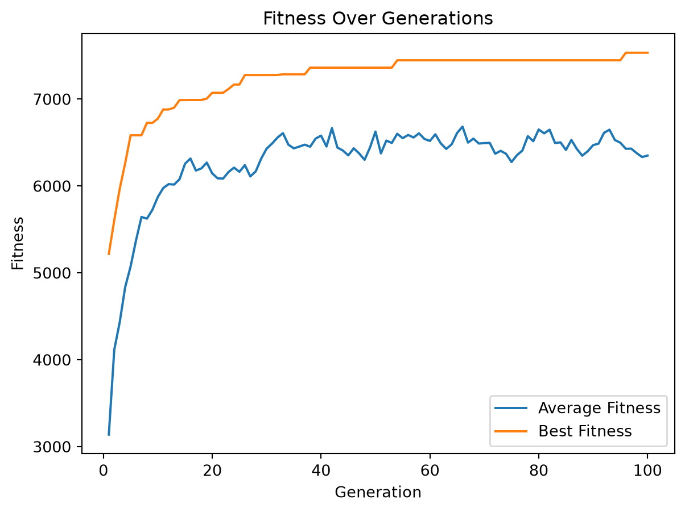

# Lecture 16

Problème du sac à dos 0/1

Auteur·rice

Affiliations

Marcel Turcotte [](mailto:marcel.turcotte@uottawa.ca)

École de science informatique et de génie électrique

Université d’Ottawa

Date de publication

21 novembre 2024

## Problème

**Problème du sac à dos 0/1** : Étant donné des objets avec des **poids** et des **valeurs** définis, l’objectif est de **maximiser la valeur totale** en sélectionnant des objets pour un sac à dos sans dépasser une **capacité fixe**. Chaque objet doit être soit entièrement **inclus (1)**, soit **exclu (0)**.


**Attribution**: Généré par DALL-E, via ChatGPT (GPT-4), OpenAI, 10 novembre 2024.

## Utilitaires

``` python
import requests

def read_knapsack_data(url):

    """
    Reads and processes knapsack problem data from a given URL.
    
    Args:
        url (str): The URL pointing to the data file.
        
    Returns:
        values, weights, capacity
        
    Raises:
        Exception: If there is an issue with fetching the data or parsing the content.
    """

    try:
        # Fetch data from the URL
        response = requests.get(url)
        
        # Raise an error if the request was unsuccessful
        response.raise_for_status()
        
        # Split the data into lines
        lines = response.text.strip().split('\n')
        
        # Parse the number of items
        num_items = int(lines[0].strip())
        
        # Parse the values and weights lists
        values = list(map(int, lines[1].strip().split()))
        weights = list(map(int, lines[2].strip().split()))
        
        # Parse the capacity
        capacity = int(lines[3].strip())
        
        # Validate that the number of items matches the length of values and weights
        if len(values) != num_items or len(weights) != num_items:
            raise ValueError("The number of items does not match the length of values or weights list.")
        
        # Return the values, weights, and capacity
        return np.array(values), np.array(weights), capacity
    
    except requests.exceptions.RequestException as e:
        print(f"Error fetching data from URL: {e}")
        raise
    except ValueError as e:
        print(f"Error processing data: {e}")
        raise
    except Exception as e:
        print(f"An unexpected error occurred: {e}")
        raise
```

## Algorithmes gloutons

> **NOTE:**
>
> Les algorithmes gloutons prennent la décision de ce qu’il faut faire ensuite en sélectionnant la meilleure option locale parmi toutes les choix disponibles, sans tenir compte de la structure globale.

### Glouton par poids

Une stratégie gloutonne possible consiste à sélectionner les objets par ordre croissant de poids jusqu’à ce que le total dépasse la capacité.

``` python
def greedy_knapsack_weight(weights, values, capacity):

    """
    Greedy algorithm for the 0/1 Knapsack Problem based on weigth.

    Args:
        weights (np.ndarray): Weights of the items.
        values (np.ndarray): Values of the items.
        capacity (int): Capacity of the knapsack.

    Returns:
        tuple: Selected items (binary array), total value, total weight.
    """

    num_items = len(weights)

    # Create a list of items with their values and original indices
    items = list(zip(weights, values, range(num_items)))

    # Sort items by weight in increasing order
    items.sort()
    
    total_weight = 0
    total_value = 0
    solution = np.zeros(num_items, dtype=int)
    
    # Select items based on the sorted order
    for w, v, idx in items:
        if total_weight + w <= capacity:
            solution[idx] = 1
            total_weight += w
            total_value += v
        else:
            continue  # Skip items that would exceed the capacity
    
    return solution, total_value, total_weight
```

### Glouton par valeur

Une autre stratégie gloutonne consiste à sélectionner les objets par ordre décroissant de valeur jusqu’à ce que le total dépasse la capacité.

``` python
import numpy as np

def greedy_knapsack_value(weights, values, capacity):

    """
    Greedy algorithm for the 0/1 Knapsack Problem based on value.

    Args:
        weights (np.ndarray): Weights of the items.
        values (np.ndarray): Values of the items.
        capacity (int): Capacity of the knapsack.

    Returns:
        tuple: Selected items (binary array), total value, total weight.
    """

    num_items = len(weights)

    # Create a list of items with their values and original indices
    items = list(zip(values, weights, range(num_items)))

    # Sort items by value in decreasing order
    items.sort(reverse=True)
    
    total_weight = 0
    total_value = 0
    solution = np.zeros(num_items, dtype=int)
    
    # Select items based on the sorted order
    for v, w, idx in items:
        if total_weight + w <= capacity:
            solution[idx] = 1
            total_weight += w
            total_value += v
        else:
            continue  # Skip items that would exceed the capacity
    
    return solution, total_value, total_weight
```

### Glouton par ratio

Basé sur le ratio valeur/poids.

``` python
def greedy_knapsack_ratio(weights, values, capacity):

    """
    Greedy algorithm for the 0/1 Knapsack Problem based on value-to-weight ratio.

    Args:
        weights (np.ndarray): Weights of the items.
        values (np.ndarray): Values of the items.
        capacity (int): Capacity of the knapsack.

    Returns:
        tuple: Selected items (binary array), total value, total weight.
    """

    num_items = len(weights)

    # Calculate value-to-weight ratio for each item
    ratio = values / weights

    # Create a list of items with their ratios and original indices
    items = list(zip(ratio, values, weights, range(num_items)))

    # Sort items by ratio in decreasing order
    items.sort(reverse=True)
    
    total_weight = 0
    total_value = 0
    solution = np.zeros(num_items, dtype=int)
    
    # Select items based on the sorted order
    for r, v, w, idx in items:
        if total_weight + w <= capacity:
            solution[idx] = 1
            total_weight += w
            total_value += v
        else:
            continue  # Skip items that would exceed the capacity
    
    return solution, total_value, total_weight
```

## Algorithme génétique

Voir les notes de cours pour les détails.

``` python
import random

def initialize_population(pop_size, num_items):
    """
    Initialize the population with random binary strings.

    Args:
        pop_size (int): Number of individuals in the population.
        num_items (int): Number of items in the knapsack problem.

    Returns:
        np.ndarray: Initialized population.
    """
    return np.random.randint(2, size=(pop_size, num_items))
```

``` python
def evaluate_fitness(population, weights, values, capacity, penalty_factor=10):
    """
    Evaluate the fitness of each individual in the population.

    Args:
        population (np.ndarray): Current population.
        weights (np.ndarray): Weights of the items.
        values (np.ndarray): Values of the items.
        capacity (int): Capacity of the knapsack.
        penalty_factor (float): Penalty factor for exceeding capacity.

    Returns:
        np.ndarray: Fitness values for the population.
    """
    total_weights = np.dot(population, weights)
    total_values = np.dot(population, values)
    penalties = penalty_factor * np.maximum(0, total_weights - capacity)
    fitness = total_values - penalties
    return fitness
```

``` python
def tournament_selection(population, fitness, tournament_size):
    """
    Select individuals from the population using tournament selection.

    Args:
        population (np.ndarray): Current population.
        fitness (np.ndarray): Fitness values of the population.
        tournament_size (int): Number of individuals in each tournament.

    Returns:
        np.ndarray: Selected parents.
    """
    pop_size = population.shape[0]
    selected_indices = []
    for _ in range(pop_size):
        participants = np.random.choice(pop_size, tournament_size, replace=False)
        best = participants[np.argmax(fitness[participants])]
        selected_indices.append(best)
    return population[selected_indices]
```

``` python
def roulette_selection(population, fitness):
    """
    Select individuals from the population using roulette wheel selection.

    Args:
        population (np.ndarray): Current population.
        fitness (np.ndarray): Fitness values of the population.

    Returns:
        np.ndarray: Selected parents.
    """
    # Adjust fitness to be non-negative
    min_fitness = np.min(fitness)
    adjusted_fitness = fitness - min_fitness + 1e-6  # small epsilon to avoid zero division
    total_fitness = np.sum(adjusted_fitness)
    probabilities = adjusted_fitness / total_fitness
    pop_size = population.shape[0]
    selected_indices = np.random.choice(pop_size, size=pop_size, p=probabilities)
    return population[selected_indices]
```

``` python
def single_point_crossover(parents, crossover_rate):
    """
    Perform single-point crossover on the parents.

    Args:
        parents (np.ndarray): Selected parents.
        crossover_rate (float): Probability of crossover.

    Returns:
        np.ndarray: Offspring after crossover.
    """
    num_parents, num_genes = parents.shape
    np.random.shuffle(parents)
    offspring = []
    for i in range(0, num_parents, 2):
        parent1 = parents[i]
        parent2 = parents[i+1 if i+1 < num_parents else 0]
        child1 = parent1.copy()
        child2 = parent2.copy()
        if np.random.rand() < crossover_rate:
            point = np.random.randint(1, num_genes)  # Crossover point
            child1[:point], child2[:point] = parent2[:point], parent1[:point]
        offspring.append(child1)
        offspring.append(child2)
    return np.array(offspring)
```

``` python
def uniform_crossover(parents, crossover_rate):
    """
    Perform uniform crossover on the parents.

    Args:
        parents (np.ndarray): Selected parents.
        crossover_rate (float): Probability of crossover.

    Returns:
        np.ndarray: Offspring after crossover.
    """
    num_parents, num_genes = parents.shape
    np.random.shuffle(parents)
    offspring = []
    for i in range(0, num_parents, 2):
        parent1 = parents[i]
        parent2 = parents[i+1 if i+1 < num_parents else 0]
        child1 = parent1.copy()
        child2 = parent2.copy()
        if np.random.rand() < crossover_rate:
            mask = np.random.randint(0, 2, size=num_genes).astype(bool)
            child1[mask], child2[mask] = parent2[mask], parent1[mask]
        offspring.append(child1)
        offspring.append(child2)
    return np.array(offspring)
```

``` python
def mutation(offspring, mutation_rate):
    """
    Apply bit-flip mutation to the offspring.

    Args:
        offspring (np.ndarray): Offspring after crossover.
        mutation_rate (float): Probability of mutation for each bit.

    Returns:
        np.ndarray: Offspring after mutation.
    """
    num_offspring, num_genes = offspring.shape
    mutation_matrix = np.random.rand(num_offspring, num_genes) < mutation_rate
    offspring[mutation_matrix] = 1 - offspring[mutation_matrix]
    return offspring
```

``` python
def elitism(population, fitness, elite_size):
    """
    Preserve the top-performing individuals in the population.

    Args:
        population (np.ndarray): Current population.
        fitness (np.ndarray): Fitness values of the population.
        elite_size (int): Number of top individuals to preserve.

    Returns:
        np.ndarray: Elite individuals.
    """
    elite_indices = np.argsort(fitness)[-elite_size:]  # Get indices of top individuals
    elites = population[elite_indices]
    return elites
```

``` python
def genetic_algorithm(weights, values, capacity, pop_size=100, num_generations=200, crossover_rate=0.8,
                      mutation_rate=0.05, elite_percent=0.02, selection_type='tournament', tournament_size=3,
                      crossover_type='single_point'):
    """
    Main function to run the genetic algorithm for the 0/1 knapsack problem.

    Args:
        weights (np.ndarray): Weights of the items.
        values (np.ndarray): Values of the items.
        capacity (int): Capacity of the knapsack.
        pop_size (int): Population size.
        num_generations (int): Number of generations.
        crossover_rate (float): Probability of crossover.
        mutation_rate (float): Probability of mutation.
        elite_percent (float): Percentage of elites to preserve.
        selection_type (str): 'tournament' or 'roulette'.
        tournament_size (int): Number of individuals in tournament selection.
        crossover_type (str): 'single_point' or 'uniform'.

    Returns:
        tuple: Best solution, best value, and best weight found.
    """

    num_items = len(weights)
    elite_size = max(1, int(pop_size * elite_percent))
    population = initialize_population(pop_size, num_items)

    average_fitness_history = []
    best_fitness_history = []

    for generation in range(num_generations):
        fitness = evaluate_fitness(population, weights, values, capacity)

        # Track average and best fitness
        average_fitness = np.mean(fitness)
        best_fitness = np.max(fitness)
        average_fitness_history.append(average_fitness)
        best_fitness_history.append(best_fitness)

        # Elitism
        elites = elitism(population, fitness, elite_size)

        # Selection
        if selection_type == 'tournament':
            parents = tournament_selection(population, fitness, tournament_size)
        elif selection_type == 'roulette':
            parents = roulette_selection(population, fitness)
        else:
            raise ValueError("Invalid selection type")

        # Crossover
        if crossover_type == 'single_point':
            offspring = single_point_crossover(parents, crossover_rate)
        elif crossover_type == 'uniform':
            offspring = uniform_crossover(parents, crossover_rate)
        else:
            raise ValueError("Invalid crossover type")

        # Mutation
        offspring = mutation(offspring, mutation_rate)

        # Create new population
        population = np.vstack((elites, offspring))

        # Ensure population size
        if population.shape[0] > pop_size:
            population = population[:pop_size]
        elif population.shape[0] < pop_size:
            # Add random individuals to fill population
            num_new_individuals = pop_size - population.shape[0]
            new_individuals = initialize_population(num_new_individuals, num_items)
            population = np.vstack((population, new_individuals))

    # After all generations, return the best solution
    fitness = evaluate_fitness(population, weights, values, capacity)
    best_index = np.argmax(fitness)
    best_solution = population[best_index]
    best_value = np.dot(best_solution, values)
    best_weight = np.dot(best_solution, weights)

    return best_solution, best_value, best_weight, average_fitness_history, best_fitness_history
```

``` python
def genetic_algorithm_do_n(weights, values, capacity, pop_size=100, num_generations=200, crossover_rate=0.8,
      mutation_rate=0.05, elite_percent=0.02, selection_type='tournament', tournament_size=3, crossover_type='single_point', repeats=100):

    best_solution = None
    best_value = -1
    best_weight = -1

    best_averages = []
    best_bests = []

    for i in range(repeats):

        solution, value, weight, average_history, best_history = genetic_algorithm(weights, values, capacity, pop_size, num_generations, crossover_rate,
            mutation_rate, elite_percent, selection_type, tournament_size, crossover_type)

        if value > best_value and weight <= capacity:
            best_solution = solution
            best_value = value
            best_weight = weight
            best_averages = average_history
            best_bests = best_history

    return best_solution, best_value, best_weight, best_averages, best_bests
```

## Tests

Test de notre algorithme génétique sur des données de [Google OR-Tools](https://developers.google.com/optimization/pack/knapsack).

``` python
import matplotlib.pyplot as plt

def test_genetic_algorithm():
    # Sample data

    values = np.array([
        360, 83, 59, 130, 431, 67, 230, 52, 93, 125, 670, 892, 600, 38, 48, 147,
        78, 256, 63, 17, 120, 164, 432, 35, 92, 110, 22, 42, 50, 323, 514, 28,
        87, 73, 78, 15, 26, 78, 210, 36, 85, 189, 274, 43, 33, 10, 19, 389, 276,
        312])

    weights = np.array([
        7, 0, 30, 22, 80, 94, 11, 81, 70, 64, 59, 18, 0, 36, 3, 8, 15, 42, 9, 0,
        42, 47, 52, 32, 26, 48, 55, 6, 29, 84, 2, 4, 18, 56, 7, 29, 93, 44, 71,
        3, 86, 66, 31, 65, 0, 79, 20, 65, 52, 13])

    capacity = 850

    # Run genetic algorithm
    best_solution, best_value, best_weight, avg_fitness, best_fitness = genetic_algorithm_do_n(
        weights, values, capacity, pop_size=50, num_generations=100,
        crossover_rate=0.8, mutation_rate=0.05, elite_percent=0.02,
        selection_type='tournament', tournament_size=3)

    print("Best Solution:", best_solution)
    print("Best Value:", best_value)
    print("Best Weight:", best_weight)

    # Plot the fitness over generations
    generations = range(1, len(avg_fitness) + 1)
    plt.plot(generations, avg_fitness, label='Average Fitness')
    plt.plot(generations, best_fitness, label='Best Fitness')
    plt.xlabel('Generation')
    plt.ylabel('Fitness')
    plt.title('Fitness Over Generations')
    plt.legend()
    plt.show()

test_genetic_algorithm()
```

    Best Solution: [1 1 0 1 1 0 1 0 0 0 1 1 1 0 1 1 1 1 1 1 0 1 1 0 1 0 0 1 1 1 1 1 1 0 1 0 0
     0 1 1 0 1 1 0 1 0 0 1 1 1]
    Best Value: 7534
    Best Weight: 850



Test de tous les algorithmes sur des données provenant de [pages.mtu.edu/~kreher/cages/data/knapsack/](https://pages.mtu.edu/~kreher/cages/data/knapsack/).

``` python
import pandas as pd

BASE_URL = 'https://pages.mtu.edu/~kreher/cages/data/knapsack/'

datasets = [
    'ks_8a.dat','ks_8b.dat','ks_8c.dat','ks_8d.dat','ks_8e.dat','ks_12a.dat',
    'ks_12b.dat','ks_12c.dat','ks_12d.dat','ks_12e.dat','ks_16a.dat','ks_16b.dat',
    'ks_16c.dat','ks_16d.dat','ks_16e.dat','ks_20a.dat','ks_20b.dat','ks_20c.dat',
    'ks_20d.dat','ks_20e.dat','ks_24a.dat','ks_24b.dat','ks_24c.dat','ks_24d.dat',
    'ks_24e.dat'
]

columns = [
    'file_path', 'capacity', 
    'gw_value', 'gw_weight', 
    'gv_value', 'gw_weight', 
    'gr_value', 'gr_weight', 
    'ga_value', 'ga_weight'
]

df = pd.DataFrame(columns=columns)

for idx, file_path in enumerate(datasets):

  values, weights, capacity = read_knapsack_data(BASE_URL + file_path)

  solution, total_value, total_weight = greedy_knapsack_weight(weights, values, capacity)

  gw_value = total_value
  gw_weight = total_weight

  solution, total_value, total_weight = greedy_knapsack_value(weights, values, capacity)

  gv_value = total_value
  gv_weight = total_weight

  solution, total_value, total_weight = greedy_knapsack_ratio(weights, values, capacity)

  gr_value = total_value
  gr_weight = total_weight

  solution, total_value, total_weight, avg_fitness, best_fitness = genetic_algorithm_do_n(
        weights, values, capacity, pop_size=50, num_generations=100,
        crossover_rate=0.8, mutation_rate=0.05, elite_percent=0.02,
        selection_type='tournament', tournament_size=3, crossover_type='single_point')

  ga_value = total_value
  ga_weight = total_weight

  df.loc[idx] = [
    file_path, capacity, 
    gw_value, gw_weight, 
    gv_value, gw_weight, 
    gr_value, gr_weight, 
    ga_value, ga_weight
  ]

df.to_csv("knapsack.csv", index=False)

print(df)
```

         file_path  capacity  gw_value  gw_weight  gv_value  gw_weight  gr_value  \
    0    ks_8a.dat   1863633    874414    1803989    925369    1803989    925369   
    1    ks_8b.dat   1822718    724029    1421763    836649    1421763    724029   
    2    ks_8c.dat   1609419    771637    1609296    756847    1609296    713452   
    3    ks_8d.dat   2112292    749458    1558340   1006793    1558340    881823   
    4    ks_8e.dat   2493250   1224805    2386238   1300939    2386238   1300939   
    5   ks_12a.dat   2805213   1180238    2323972   1409053    2323972   1381444   
    6   ks_12b.dat   3259036   1334963    2639964   1681436    2639964   1602435   
    7   ks_12c.dat   2489815    926226    1808471   1152681    1808471   1303224   
    8   ks_12d.dat   3453702   1679959    3406646   1724265    3406646   1858992   
    9   ks_12e.dat   2520392   1277814    2429214   1216398    2429214   1309915   
    10  ks_16a.dat   3780355   1654432    3150713   1886539    3150713   2018230   
    11  ks_16b.dat   4426945   1838356    3601726   2182562    3601726   2170190   
    12  ks_16c.dat   4323280   1741661    3539978   2125245    3539978   2176322   
    13  ks_16d.dat   4450938   2051218    4155271   2189910    4155271   2207441   
    14  ks_16e.dat   3760429   1735397    3442535   1954173    3442535   1967510   
    15  ks_20a.dat   5169647   2558243    5101533   2658865    5101533   2721946   
    16  ks_20b.dat   4681373   2230065    4543967   2419141    4543967   2383424   
    17  ks_20c.dat   5063791   2128763    4361690   2410432    4361690   2723135   
    18  ks_20d.dat   4286641   1870486    3557405   2158431    3557405   2276327   
    19  ks_20e.dat   4476000   2115412    4173744   2159969    4173744   2294511   
    20  ks_24a.dat   6404180   2886589    5845661   3174264    5845661   3393387   
    21  ks_24b.dat   5971071   2961351    5941814   3019080    5941814   3164151   
    22  ks_24c.dat   5870470   2505304    5008038   2830470    5008038   3045772   
    23  ks_24d.dat   5762284   2711513    5247821   3047367    5247821   3135427   
    24  ks_24e.dat   6654569   3278044    6634696   3296337    6634696   3401688   

        gr_weight  ga_value  ga_weight  
    0     1714834    925369    1714834  
    1     1421763    853704    1750340  
    2     1422422    771637    1609296  
    3     1682688   1084704    2059405  
    4     2377405   1300939    2377405  
    5     2672179   1468476    2804581  
    6     2953017   1753926    3254705  
    7     2406387   1329478    2458307  
    8     3412958   1858992    3412958  
    9     2477116   1309915    2477116  
    10    3768480   2018230    3768480  
    11    4071350   2311731    4392978  
    12    4054333   2282303    4315302  
    13    4245406   2298302    4422372  
    14    3616049   2030691    3755734  
    15    5054489   2788040    5161352  
    16    4471059   2471511    4676284  
    17    5029940   2723135    5029940  
    18    4273053   2280911    4275282  
    19    4353690   2350457    4471547  
    20    6379172   3393387    6379172  
    21    5911388   3194906    5970122  
    22    5820857   3066886    5848030  
    23    5734259   3150365    5754023  
    24    6435390   3501861    6649161  

Dans le cadre des 25 instances du problème du sac à dos 0/1, l’algorithme génétique a constamment surpassé les algorithmes gloutons. Plus précisément, il a obtenu des solutions équivalentes aux meilleurs résultats des algorithmes gloutons dans 8 cas et les a dépassées dans 17 cas, avec une amélioration allant jusqu’à 6 %.

## Ressources

- [DEAP](https://github.com/deap) est un cadre de calcul évolutif conçu pour le prototypage rapide et le test d’idées. Cet environnement est développé à l’Université Laval depuis (au moins) 2012.
  - [Résoudre le problème du sac à dos à l’aide de DEAP](https://deap.readthedocs.io/en/master/examples/ga_knapsack.html), [exemple complet](https://github.com/DEAP/deap/blob/0ebb47e34298885840fa7474fa9ffb9c7d7f2c8d/examples/ga/knapsack.py).

## Les références

Skiena, Steven S. 2008. *The Algorithm Design Manual*. Springer. <https://doi.org/10.1007/978-1-84800-070-4>.
